<p align="center">
  <a href="https://normansrule.github.io/transistor-odyssey/"></a>
</p>

<p align="center">
  <b>An open, simulated history of the transistor, 1947 → 2026.</b><br>
  How the switch changed shape, what an electron sees inside each one, and what might replace silicon.
</p>

<p align="center">
  <a href="https://normansrule.github.io/transistor-odyssey/"><b>Website</b></a> &nbsp;·&nbsp;
  <a href="https://normansrule.github.io/transistor-odyssey/devices.html"><b>Device Atlas</b></a> &nbsp;·&nbsp;
  <a href="https://normansrule.github.io/transistor-odyssey/physics.html"><b>Physics Lab</b></a> &nbsp;·&nbsp;
  <a href="docs/README.md"><b>Chapters</b></a> &nbsp;·&nbsp;
  <a href="#quick-start"><b>Quick start</b></a>
</p>

<p align="center">
  <a href="https://normansrule.github.io/transistor-odyssey/"></a>
  <a href=".github/workflows/ci.yml"></a>
  <a href="REFERENCES.md"></a>
  <a href="docs/README.md"></a>
  <a href="LICENSE"></a>
</p>

<br>

<p align="center"><a href="https://normansrule.github.io/transistor-odyssey/devices.html#finfet"></a></p>

<p align="center"><sub>The FinFET from the <a href="https://normansrule.github.io/transistor-odyssey/devices.html#finfet">Device Atlas</a>. The gate sweeps from off to on; electrons (blue) pile up behind the source barrier, then flow over it as the gate pulls it down. Recorded from the live page.</sub></p>

## Overview

Transistor Odyssey follows the transistor from a 50 µm gold contact on germanium to gate-all-around nanosheets, IBM's 7 Å nanostack and a 0.42 nm oxide on one-molecule-thick molybdenum disulfide (MoS₂), and through the gallium nitride (GaN), gallium arsenide (GaAs), silicon carbide (SiC) and diamond devices that compete with silicon. It is three things at once:

| | |
|---|---|
| **A website** | An animated history, a [Device Atlas](https://normansrule.github.io/transistor-odyssey/devices.html) of 19 transistors with live energy band diagrams, and a [Physics Lab](https://normansrule.github.io/transistor-odyssey/physics.html) of 15 simulations. Everything runs in the browser; nothing is pre-rendered. |
| **A textbook** | [20 chapters](docs/README.md), from the point contact to packaging, with 262 cited sources. Every number traces to a reference. |
| **A simulation package** | Python models in [`sim/transistor_sim`](sim/transistor_sim) that draw every figure here, each with a browser twin checked against it by 132 tests in continuous integration. |

> [!IMPORTANT]
> **About "0.42 nm".** No foundry manufactures a 0.42 nm (or 0.7 nm) process. As of September 2026 the most advanced production nodes are 2 nm-class (TSMC N2 and Intel 18A, both in volume since Q4 2025), with TSMC A16 ramping. **0.7 nm** is IBM's *research* node announced on 25 June 2026. **0.42 nm** is the measured thickness of an aluminium-oxide interface layer in a 2026 NYCU + TSMC monolayer-MoS₂ transistor whose channel is ~100 nm long. This repository explains all three and why node names stopped being lengths. See [Chapter 8](docs/08-gaa-and-angstrom-era.md) and [Chapter 9](docs/09-2d-materials.md).

### Where to start

| You are… | Suggested path |
|---|---|
| **New to semiconductors** | [How to read a band diagram](https://normansrule.github.io/transistor-odyssey/devices.html#primer) → the [planar MOSFET](https://normansrule.github.io/transistor-odyssey/devices.html#planar_mosfet) and [bipolar transistor](https://normansrule.github.io/transistor-odyssey/devices.html#bjt) in the atlas → Physics Lab parts [I](https://normansrule.github.io/transistor-odyssey/physics.html#crystal) and [II](https://normansrule.github.io/transistor-odyssey/physics.html#pn) → the [self-test quiz](https://normansrule.github.io/transistor-odyssey/devices.html#quiz) |
| **An engineer asking why FinFET and GAA** | [Physics Lab 09: 2D electrostatics](https://normansrule.github.io/transistor-odyssey/physics.html#short) → [the side-by-side comparison](https://normansrule.github.io/transistor-odyssey/devices.html#compare) → [Labs 13–15: inverter, ballistic limit, wires](https://normansrule.github.io/transistor-odyssey/physics.html#part-vi) → [Chapter 6](docs/06-finfet.md), [Chapter 8](docs/08-gaa-and-angstrom-era.md) and [the process flow](docs/16-process-flow.md) |
| **Working in power or radio frequency** | [Materials chart](https://normansrule.github.io/transistor-odyssey/devices.html#align) → [GaN HEMT](https://normansrule.github.io/transistor-odyssey/devices.html#gan_hemt) → [heterojunction builder](https://normansrule.github.io/transistor-odyssey/devices.html#hetero) → [self-heating lab](https://normansrule.github.io/transistor-odyssey/physics.html#heat) → [Chapters 10](docs/10-compound-semiconductors.md) and [13](docs/13-diamond-electronics.md) |
| **Teaching** | Every figure is CC BY 4.0 and regenerated by `python sim/make_figures.py`; the atlas deep-links to any device (`devices.html#finfet`), and the quiz draws new questions each round. |

## Contents

1. [How each transistor works](#how-each-transistor-works)
2. [Energy band diagrams for every device and material](#energy-band-diagrams-for-every-device-and-material)
3. [The interactive site](#the-interactive-site)
4. [The Physics Lab](#the-physics-lab)
5. [A history in cross-sections](#a-history-in-cross-sections)
6. [The data](#the-data)
7. [Chapters](#chapters)
8. [Quick start](#quick-start)
9. [Repository layout](#repository-layout) · [Accuracy](#accuracy-policy) · [Credits](#credits-and-inspiration) · [License](#license) · [Cite](#cite)

## How each transistor works

Each animation is recorded from the [Device Atlas](https://normansrule.github.io/transistor-odyssey/devices.html). The left panel is the device's cross-section, with electrons (filled blue) and holes (open orange) moving along the current path; the right panel is the energy band diagram along that path, computed from the same model. [Chapter 20](docs/20-how-transistors-work.md) walks through all 19 devices in text.

### Planar MOSFET · 1960

<p align="center"><a href="https://normansrule.github.io/transistor-odyssey/devices.html#planar_mosfet">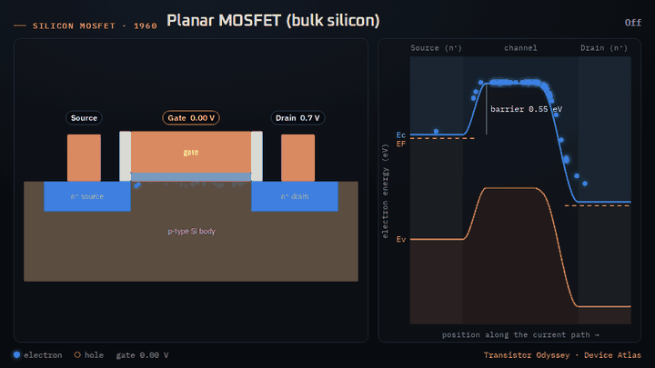</a></p>

The gate pulls the conduction band under it down. Below threshold, electrons must climb a barrier between source and channel and the current falls tenfold for every 60 mV of gate voltage; above threshold an inversion layer forms and the barrier is gone.

### Why the FinFET had to happen

<p align="center"><a href="https://normansrule.github.io/transistor-odyssey/devices.html#compare">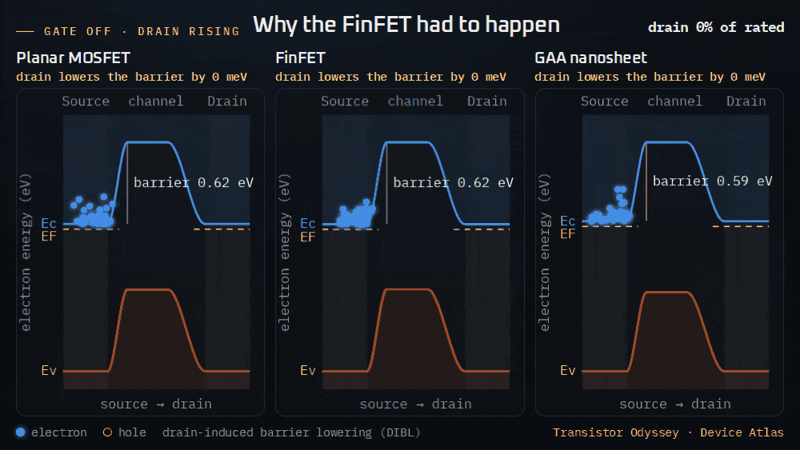</a></p>

All three silicon devices with the gate off and the drain voltage rising. The drain reaches around a single planar gate and pulls its barrier down by about 120 meV; wrapping the gate around a fin cuts that to about 40 meV, and around stacked nanosheets to about 22 meV. Every 60 meV is a factor of ten in leakage. Try it live in the [comparison](https://normansrule.github.io/transistor-odyssey/devices.html#compare).

### Gate-all-around nanosheet · 2022–25

<p align="center"><a href="https://normansrule.github.io/transistor-odyssey/devices.html#gaa">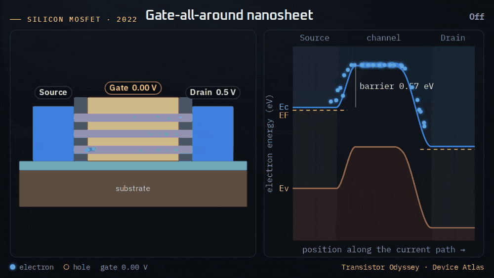</a></p>

The 2 nm generation (Samsung SF3, TSMC N2, Intel 18A): stacked silicon sheets about 5 nm thick, with the gate on all four sides of each.

### AlGaN/GaN high-electron-mobility transistor · 1993

<p align="center"><a href="https://normansrule.github.io/transistor-odyssey/devices.html#gan_hemt">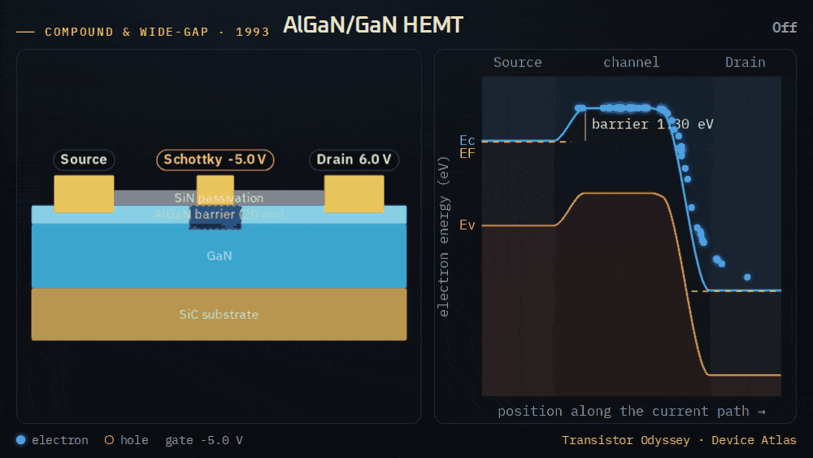</a></p>

Polarization charge at the aluminium gallium nitride / gallium nitride interface creates a sheet of about 10¹³ electrons/cm² with no doping at all. The device is normally on: a negative gate voltage lifts the quantum well above the Fermi level to switch it off.

### Bipolar junction transistor · 1951

<p align="center"><a href="https://normansrule.github.io/transistor-odyssey/devices.html#bjt">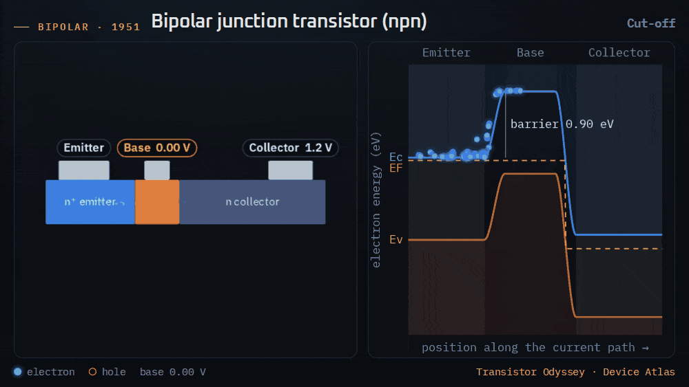</a></p>

No insulated gate: forward bias on the emitter–base junction lowers its built-in barrier, electrons diffuse across a thin base, and fall down the reverse-biased collector junction.

<details>
<summary><b>Four more: tunnel FET, IGBT, carbon-nanotube FET and diamond FET</b></summary>

### Tunnel FET · 2004

<p align="center"><a href="https://normansrule.github.io/transistor-odyssey/devices.html#tfet">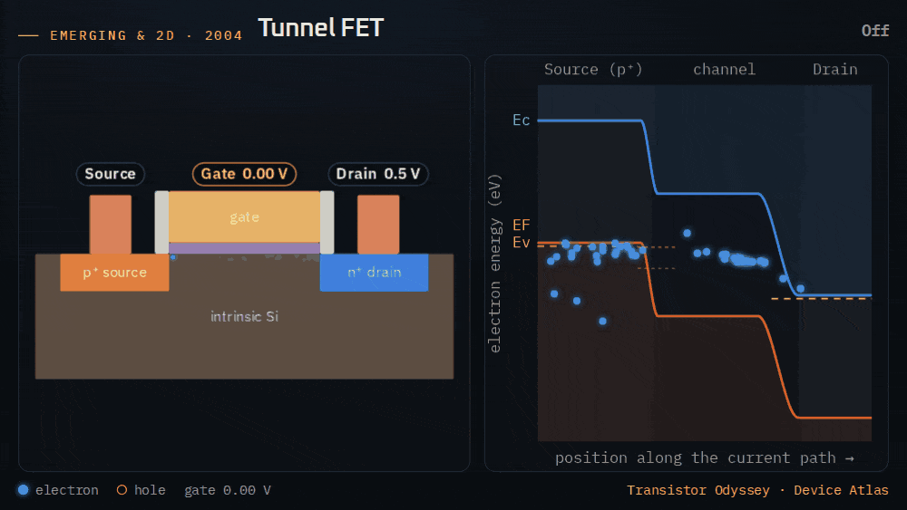</a></p>

Electrons tunnel sideways from the source valence band into the channel conduction band once the gate opens an energy window, so the swing can beat 60 mV per decade.

### Insulated-gate bipolar transistor · 1982

<p align="center"><a href="https://normansrule.github.io/transistor-odyssey/devices.html#igbt">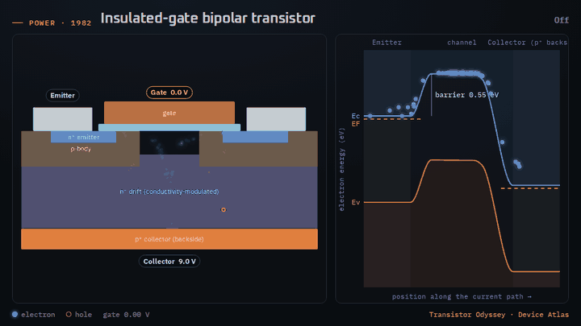</a></p>

A MOS channel feeds electrons into a thick drift region; the p⁺ layer at the back injects holes, and the region floods with both carriers, conducting far better than its doping alone allows.

### Carbon-nanotube FET · 1998

<p align="center"><a href="https://normansrule.github.io/transistor-odyssey/devices.html#cnt_fet">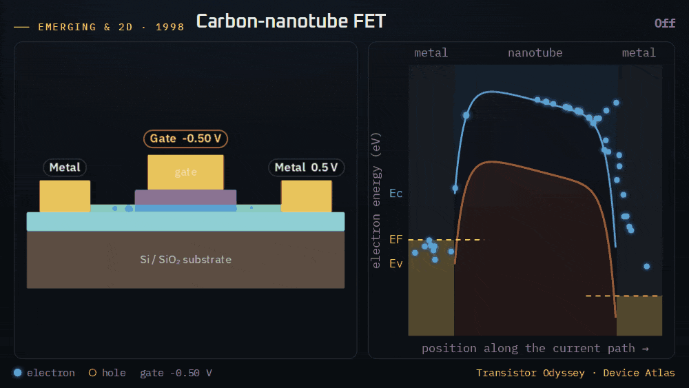</a></p>

Metal contacts form Schottky barriers at each end of a 1.5 nm nanotube; the gate thins those barriers until electrons tunnel through.

### Hydrogen-terminated diamond FET · 1994

<p align="center"><a href="https://normansrule.github.io/transistor-odyssey/devices.html#diamond_fet">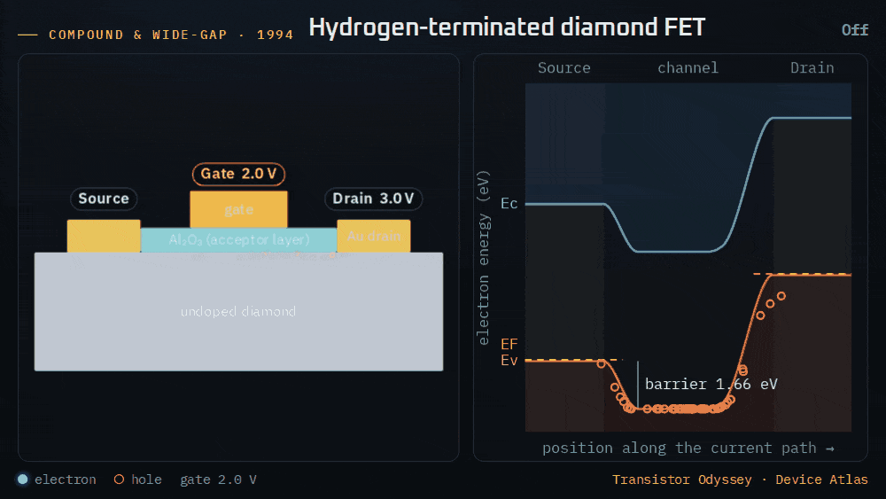</a></p>

Surface transfer doping gives diamond a sheet of holes with no dopant atoms; the device conducts holes, so its bands bend the other way.

</details>

## Energy band diagrams for every device and material

<p align="center">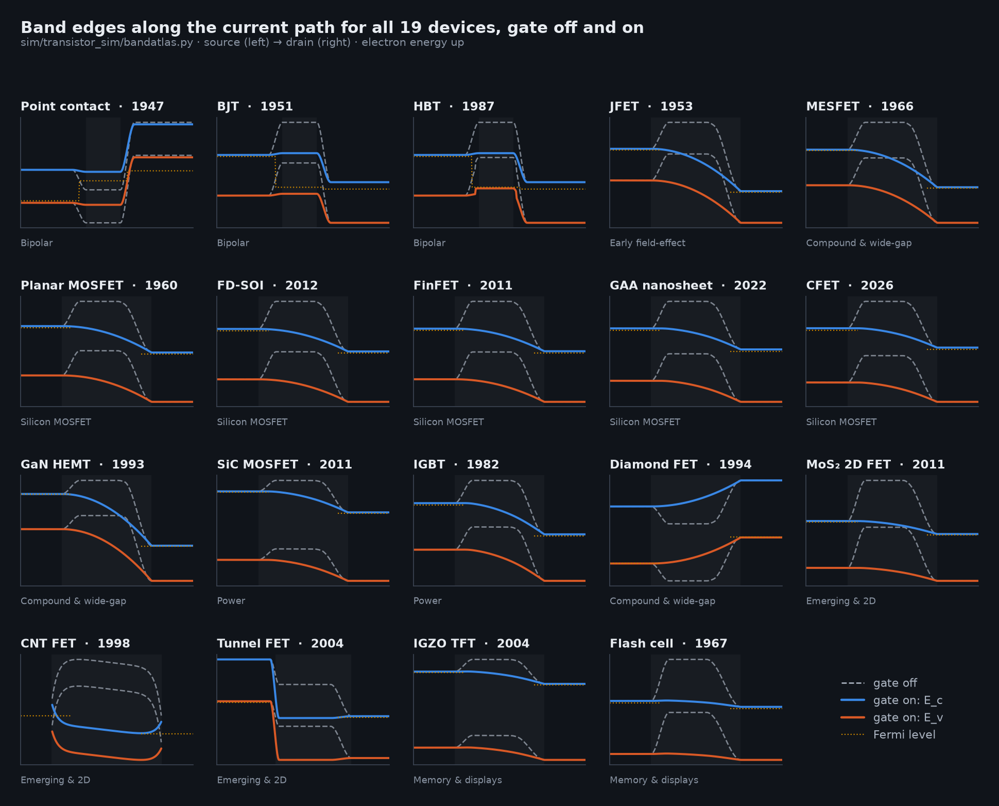</p>

<sub>All 19 devices along the current path, gate off (grey, dashed) and on (colour), from <code>sim/transistor_sim/bandatlas.py</code>. One figure per device, with the cut through the gate, is in <a href="figures/bands">figures/bands/</a>.</sub>

<p align="center">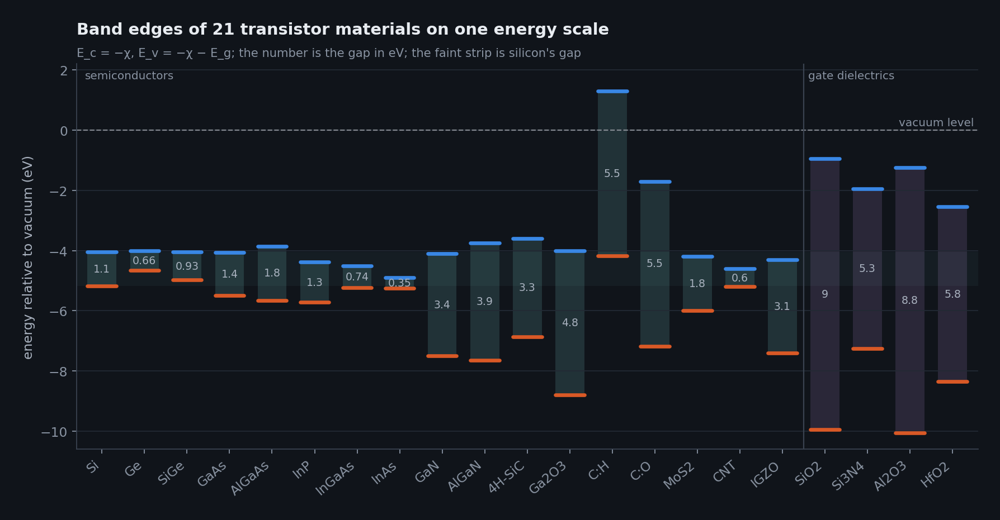</p>

<sub>21 channel and gate materials on one energy scale, from electron affinity and band gap. The gaps between them decide where carriers collect and how much a gate leaks.</sub>

<p align="center">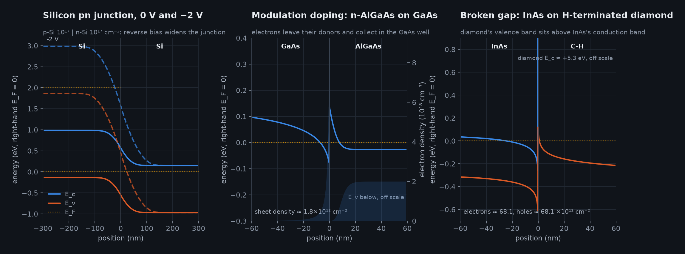</p>

<sub>New in this version: a Poisson solver for any pair of the 21 materials (<code>sim/transistor_sim/physics/hetero.py</code>). Left, a silicon pn junction at 0 V and −2 V; middle, modulation doping, where electrons leave their donors in AlGaAs and collect in GaAs; right, a broken-gap junction between InAs and hydrogen-terminated diamond.</sub>

<p align="center"><a href="https://normansrule.github.io/transistor-odyssey/devices.html#hetero">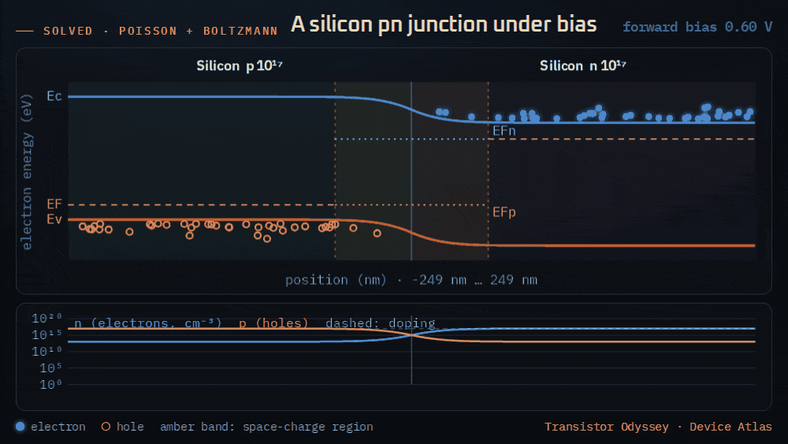</a></p>

<p align="center"><sub>The same solver, live in the <a href="https://normansrule.github.io/transistor-odyssey/devices.html#hetero">heterojunction builder</a>: a silicon pn junction swept from −2 V to +0.6 V, with the space-charge region (amber) shrinking under forward bias.</sub></p>

## The interactive site

| Page | What it does |
|---|---|
| [**History**](https://normansrule.github.io/transistor-odyssey/) | WebGL fluid hero, scroll-pinned timeline of 20 structures, three.js explorer that explodes seven architectures, compact-model device lab, Moore's-law chart, die photographs beside generated drawings, materials ranking, diamond lab, 14-step fab animation, niche atlas of 31 devices, lithography calculator and searchable bibliography |
| [**Device Atlas**](https://normansrule.github.io/transistor-odyssey/devices.html) | 19 animated transistors with band diagrams along the current path and through the gate, step-by-step walk-throughs, side-by-side comparison, 21-material band chart, heterojunction builder with doping and bias, and an 8-question self-test |
| [**Physics Lab**](https://normansrule.github.io/transistor-odyssey/physics.html) | 15 simulations in six parts, from crystal lattices to lithography optics, CMOS logic, ballistic transport and on-chip wires, each with guided experiments and typeset equations |

<p align="center"><a href="https://normansrule.github.io/transistor-odyssey/devices.html#gan_hemt">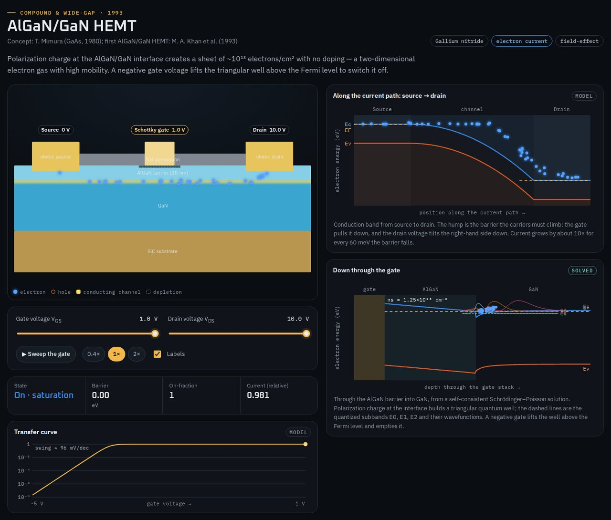</a></p>
<p align="center"><sub>Device Atlas: the GaN HEMT, with the solved quantum well in the lower band diagram.</sub></p>

<p align="center"><a href="https://normansrule.github.io/transistor-odyssey/devices.html#hetero">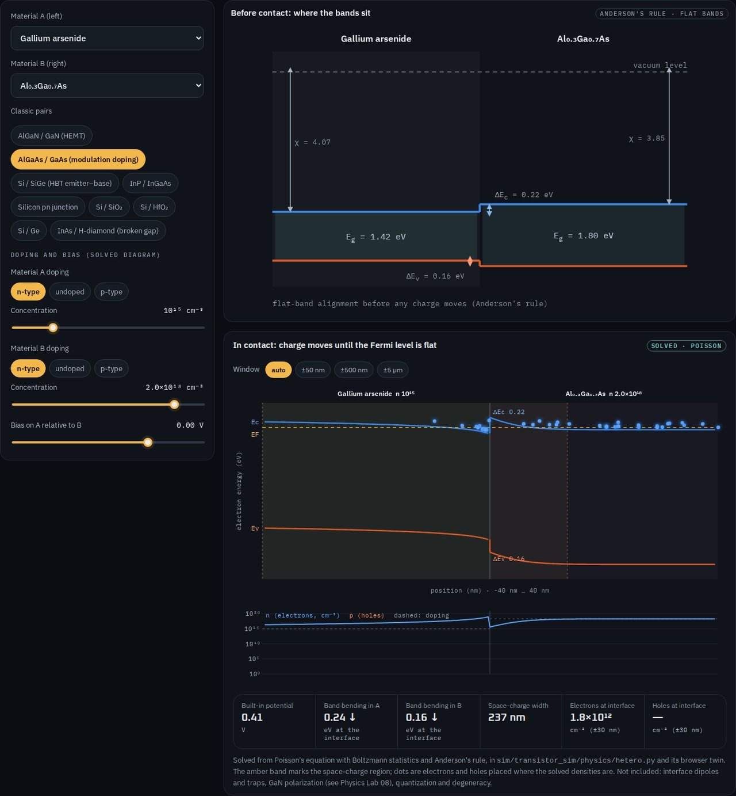</a></p>
<p align="center"><sub>Heterojunction builder: flat-band alignment above, the solved junction below, with carrier densities and the charge collected at the interface.</sub></p>

<table>
<tr>
<td width="50%"><a href="https://normansrule.github.io/transistor-odyssey/devices.html#compare">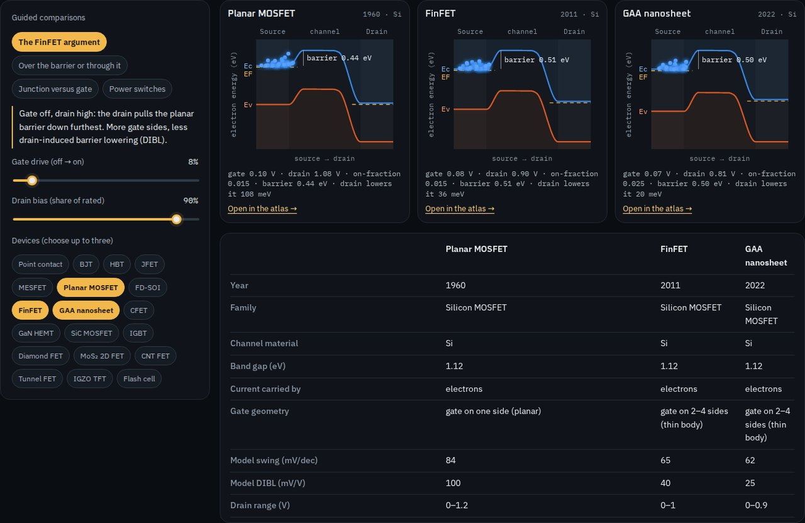</a><br><sub>Side-by-side comparison with guided presets.</sub></td>
<td width="50%"><a href="https://normansrule.github.io/transistor-odyssey/devices.html#quiz">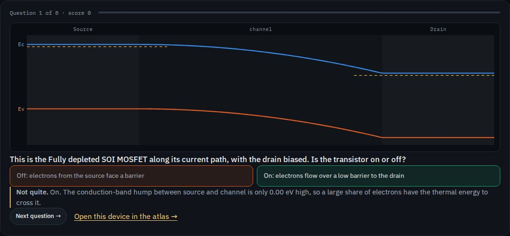</a><br><sub>Self-test: questions are generated from the models each round.</sub></td>
</tr>
<tr>
<td><a href="https://normansrule.github.io/transistor-odyssey/">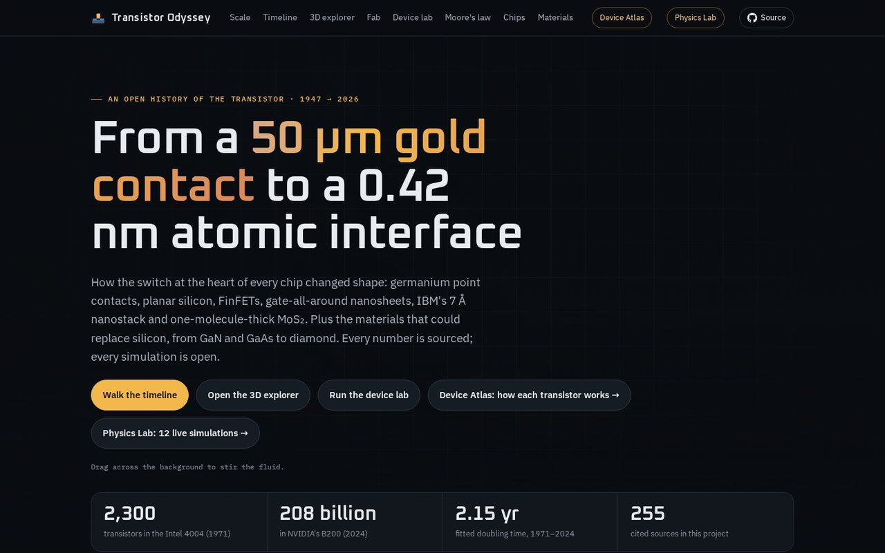</a><br><sub>The history page.</sub></td>
<td><a href="https://normansrule.github.io/transistor-odyssey/physics.html#short">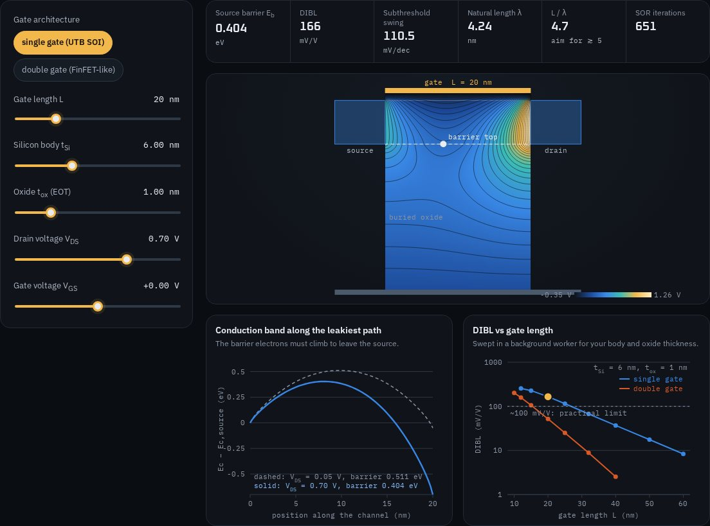</a><br><sub>Physics Lab 09: a live 2D Poisson solver.</sub></td>
</tr>
</table>

## The Physics Lab

The [Physics Lab](https://normansrule.github.io/transistor-odyssey/physics.html) turns the semiconductor physics behind the history into fifteen experiments you can run, grouped as materials → junctions and gates → quantum effects → scaling and transport → manufacturing → transistor to circuit. Each lab has sliders, guided "try this" experiments, the equations typeset with KaTeX, and a note on why it matters for transistors. The same models render these figures:

<table>
<tr>
<td width="50%"><br><sub>A 2D Poisson solve shows the drain lowering the source barrier, and a second gate cutting DIBL several-fold: the case for the FinFET.</sub></td>
<td width="50%"><br><sub>Transfer-matrix tunnelling: SiO₂ leaks ~10× more per 2 Å thinner; HfO₂ at the same EOT leaks orders of magnitude less.</sub></td>
</tr>
<tr>
<td><br><sub>Ensemble Monte Carlo reproduces silicon's measured mobility and ~10⁷ cm/s saturation velocity.</sub></td>
<td><br><sub>Exact MOS-capacitor C–V at three oxide thicknesses, low and high frequency.</sub></td>
</tr>
<tr>
<td><br><sub>Charge, field and band bending across an abrupt junction.</sub></td>
<td><br><sub>Why wide-gap semiconductors survive heat.</sub></td>
</tr>
<tr>
<td>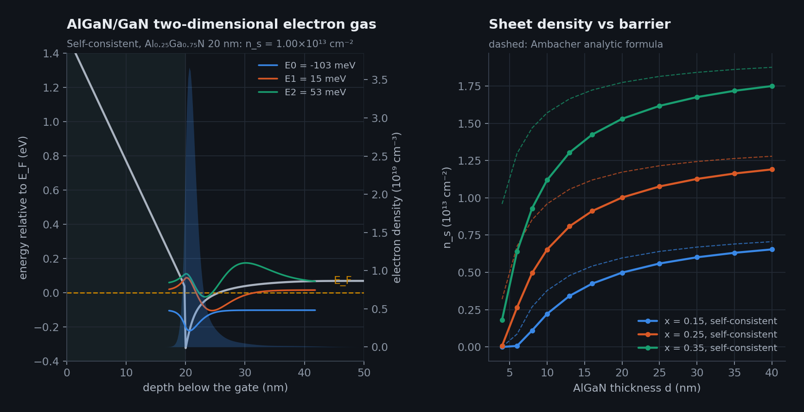<br><sub>Self-consistent Schrödinger–Poisson: the AlGaN/GaN two-dimensional electron gas with no doping at all.</sub></td>
<td>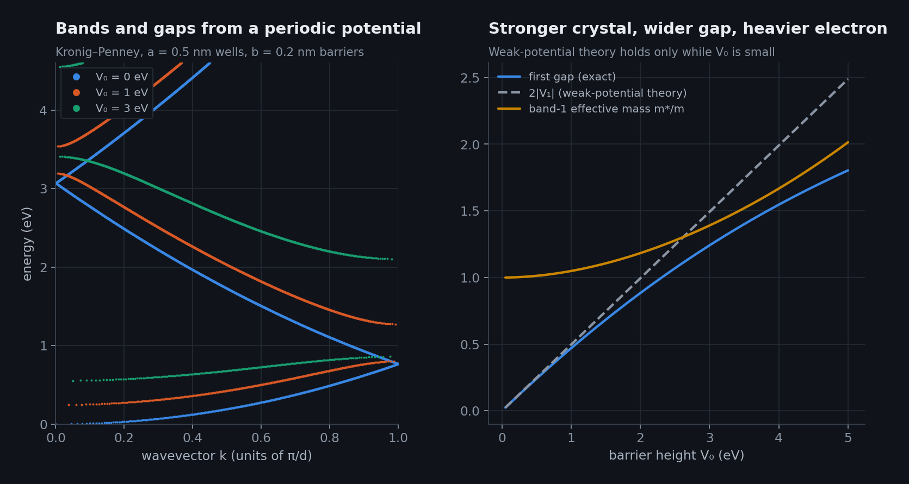<br><sub>Band gaps open where the crystal Bragg-reflects the electron wave.</sub></td>
</tr>
<tr>
<td>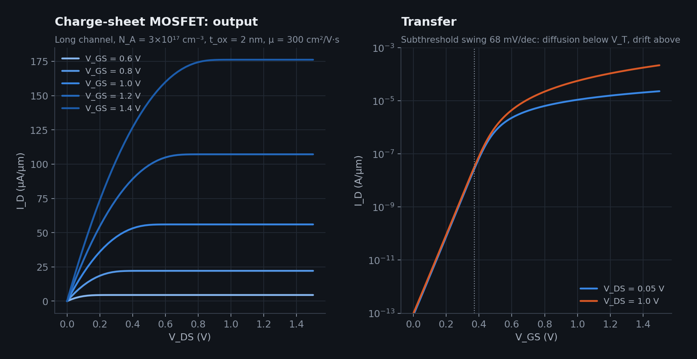<br><sub>The long-channel MOSFET from the exact surface potential: subthreshold, linear and saturation in one model.</sub></td>
<td>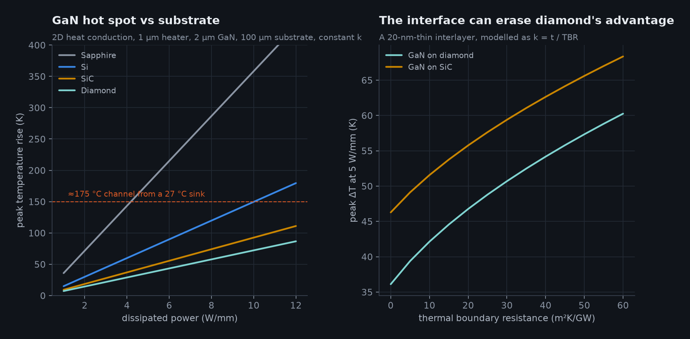<br><sub>2D heat conduction: the substrate, and the interface to it, set how hot a GaN amplifier runs.</sub></td>
</tr>
<tr>
<td colspan="2">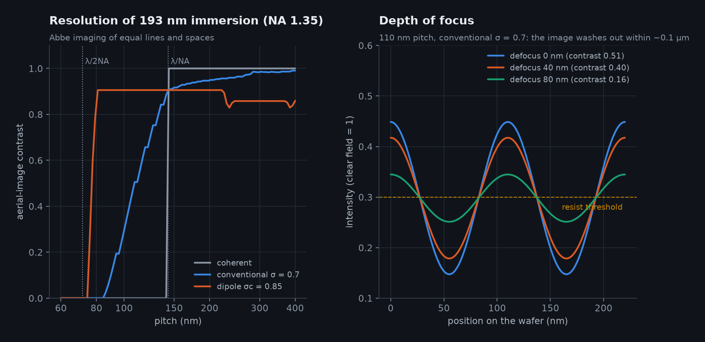<br><sub>Abbe imaging: coherent light stops at λ/NA, tilted light reaches λ/2NA, and defocus washes the image out.</sub></td>
</tr>
</table>

**New: Part VI, from transistor to circuit.** Three labs follow the transistor into a chip: the CMOS inverter built from the compact model, the ballistic limit on drive current, and the copper wires that now dominate delay.

<p align="center"></p>
<p align="center">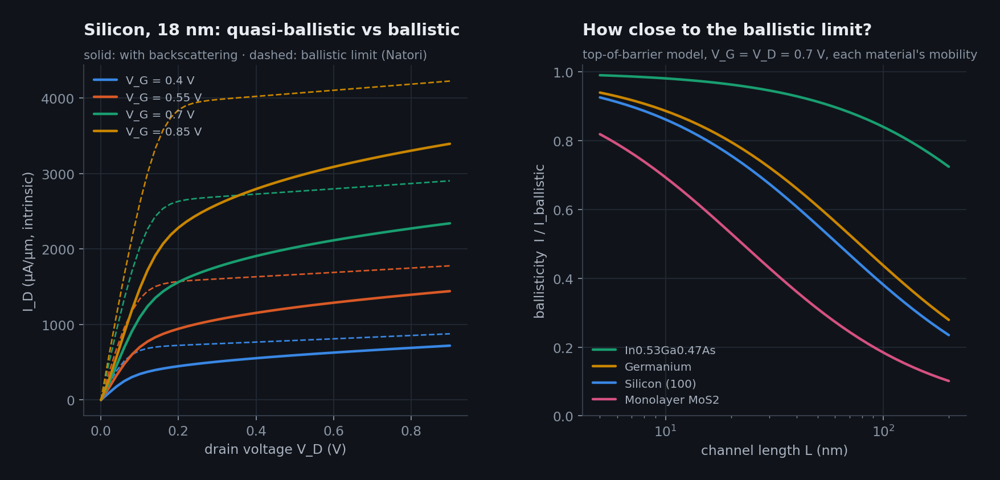</p>
<p align="center">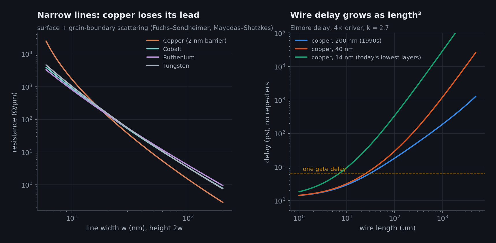</p>

## A history in cross-sections

<table>
<tr>
<td width="33%"><br><b>1947 · Point contact</b><br><sub>Two gold foils ~50 µm apart on germanium. Bardeen & Brattain.</sub></td>
<td width="33%"><br><b>1959 · Planar process & IC</b><br><sub>Oxide masks diffusion and stays on. Hoerni, Kilby, Noyce.</sub></td>
<td width="33%"><br><b>1968 · Self-aligned silicon gate</b><br><sub>Faggin & Klein; the Intel 4004's 10 µm pMOS.</sub></td>
</tr>
<tr>
<td><br><b>2003 · Strained silicon</b><br><sub>Embedded SiGe squeezes pMOS channels (90 nm).</sub></td>
<td><br><b>2007 · High-k metal gate</b><br><sub>HfO₂ replaces SiO₂ at 45 nm.</sub></td>
<td><br><b>2011 · FinFET</b><br><sub>Gate on three sides of a silicon fin (22 nm).</sub></td>
</tr>
<tr>
<td><br><b>2022–25 · Gate-all-around</b><br><sub>Samsung SF3E, TSMC N2, Intel 18A RibbonFET.</sub></td>
<td><br><b>2026 · IBM 7 Å nanostack</b><br><sub>Stacked, staggered nanosheet tiers (research).</sub></td>
<td><br><b>2026 · 0.42 nm AlOx on MoS₂</b><br><sub>NYCU + TSMC: ~1 nm EOT on a 2D channel.</sub></td>
</tr>
</table>

<sub>All 21 drawings: <code>python sim/make_figures.py</code> → <a href="figures/cross_sections">figures/cross_sections/</a>. The full era list with sources is in <a href="data/timeline.json">data/timeline.json</a>.</sub>

<details>
<summary><b>Physical chips next to their simulations</b></summary>

| Photograph (Wikimedia Commons) | Generated by this repo |
|---|---|
| <br><sub>Intel C4004, 1971 · 10 µm · 2,300 transistors · CC BY-SA 4.0</sub> | <br><sub>CMOS-equivalent inverter at λ = 5 µm (GDS in <code>figures/layout</code>)</sub> |
| <br><sub>MOS 6502 die, 1975 · 8 µm nMOS · Pauli Rautakorpi, CC BY 3.0</sub> | <br><sub>Silicon-gate nMOS cross-section</sub> |
| <br><sub>Intel 80486 DX2 · first x86 above 1 M transistors · Pauli Rautakorpi, CC BY 3.0</sub> | <br><sub>Inverter at λ = 0.75 µm</sub> |
| <br><sub>AMD Zen 2 core, TSMC N7 FinFET · Fritzchens Fritz, CC0</sub> | <br><sub>Gridded FinFET inverter, 51 nm CPP / 28 nm MMP</sub> |

<sub>Full attribution: <a href="CREDITS.md">CREDITS.md</a>. <code>python scripts/fetch_images.py</code> mirrors the photos locally and refreshes author and license from the Commons API.</sub>

</details>

<details>
<summary><b>Build one: the 14-step nanosheet process flow</b></summary>

<table>
<tr>
<td width="33%"><br><sub>2 · Si/SiGe superlattice</sub></td>
<td width="33%"><br><sub>11 · Release the nanosheets</sub></td>
<td width="33%"><br><sub>14 · Backside power</sub></td>
</tr>
</table>

</details>

<details>
<summary><b>Diamond, niche and exotic devices</b></summary>

<table>
<tr>
<td width="33%"><br><b>2024 · Vertical diamond MOSFET</b><br><sub>Waseda: 2D hole gas on trench walls, 0.7 A per device.</sub></td>
<td width="33%"><br><b>Surface transfer doping</b><br><sub>How H-terminated diamond conducts without bulk dopants.</sub></td>
<td width="33%"><br><b>NV centre</b><br><sub>A room-temperature spin in the diamond lattice.</sub></td>
</tr>
<tr>
<td><br><b>IGZO thin-film transistor</b><br><sub>Displays and the bendable Flex-RV CPU (2024).</sub></td>
<td><br><b>3D NAND string</b><br><sub>200+ stacked word lines around one channel.</sub></td>
<td><br><b>Tunnel FET</b><br><sub>Band-to-band tunnelling beats 60 mV/decade.</sub></td>
</tr>
</table>

<table>
<tr>
<td width="50%"><br><sub>Boron in diamond is ~0.5% ionized at room temperature; boron in silicon ~90–100%.</sub></td>
<td width="50%"><br><sub>Tunnel and negative-capacitance FETs versus the thermionic limit.</sub></td>
</tr>
</table>

</details>

## The data

<p align="center"></p>

<table>
<tr>
<td width="50%"><br><sub>Node labels kept shrinking after 2010; gate and metal pitches levelled off.</sub></td>
<td width="50%"><br><sub>Wrapping the gate (FinFET, GAA) or thinning the channel (MoS₂) steepens turn-off.</sub></td>
</tr>
<tr>
<td><br><sub>Output curves from the compact model, four eras.</sub></td>
<td><br><sub>Supply voltage and clock stall around 2005.</sub></td>
</tr>
<tr>
<td><br><sub>Why power electronics moved to SiC and GaN.</sub></td>
<td><br><sub>AlGaN/GaN polarization creates a 2DEG with no doping.</sub></td>
</tr>
</table>

### Beyond silicon

| Material | Gap (eV) | µₙ (cm²/V·s) | E꜀ (MV/cm) | k (W/cm·K) | Baliga FOM (× Si) | Where it wins |
|---|---|---|---|---|---|---|
| Si | 1.12 | 1,400 | 0.3 | 1.5 | 1 | logic, integration |
| GaAs | 1.42 | 8,500 | 0.4 | 0.55 | ~16 | RF HBT/pHEMT, optics |
| InP | 1.34 | 5,400 | 0.5 | 0.68 | ~19 | fastest HEMT/HBT, lasers |
| 4H-SiC | 3.26 | 900 | 2.5 | 3.7 | ~310 | EV traction, kV switches |
| GaN | 3.4 | 1,200 (2DEG ~2,000) | 3.3 | 1.3 | ~880 | chargers, data-center power, 5G/radar |
| β-Ga₂O₃ | 4.8 | 200 | 8 | 0.27 | ~2,300 | future kV power |
| Diamond | 5.47 | 2,200 | 10 | 22 | ~28,000 | heat, voltage, radiation, NV quantum |
| MoS₂ (1L) | 1.8 | 10–200 | — | — | — | 0.7 nm channels for 2D logic |

<sub>Representative 300 K values from <a href="data/materials.json">data/materials.json</a>; FOMs computed by <code>sim/transistor_sim/materials.py</code>. Details and caveats in <a href="docs/10-compound-semiconductors.md">Chapter 10</a> and <a href="docs/11-diamond-and-beyond.md">Chapter 11</a>.</sub>

## Chapters

<details open>
<summary><b>All 20 chapters</b>. Citations are written <code>[@key]</code>; each key resolves to <a href="REFERENCES.md">REFERENCES.md</a>.</summary>

1. [Origins: the point contact and the junction](docs/01-origins.md) — 1947–1954
2. [Oxide, the planar process and the integrated circuit](docs/02-planar-and-ic.md) — 1957–1961
3. [The MOSFET, CMOS and the silicon gate](docs/03-mosfet-and-cmos.md) — 1960–1971
4. [Moore, Dennard and the scaling era](docs/04-scaling-era.md) — 1965–2005
5. [Strained silicon and high-k metal gates](docs/05-strain-and-hkmg.md) — 2003–2011
6. [FinFET: the transistor stands up](docs/06-finfet.md) — 2011–2022
7. [Lithography: printing the pattern](docs/07-lithography.md)
8. [Gate-all-around, backside power and the ångström era](docs/08-gaa-and-angstrom-era.md) — 2022–2026
9. [Two-dimensional channels and the 0.42 nm interface](docs/09-2d-materials.md)
10. [Compound semiconductors: GaAs, InP, GaN, SiC, Ga₂O₃](docs/10-compound-semiconductors.md)
11. [Diamond, carbon nanotubes and beyond-CMOS](docs/11-diamond-and-beyond.md)
12. [How the simulations work](docs/12-simulation.md)
13. [Diamond electronics in depth](docs/13-diamond-electronics.md) — doping, transfer doping, kV MOSFETs, wafers, GaN-on-diamond, NV centres
14. [Niche and forgotten transistors](docs/14-niche-and-forgotten.md) — alloy junction, JFET, IGBT, IGZO/organic/flexible, flash & 3D NAND, FD-SOI, junctionless, VTFET
15. [Steep-slope and exotic switches](docs/15-steep-slope-and-exotic.md) — TFET, NC-FET/FeFET, single-electron, spin FET, memristor, vacuum, RSFQ
16. [How a 2 nm-class transistor is built](docs/16-process-flow.md) — 14-step GAA nanosheet flow, wafer to backside power
17. [Packaging and 3D integration](docs/17-packaging-and-3d.md) — CoWoS interposers, HBM4, hybrid bonding
18. [Glossary](docs/18-glossary.md)
19. [The Physics Lab: semiconductor physics you can run](docs/19-physics-lab.md) — what each of the fifteen simulations solves and leaves out
20. [How each transistor works: cross-sections and energy band diagrams](docs/20-how-transistors-work.md) — all 19 devices of the Device Atlas, with animations, band diagrams and heterojunctions

</details>

## Quick start

On Ubuntu or Windows Subsystem for Linux (WSL2). A browser download from Windows lands in the Windows Downloads folder, which WSL sees as `/mnt/c/Users/<you>/Downloads/`, not `~`:

```bash
ZIP=$(ls -t /mnt/c/Users/$USER/Downloads/transistor-odyssey*.zip | head -1) && echo "$ZIP"
mkdir -p ~/projects && cd ~/projects
[ -d transistor-odyssey ] && mv transistor-odyssey "transistor-odyssey.old.$(date +%s)"
unzip -q "$ZIP" && cd transistor-odyssey && bash scripts/setup_ubuntu.sh
```

`scripts/setup_ubuntu.sh` builds a private `.venv`, regenerates everything, runs the tests, creates `Normansrule/transistor-odyssey`, pushes over the `github-normansrule` SSH alias, enables GitHub Pages and starts the deploy. Override with `OWNER=… REPO=… SSH_HOST=…`, or `SKIP_GITHUB=1` to build locally only. It stops at the first error.

Day-to-day:

```bash
source .venv/bin/activate
make figures     # regenerate cross-sections, GDS layouts, charts, site data
make test        # physics + data checks (+ JS parity if Node.js is installed)
make serve       # website at http://localhost:8000
make spice       # optional: needs `sudo apt install ngspice`
```

Open a generated layout in KLayout: `klayout figures/layout/inverter_22_nm_FinFET.gds`.

## Repository layout

```
transistor-odyssey/
├── site/                  GitHub Pages website: index.html (history) · devices.html (Device Atlas) · physics.html (Physics Lab), css/, js/, vendor/ (three.js, GSAP, KaTeX, fonts)
│   ├── js/physics/        browser twins of the Python physics, checked by tests/js_parity.mjs
│   └── js/devices/        Device Atlas: band models, scenes, animated renderers, comparison, quiz, junction builder
├── docs/                  20 chapters, citations as [@key]
├── sim/
│   ├── transistor_sim/    mosfet · hemt · bjt · dopants · steep · process · materials · scaling · crosssection · layout · bandatlas
│   │   └── physics/       carriers · bandstructure · junction · hetero · moscap · chargesheet · tunnel · qwell · poisson2d · montecarlo · thermal · litho · crystal · inverter · ballistic · interconnect
│   ├── spice/             ngspice netlists
│   └── make_figures.py    renders everything in figures/
├── figures/               generated charts, bands/ (per-device band diagrams), anim/ (GIFs), screens/, cross_sections/, layout/ (SVG + GDS)
├── data/                  devices · band_alignment · chips · nodes · materials · timeline · niche · diamond · dopants · process · images · references
├── scripts/               setup_ubuntu.sh · build_data.py (site bundle, REFERENCES.md, CREDITS.md) · fetch_images.py · banner.html + render_banner.py
├── tests/                 pytest suite
├── REFERENCES.md          262 sources, generated
└── CREDITS.md             photo attribution, generated
```

**What is in it:** 19 devices and 21 band alignments · 33 landmark chips · 25 process nodes · 12 semiconductors · 20 structural eras · 31 niche devices · 16 diamond milestones · 9 dopants · 14 process steps · 7 crystal structures ([data/](data)) · 43 labelled cross-sections, 14 process-flow drawings, 6 GDS mask layouts, 30 charts, 19 band-diagram figures and 11 animations ([figures/](figures)) · ngspice netlists ([sim/spice](sim/spice)) · 132 tests ([tests/](tests)).

## Accuracy policy

* Transistor counts, dates and process facts come from manufacturer releases, peer-reviewed papers or the Computer History Museum; each record lists its `refs`.
* Estimates are labelled "est." or "approx." in the data and on the site.
* Compact-model presets are **educational approximations** tuned to published anchors (tests state which). They are not foundry models.
* Post-2025 items (N2/18A volume production, A16, IBM's nanostack, the NYCU/TSMC interface) are cited to the announcing organization plus independent coverage.
* Found an error? Open an issue with a source; see [CONTRIBUTING.md](CONTRIBUTING.md).
* The Device Atlas band diagrams say which parts are **solved** (MOS electrostatics, the HEMT quantum well) and which are **schematic** shapes tuned to published threshold, swing and DIBL values.
* The heterojunction solver uses Boltzmann statistics and Anderson's rule; it leaves out interface dipoles and traps, polarization, quantization and degeneracy, and the page says so.

## Credits and inspiration

Photographs: Wikimedia Commons contributors including Pauli Rautakorpi and Fritzchens Fritz ([CREDITS.md](CREDITS.md)). Libraries: [three.js](https://threejs.org/) (MIT) and [GSAP](https://gsap.com/) (standard "no charge" license), vendored in `site/vendor/`. Visual direction drew on [react-bits](https://github.com/DavidHDev/react-bits), [magicui](https://github.com/magicuidesign/magicui), [Animate UI](https://animate-ui.com/), [motion-primitives](https://github.com/ibelick/motion-primitives), [WebGL-Fluid-Simulation](https://github.com/PavelDoGreat/WebGL-Fluid-Simulation), [folio-2019](https://github.com/brunosimon/folio-2019), [Remotion](https://github.com/remotion-dev/remotion), [llm-viz](https://github.com/bbycroft/llm-viz), [Transformer Explainer](https://github.com/poloclub/transformer-explainer), [gods-eye-view](https://github.com/bilawalsidhu/gods-eye-view) and [worldmonitor](https://github.com/koala73/worldmonitor). No code was copied from those projects; the fluid solver is an original implementation of Stam's *Stable Fluids*.

## License

Code: [MIT](LICENSE). Text, data and generated figures: [CC BY 4.0](LICENSE). Photographs keep their original Commons licenses.

## Cite

```bibtex
@misc{transistor_odyssey_2026,
  title  = {Transistor Odyssey: an open, simulated history of transistor structure and materials, 1947--2026},
  author = {Norman, Aleksander},
  year   = {2026},
  url    = {https://github.com/Normansrule/transistor-odyssey}
}
```
