<p align="center">
  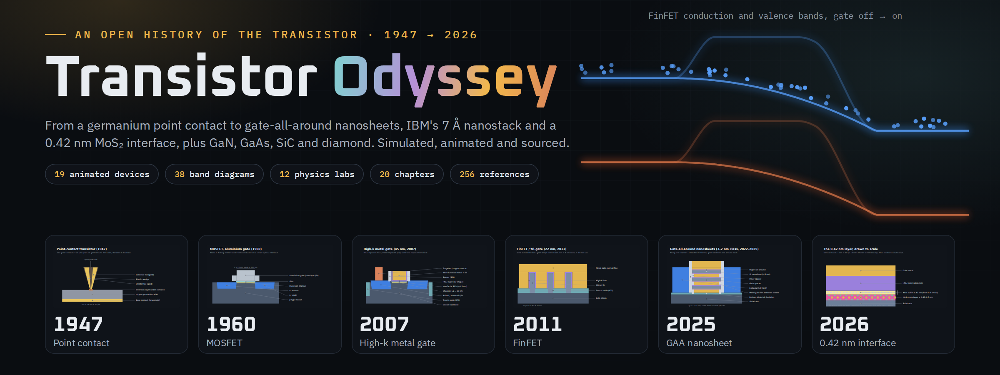
</p>

<p align="center">
  <a href="https://normansrule.github.io/transistor-odyssey/"></a>
  <a href="REFERENCES.md"></a>
  <a href="docs/README.md"></a>
  <a href="https://normansrule.github.io/transistor-odyssey/physics.html"></a>
  <a href=".github/workflows/ci.yml"></a>
  <a href="LICENSE"></a>
</p>

<p align="center"><b>How the transistor changed shape, from a germanium point contact to gate-all-around nanosheets, IBM's 7 Å nanostack and one-molecule-thick MoS₂ — and what could replace silicon.</b><br>
Every number traces to a source. Every picture on the "simulation" side is generated by code in this repository.</p>

---

> [!IMPORTANT]
> **About "0.42 nm".** No foundry manufactures a 0.42 nm (or 0.7 nm) process. As of September 2026 the most advanced production nodes are 2 nm-class (TSMC N2 and Intel 18A, both in volume since Q4 2025), with TSMC A16 ramping. **0.7 nm** is IBM's *research* node announced on 25 June 2026. **0.42 nm** is the measured thickness of an aluminium-oxide interface layer in a 2026 NYCU + TSMC monolayer-MoS₂ transistor whose channel is ~100 nm long. This repository explains all three and why node names stopped being lengths. See [Chapter 8](docs/08-gaa-and-angstrom-era.md) and [Chapter 9](docs/09-2d-materials.md).

## What's inside

| | |
|---|---|
| 🌐 **[Interactive website](site/)** | WebGL fluid hero · GSAP scroll-pinned timeline · three.js explorer that explodes seven architectures (incl. an H-terminated diamond FET) and animates carrier flow · live device lab · Moore's-law chart · die-photo vs generated-drawing slider · materials ranking · **Diamond lab** (dopant ionization simulator + milestones) · **Fab stepper** (14-step animated nanosheet process flow) · **Niche atlas** of 31 forgotten, exotic and packaging structures · lithography calculator · searchable bibliography |
| 🔬 **[Physics Lab](https://normansrule.github.io/transistor-odyssey/physics.html)** | Seven live simulations with guided experiments and typeset equations: **bands & carriers** in six materials · **pn junction** with animated depletion region · exact **MOS capacitor** band bending and C–V · **quantum tunnelling** by transfer matrix (resonant double barriers, gate-oxide leakage) · a live **2D Poisson solver** showing DIBL, single vs double gate · **ensemble Monte Carlo** of hot electrons (velocity saturation and overshoot) · **3D crystal lattices** (diamond, zincblende, wurtzite, 4H-SiC, MoS₂). Every browser model is checked in CI against its Python twin. |
| 📚 **[19 chapters](docs/README.md)** | 1947 point contact → planar → MOSFET/CMOS → scaling → strain/HKMG → FinFET → lithography → GAA/backside power/ångström era → 2D MoS₂ → GaAs/GaN/SiC/Ga₂O₃ → diamond/CNT/beyond-CMOS → simulation methods → **diamond electronics in depth** → **niche & forgotten transistors** → **steep-slope & exotic switches** → **how a 2 nm transistor is built** → **packaging & 3D integration** → glossary → **the Physics Lab explained** |
| 🧮 **[Simulation package](sim/transistor_sim)** | Compact MOSFET model with 8 era presets · AlGaN/GaN polarization 2DEG model · BJT Gummel model · dopant-ionization model (why diamond is hard to dope) · tunnel-FET and negative-capacitance steep-slope models · Baliga/Johnson figures of merit · Moore/Dennard scaling · **`physics/`**: carrier statistics, pn junction, exact MOS capacitor, transfer-matrix tunnelling, 2D Poisson (SOR), ensemble Monte Carlo, crystal generator |
| 🖼️ **Generated drawings** | [43 labelled cross-sections](figures/cross_sections) · [14-step process flow](figures/process) · [6 GDS mask layouts](figures/layout) (open in KLayout/Magic) · [19 charts](figures) |
| ⚡ **[SPICE netlists](sim/spice)** | ngspice inverters (1.5 µm, 180 nm), a 5-stage ring oscillator and a behavioural GaN HEMT |
| 🗂️ **[Open data](data/)** | 33 landmark chips · 25 process nodes · 12 semiconductors · 20 structural eras · 31 niche devices · 16 diamond milestones · 9 dopants · 14 process steps · 7 crystal structures · 245 references |
| ✅ **[Tests](tests/)** | 70 checks tying model output to published numbers or closed forms, every citation key to the bibliography, and the browser physics to the Python reference (`tests/js_parity.mjs`) |

## Twenty shapes of one switch

<table>
<tr>
<td width="33%">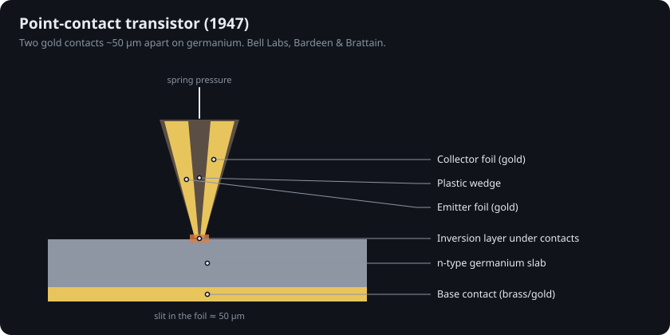<br><b>1947 · Point contact</b><br><sub>Two gold foils ~50 µm apart on germanium. Bardeen & Brattain.</sub></td>
<td width="33%"><br><b>1959 · Planar process & IC</b><br><sub>Oxide masks diffusion and stays on. Hoerni, Kilby, Noyce.</sub></td>
<td width="33%">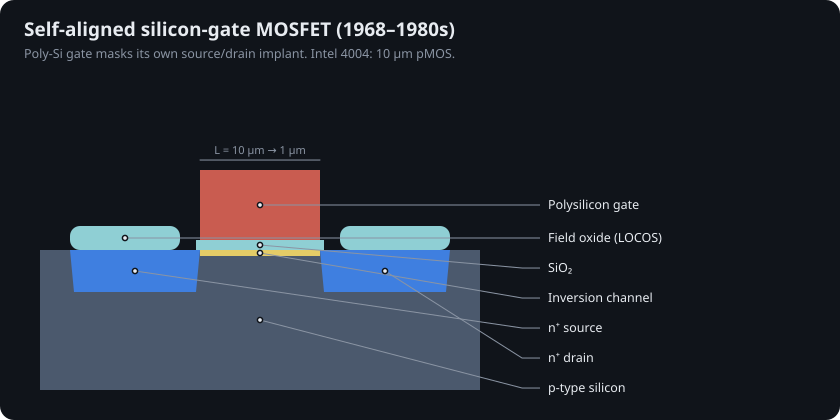<br><b>1968 · Self-aligned silicon gate</b><br><sub>Faggin & Klein; the Intel 4004's 10 µm pMOS.</sub></td>
</tr>
<tr>
<td>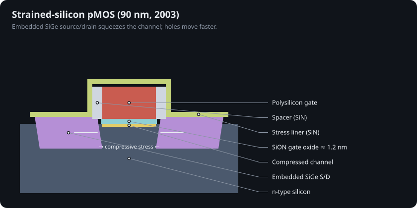<br><b>2003 · Strained silicon</b><br><sub>Embedded SiGe squeezes pMOS channels (90 nm).</sub></td>
<td>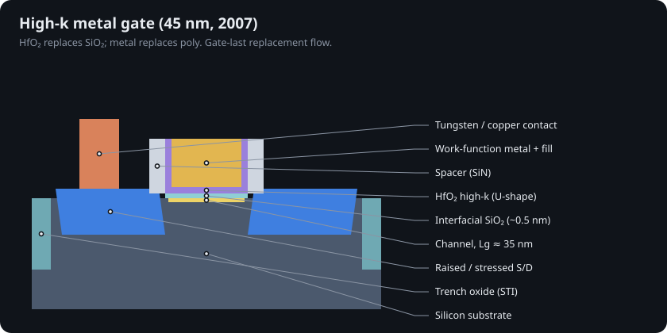<br><b>2007 · High-k metal gate</b><br><sub>HfO₂ replaces SiO₂ at 45 nm.</sub></td>
<td>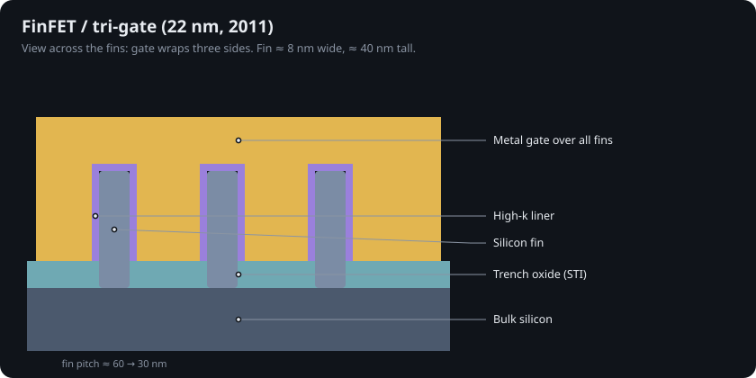<br><b>2011 · FinFET</b><br><sub>Gate on three sides of a silicon fin (22 nm).</sub></td>
</tr>
<tr>
<td>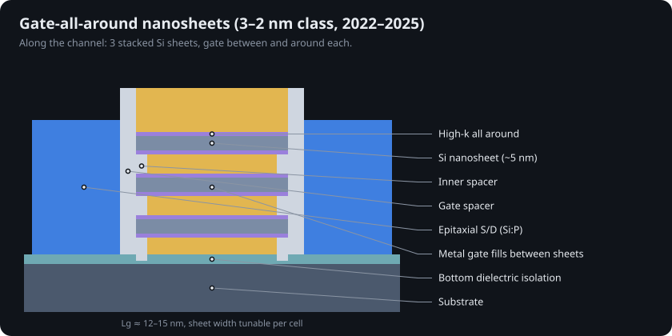<br><b>2022–25 · Gate-all-around</b><br><sub>Samsung SF3E, TSMC N2, Intel 18A RibbonFET.</sub></td>
<td>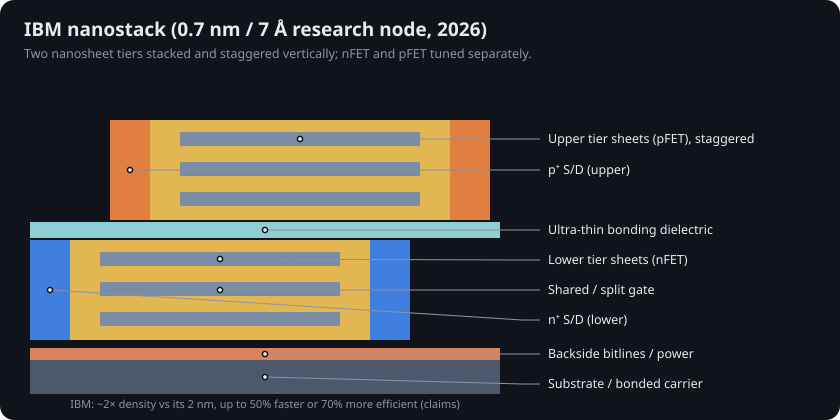<br><b>2026 · IBM 7 Å nanostack</b><br><sub>Stacked, staggered nanosheet tiers (research).</sub></td>
<td>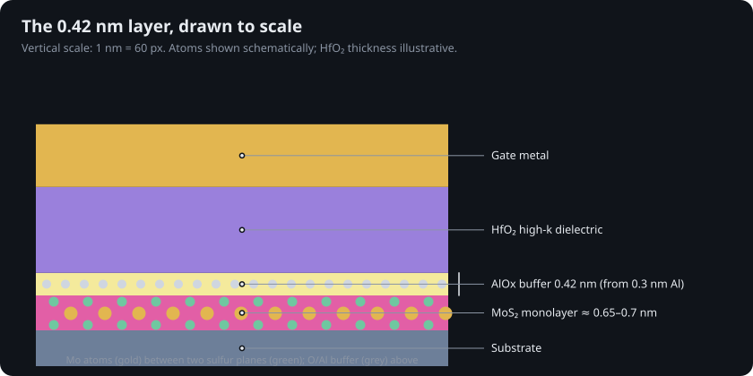<br><b>2026 · 0.42 nm AlOx on MoS₂</b><br><sub>NYCU + TSMC: ~1 nm EOT on a 2D channel.</sub></td>
</tr>
</table>

<sub>All 21 drawings: <code>python sim/make_figures.py</code> → <a href="figures/cross_sections">figures/cross_sections/</a>. The full era list with sources is in <a href="data/timeline.json">data/timeline.json</a>.</sub>

## Physical chips next to their simulations

| Photograph (Wikimedia Commons) | Generated by this repo |
|---|---|
| <br><sub>Intel C4004, 1971 · 10 µm · 2,300 transistors · CC BY-SA 4.0</sub> | 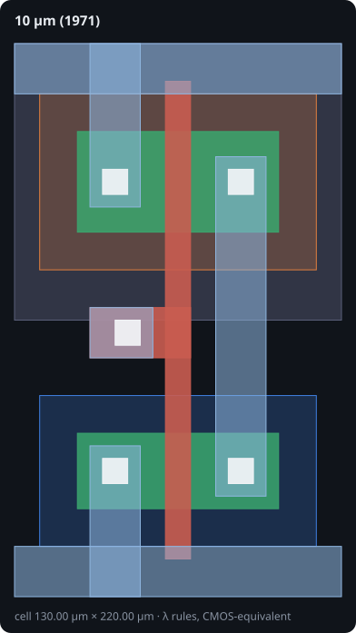<br><sub>CMOS-equivalent inverter at λ = 5 µm (GDS in <code>figures/layout</code>)</sub> |
| <br><sub>MOS 6502 die, 1975 · 8 µm nMOS · Pauli Rautakorpi, CC BY 3.0</sub> | <br><sub>Silicon-gate nMOS cross-section</sub> |
| <br><sub>Intel 80486 DX2 · first x86 above 1 M transistors · Pauli Rautakorpi, CC BY 3.0</sub> | 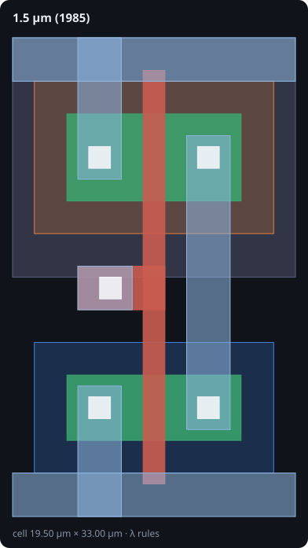<br><sub>Inverter at λ = 0.75 µm</sub> |
| <br><sub>AMD Zen 2 core, TSMC N7 FinFET · Fritzchens Fritz, CC0</sub> | 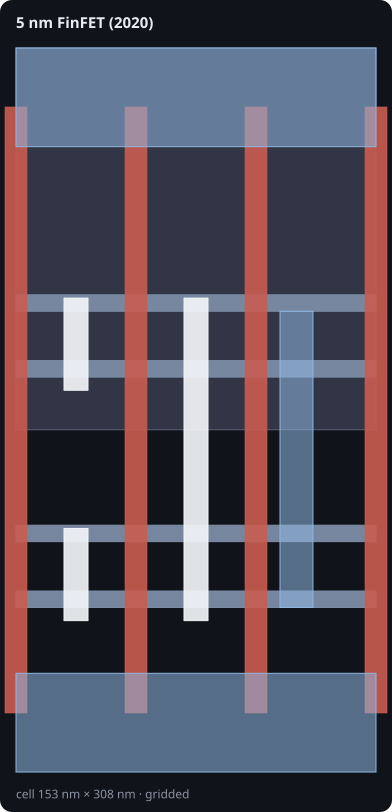<br><sub>Gridded FinFET inverter, 51 nm CPP / 28 nm MMP</sub> |

<sub>Full attribution: <a href="CREDITS.md">CREDITS.md</a>. <code>python scripts/fetch_images.py</code> mirrors the photos locally and refreshes author and license from the Commons API.</sub>

## The data, charted

<p align="center">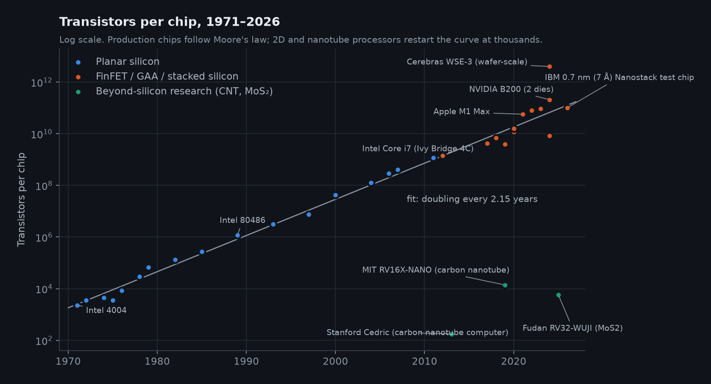</p>

<table>
<tr>
<td width="50%">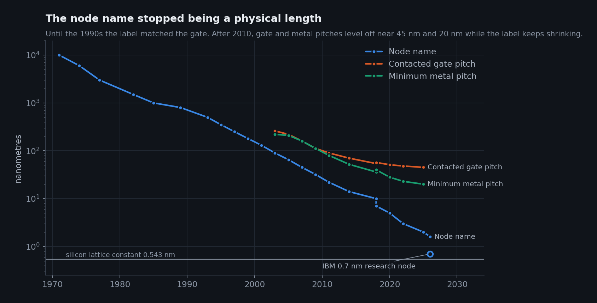<br><sub>Node labels kept shrinking after 2010; gate and metal pitches levelled off.</sub></td>
<td width="50%">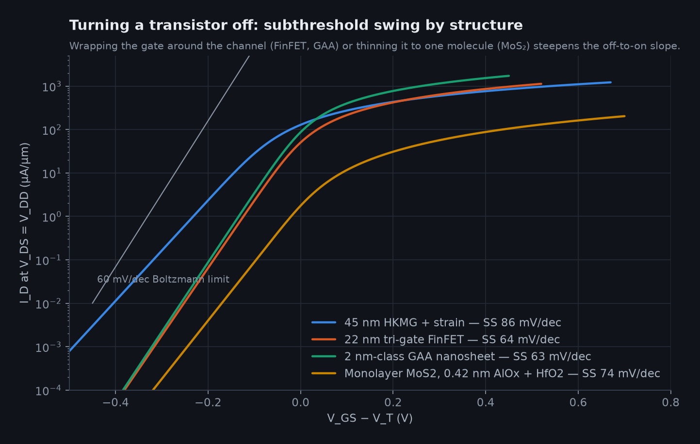<br><sub>Wrapping the gate (FinFET, GAA) or thinning the channel (MoS₂) steepens turn-off.</sub></td>
</tr>
<tr>
<td>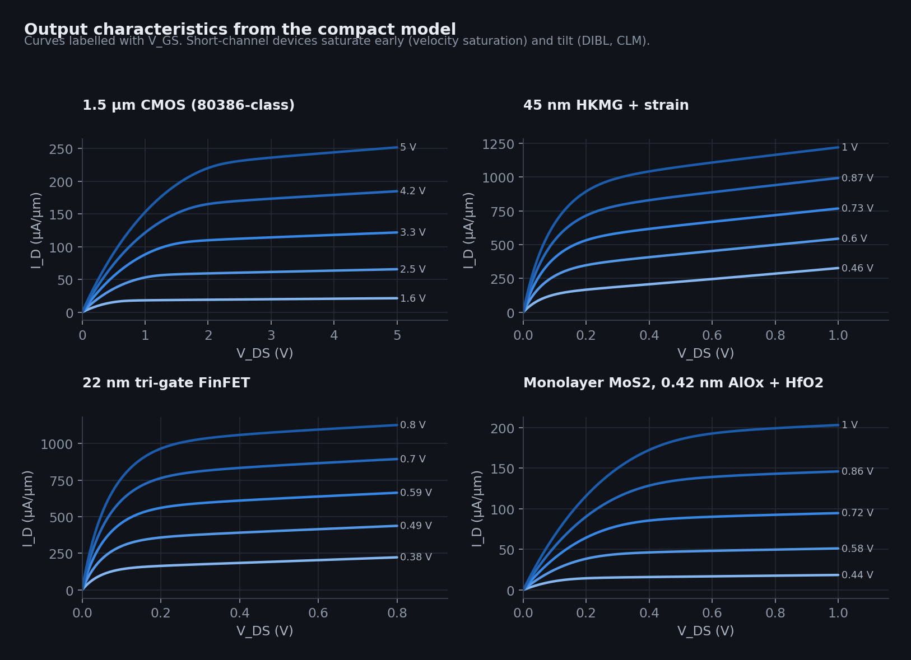<br><sub>Output curves from the compact model, four eras.</sub></td>
<td>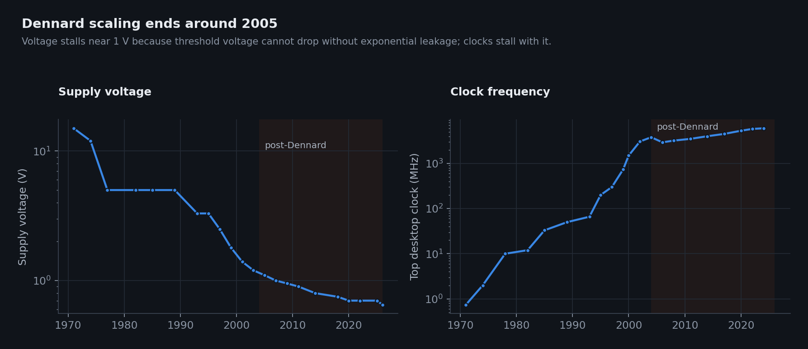<br><sub>Supply voltage and clock stall around 2005.</sub></td>
</tr>
<tr>
<td>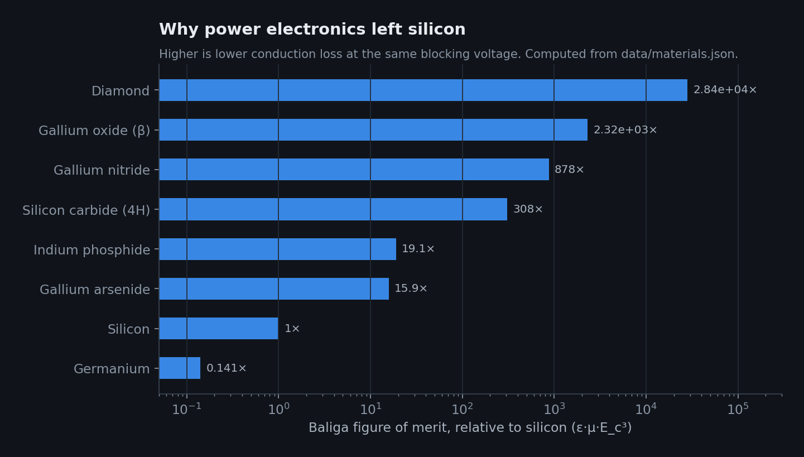<br><sub>Why power electronics moved to SiC and GaN.</sub></td>
<td>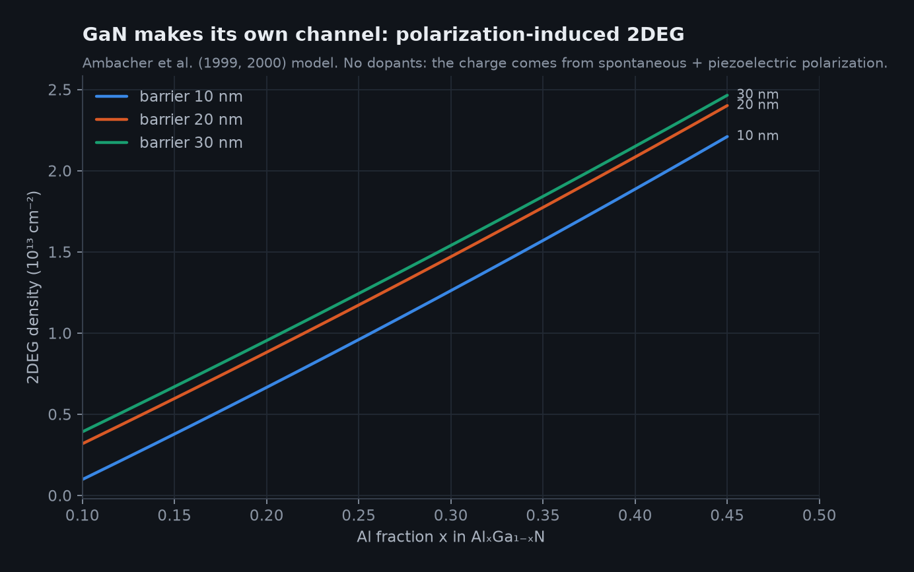<br><sub>AlGaN/GaN polarization creates a 2DEG with no doping.</sub></td>
</tr>
</table>

## Beyond silicon

| Material | Gap (eV) | µₙ (cm²/V·s) | E꜀ (MV/cm) | k (W/cm·K) | Baliga FOM (× Si) | Where it wins |
|---|---|---|---|---|---|---|
| Si | 1.12 | 1,400 | 0.3 | 1.5 | 1 | logic, integration |
| GaAs | 1.42 | 8,500 | 0.4 | 0.55 | ~16 | RF HBT/pHEMT, optics |
| InP | 1.34 | 5,400 | 0.5 | 0.68 | ~19 | fastest HEMT/HBT, lasers |
| 4H-SiC | 3.26 | 900 | 2.5 | 3.7 | ~310 | EV traction, kV switches |
| GaN | 3.4 | 1,200 (2DEG ~2,000) | 3.3 | 1.3 | ~880 | chargers, data-center power, 5G/radar |
| β-Ga₂O₃ | 4.8 | 200 | 8 | 0.27 | ~2,300 | future kV power |
| Diamond | 5.47 | 2,200 | 10 | 22 | ~28,000 | heat, voltage, radiation, NV quantum |
| MoS₂ (1L) | 1.8 | 10–200 | — | — | — | 0.7 nm channels for 2D logic |

<sub>Representative 300 K values from <a href="data/materials.json">data/materials.json</a>; FOMs computed by <code>sim/transistor_sim/materials.py</code>. Details and caveats in <a href="docs/10-compound-semiconductors.md">Chapter 10</a> and <a href="docs/11-diamond-and-beyond.md">Chapter 11</a>.</sub>

## Build one: the 14-step process flow

<table>
<tr>
<td width="33%">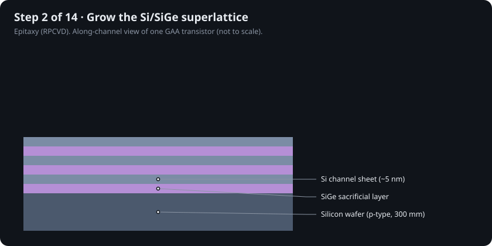<br><sub>2 · Si/SiGe superlattice</sub></td>
<td width="33%">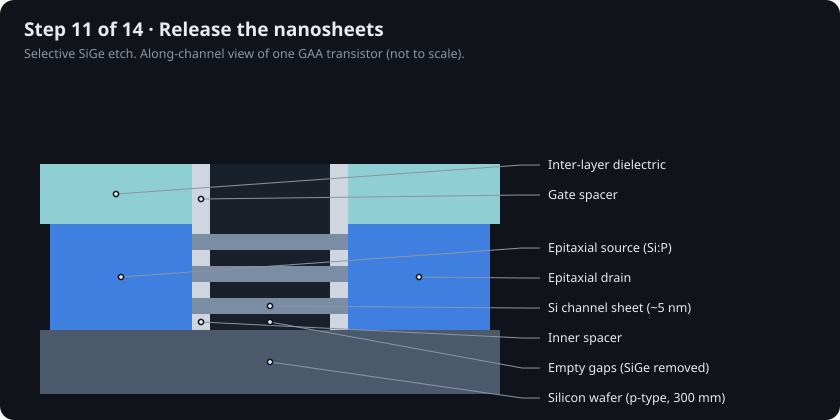<br><sub>11 · Release the nanosheets</sub></td>
<td width="33%">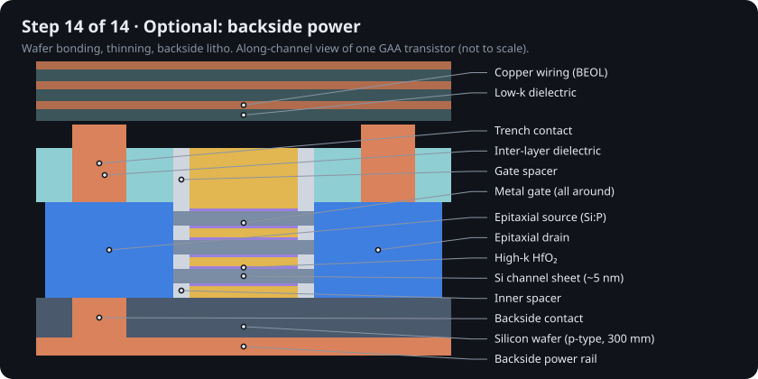<br><sub>14 · Backside power</sub></td>
</tr>
</table>

## Diamond, niche and exotic devices

<table>
<tr>
<td width="33%">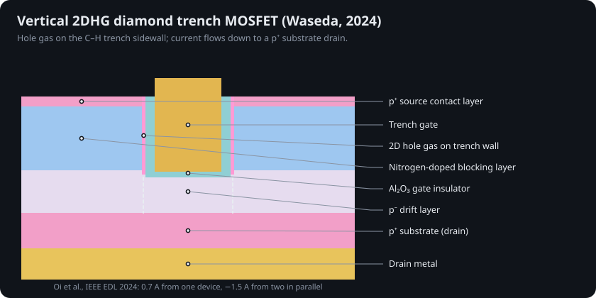<br><b>2024 · Vertical diamond MOSFET</b><br><sub>Waseda: 2D hole gas on trench walls, 0.7 A per device.</sub></td>
<td width="33%">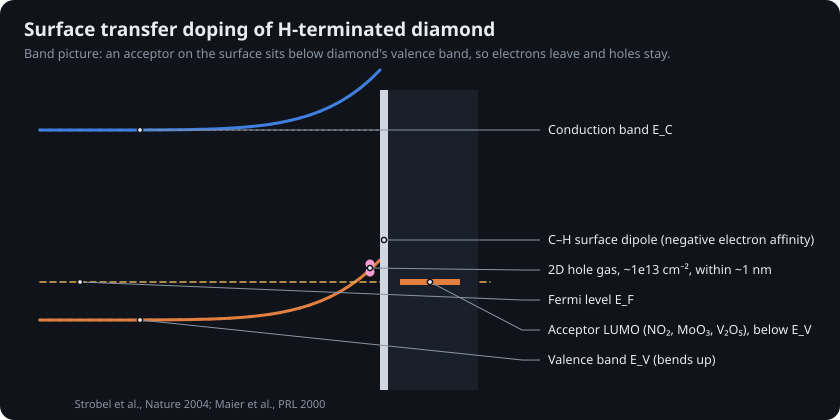<br><b>Surface transfer doping</b><br><sub>How H-terminated diamond conducts without bulk dopants.</sub></td>
<td width="33%">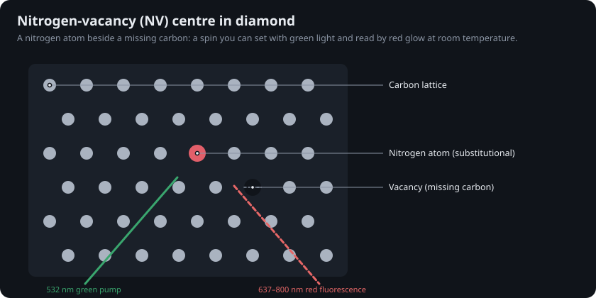<br><b>NV centre</b><br><sub>A room-temperature spin in the diamond lattice.</sub></td>
</tr>
<tr>
<td>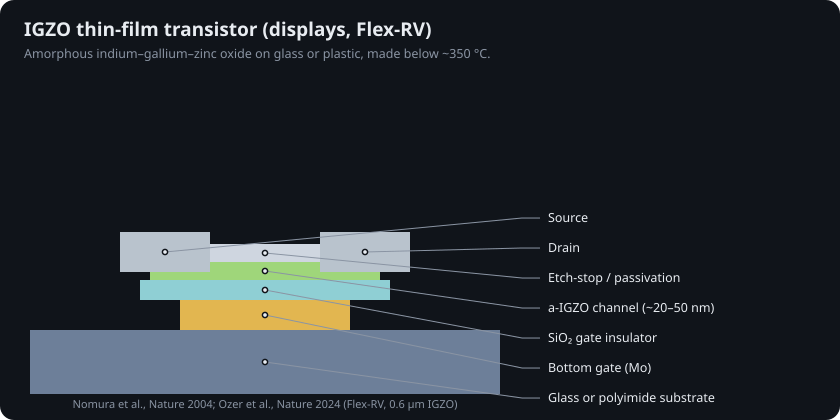<br><b>IGZO thin-film transistor</b><br><sub>Displays and the bendable Flex-RV CPU (2024).</sub></td>
<td>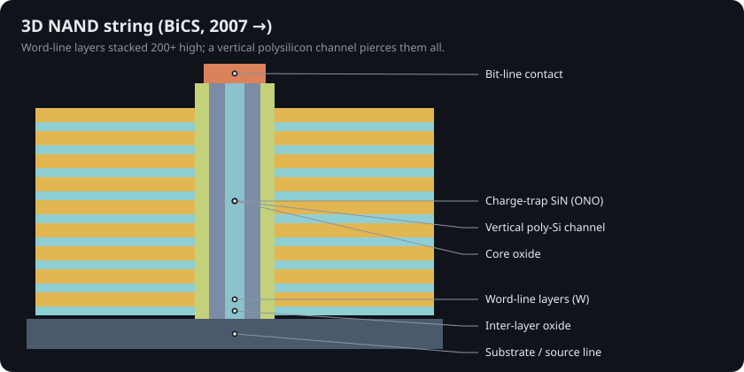<br><b>3D NAND string</b><br><sub>200+ stacked word lines around one channel.</sub></td>
<td>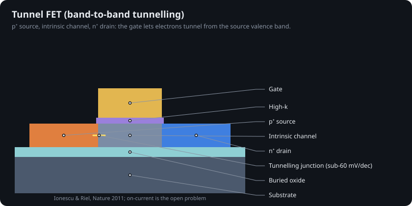<br><b>Tunnel FET</b><br><sub>Band-to-band tunnelling beats 60 mV/decade.</sub></td>
</tr>
</table>

<table>
<tr>
<td width="50%">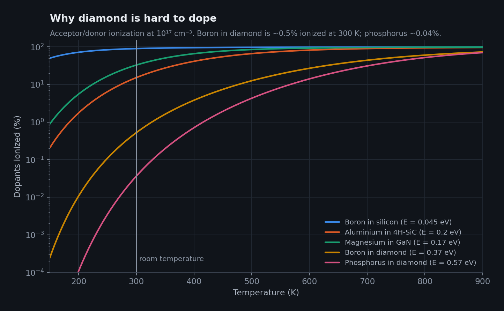<br><sub>Boron in diamond is ~0.5% ionized at room temperature; boron in silicon ~90–100%.</sub></td>
<td width="50%">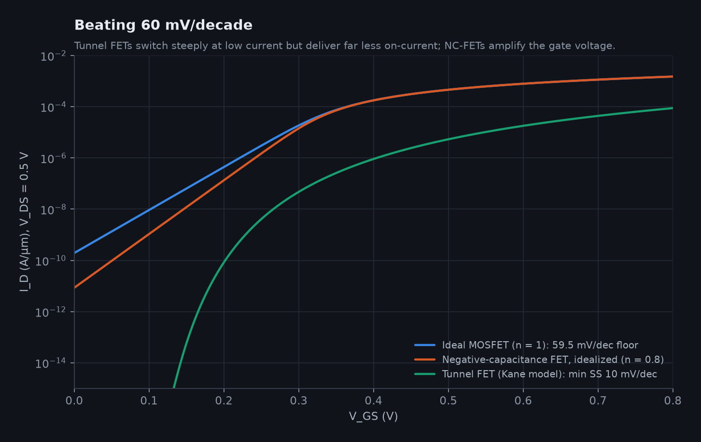<br><sub>Tunnel and negative-capacitance FETs versus the thermionic limit.</sub></td>
</tr>
</table>

## Physics Lab: the equations, live

The [Physics Lab](https://normansrule.github.io/transistor-odyssey/physics.html) page turns the semiconductor physics behind the history into seven experiments you can run. Each lab has sliders, guided "try this" experiments, the equations typeset with KaTeX, and a note on why it matters for transistors. The same models render these figures:

<table>
<tr>
<td width="50%"><br><sub>A 2D Poisson solve shows the drain lowering the source barrier, and a second gate cutting DIBL several-fold: the case for the FinFET.</sub></td>
<td width="50%"><br><sub>Transfer-matrix tunnelling: SiO₂ leaks ~10× more per 2 Å thinner; HfO₂ at the same EOT leaks orders of magnitude less.</sub></td>
</tr>
<tr>
<td><br><sub>Ensemble Monte Carlo reproduces silicon's measured mobility and ~10⁷ cm/s saturation velocity.</sub></td>
<td><br><sub>Exact MOS-capacitor C–V at three oxide thicknesses, low and high frequency.</sub></td>
</tr>
<tr>
<td><br><sub>Charge, field and band bending across an abrupt junction.</sub></td>
<td><br><sub>Why wide-gap semiconductors survive heat.</sub></td>
</tr>
</table>

## Chapters

1. [Origins: the point contact and the junction](docs/01-origins.md) — 1947–1954
2. [Oxide, the planar process and the integrated circuit](docs/02-planar-and-ic.md) — 1957–1961
3. [The MOSFET, CMOS and the silicon gate](docs/03-mosfet-and-cmos.md) — 1960–1971
4. [Moore, Dennard and the scaling era](docs/04-scaling-era.md) — 1965–2005
5. [Strained silicon and high-k metal gates](docs/05-strain-and-hkmg.md) — 2003–2011
6. [FinFET: the transistor stands up](docs/06-finfet.md) — 2011–2022
7. [Lithography: printing the pattern](docs/07-lithography.md)
8. [Gate-all-around, backside power and the ångström era](docs/08-gaa-and-angstrom-era.md) — 2022–2026
9. [Two-dimensional channels and the 0.42 nm interface](docs/09-2d-materials.md)
10. [Compound semiconductors: GaAs, InP, GaN, SiC, Ga₂O₃](docs/10-compound-semiconductors.md)
11. [Diamond, carbon nanotubes and beyond-CMOS](docs/11-diamond-and-beyond.md)
12. [How the simulations work](docs/12-simulation.md)
13. [Diamond electronics in depth](docs/13-diamond-electronics.md) — doping, transfer doping, kV MOSFETs, wafers, GaN-on-diamond, NV centres
14. [Niche and forgotten transistors](docs/14-niche-and-forgotten.md) — alloy junction, JFET, IGBT, IGZO/organic/flexible, flash & 3D NAND, FD-SOI, junctionless, VTFET
15. [Steep-slope and exotic switches](docs/15-steep-slope-and-exotic.md) — TFET, NC-FET/FeFET, single-electron, spin FET, memristor, vacuum, RSFQ
16. [How a 2 nm-class transistor is built](docs/16-process-flow.md) — 14-step GAA nanosheet flow, wafer to backside power
17. [Packaging and 3D integration](docs/17-packaging-and-3d.md) — CoWoS interposers, HBM4, hybrid bonding
18. [Glossary](docs/18-glossary.md)
19. [The Physics Lab: semiconductor physics you can run](docs/19-physics-lab.md) — what each of the seven simulations solves and leaves out

## Quick start (Ubuntu / WSL2)

A browser download from Windows lands in the Windows Downloads folder, which WSL sees as `/mnt/c/Users/<you>/Downloads/`, not `~`:

```bash
ZIP=$(ls -t /mnt/c/Users/$USER/Downloads/transistor-odyssey*.zip | head -1) && echo "$ZIP"
mkdir -p ~/projects && cd ~/projects
[ -d transistor-odyssey ] && mv transistor-odyssey "transistor-odyssey.old.$(date +%s)"
unzip -q "$ZIP" && cd transistor-odyssey && bash scripts/setup_ubuntu.sh
```

`scripts/setup_ubuntu.sh` builds a private `.venv`, regenerates everything, runs the tests, creates `Normansrule/transistor-odyssey`, pushes over the `github-normansrule` SSH alias, enables GitHub Pages and starts the deploy. Override with `OWNER=… REPO=… SSH_HOST=…`, or `SKIP_GITHUB=1` to build locally only. It stops at the first error.

Day-to-day:

```bash
source .venv/bin/activate
make figures     # regenerate cross-sections, GDS layouts, charts, site data
make test        # physics + data checks (+ JS parity if Node.js is installed)
make serve       # website at http://localhost:8000
make spice       # optional: needs `sudo apt install ngspice`
```

Open a generated layout in KLayout: `klayout figures/layout/inverter_22_nm_FinFET.gds`.

## Repository layout

```
transistor-odyssey/
├── site/                  GitHub Pages website: index.html (history) + physics.html (Physics Lab), css/, js/, vendor/ (three.js, GSAP, KaTeX)
│   └── js/physics/        browser twins of the Python physics, checked by tests/js_parity.mjs
├── docs/                  19 chapters, citations as [@key]
├── sim/
│   ├── transistor_sim/    mosfet · hemt · bjt · dopants · steep · process · materials · scaling · crosssection · layout
│   │   └── physics/       carriers · junction · moscap · tunnel · poisson2d · montecarlo · crystal
│   ├── spice/             ngspice netlists
│   └── make_figures.py    renders everything in figures/
├── figures/               generated PNG/SVG charts, cross_sections/, layout/ (SVG + GDS)
├── data/                  chips · nodes · materials · timeline · niche · diamond · dopants · process · images · references
├── scripts/               setup_ubuntu.sh · build_data.py (site bundle, REFERENCES.md, CREDITS.md) · fetch_images.py
├── tests/                 pytest suite
├── REFERENCES.md          245 sources, generated
└── CREDITS.md             photo attribution, generated
```

## Accuracy policy

* Transistor counts, dates and process facts come from manufacturer releases, peer-reviewed papers or the Computer History Museum; each record lists its `refs`.
* Estimates are labelled "est." or "approx." in the data and on the site.
* Compact-model presets are **educational approximations** tuned to published anchors (tests state which). They are not foundry models.
* Post-2025 items (N2/18A volume production, A16, IBM's nanostack, the NYCU/TSMC interface) are cited to the announcing organization plus independent coverage.
* Found an error? Open an issue with a source; see [CONTRIBUTING.md](CONTRIBUTING.md).

## Credits and inspiration

Photographs: Wikimedia Commons contributors including Pauli Rautakorpi and Fritzchens Fritz ([CREDITS.md](CREDITS.md)). Libraries: [three.js](https://threejs.org/) (MIT) and [GSAP](https://gsap.com/) (standard "no charge" license), vendored in `site/vendor/`. Visual direction drew on [react-bits](https://github.com/DavidHDev/react-bits), [magicui](https://github.com/magicuidesign/magicui), [Animate UI](https://animate-ui.com/), [motion-primitives](https://github.com/ibelick/motion-primitives), [WebGL-Fluid-Simulation](https://github.com/PavelDoGreat/WebGL-Fluid-Simulation), [folio-2019](https://github.com/brunosimon/folio-2019), [Remotion](https://github.com/remotion-dev/remotion), [llm-viz](https://github.com/bbycroft/llm-viz), [Transformer Explainer](https://github.com/poloclub/transformer-explainer), [gods-eye-view](https://github.com/bilawalsidhu/gods-eye-view) and [worldmonitor](https://github.com/koala73/worldmonitor). No code was copied from those projects; the fluid solver is an original implementation of Stam's *Stable Fluids*.

## License

Code: [MIT](LICENSE). Text, data and generated figures: [CC BY 4.0](LICENSE). Photographs keep their original Commons licenses.

## Cite

```bibtex
@misc{transistor_odyssey_2026,
  title  = {Transistor Odyssey: an open, simulated history of transistor structure and materials, 1947--2026},
  author = {Norman, Aleksander},
  year   = {2026},
  url    = {https://github.com/Normansrule/transistor-odyssey}
}
```
