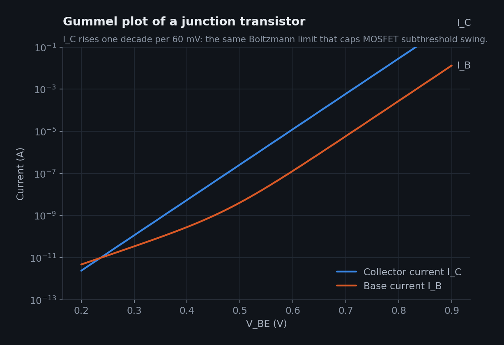

# 1 · Origins: the point contact and the junction (1947–1954)

 Replica of the Bell Labs point-contact transistor. Wikimedia Commons, public domain.

## The problem it solved

By the 1940s the telephone network ran on vacuum tubes and electromechanical relays. Tubes were hot, fragile and power-hungry; relays were slow. Bell Labs wanted a solid-state amplifier. The field-effect idea already existed on paper: Julius Lilienfeld patented a device in 1926 in which a voltage on a plate controls current in a thin semiconductor film [@lilienfeld_patent]. Nobody could make it work, because the surfaces of real semiconductors trapped the induced charge.

## The point-contact transistor, December 1947

John Bardeen and Walter Brattain pressed two gold contacts, separated by a slit of roughly 50 µm cut in a single gold foil, onto a slab of n-type germanium [@bardeen1948]. A small current into one contact (the emitter) changed a larger current collected by the other. Holes injected at the emitter formed a thin inversion layer near the surface and were swept to the collector: power gain from a crystal.

The device was temperamental: its characteristics depended on how hard the wedge pressed and how the contacts had been "formed" by current pulses. It went into limited production (Western Electric Type A), but its real legacy was proof that semiconductor amplification was possible. Shockley, Bardeen and Brattain shared the 1956 Nobel Prize [@nobel1956].

## The junction transistor (1948–1951)

William Shockley, frustrated at being left out of the point-contact work, developed the theory of p-n junctions and proposed a sandwich transistor in which minority carriers diffuse across a thin base region [@shockley1949]. Morgan Sparks and Gordon Teal grew the first working n-p-n junction transistors into germanium crystals by changing the dopant in the melt during growth [@shockley1951].

The bipolar junction transistor (BJT) is robust, predictable and described by clean equations. Its collector current rises exponentially with base-emitter voltage, one decade for every ~60 mV at room temperature:

$$I_C \approx I_S\, e^{V_{BE}/(kT/q)}$$

That 60 mV/decade number reappears in every later chapter, because MOSFETs obey the same Boltzmann statistics when they are turning off.

## Germanium to silicon (1954)

Germanium's small bandgap (0.66 eV) made it leak badly when warm. Silicon (1.12 eV) is harder to purify and melts at 1414 °C, but works to well over 100 °C. Gordon Teal, now at Texas Instruments, announced grown-junction silicon transistors in 1954 [@riordan1997]. Silicon's decisive advantage came three years later, when its native oxide turned out to be almost perfect (Chapter 2).

## Try it

* `python -c "import sys; sys.path.insert(0,'sim'); from transistor_sim import bjt; print(bjt.gummel()[1][-1])"` evaluates the Ebers–Moll model behind the Gummel plot.
* The website's timeline starts with this device; the 3D explorer begins at the planar MOSFET.

## Further reading

Riordan & Hoddeson's *Crystal Fire* [@riordan1997] is the standard narrative history; Lojek [@lojek2007] covers the engineering in more depth.
