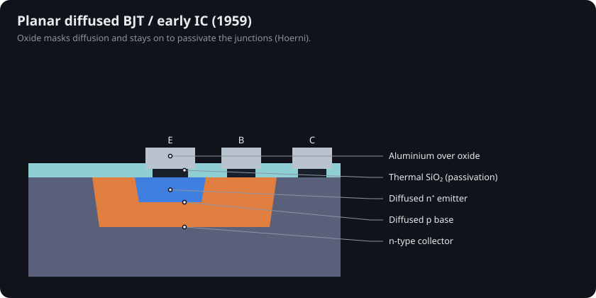

# 2 · Oxide, the planar process and the integrated circuit (1957–1961)

## Oxide masking

In 1957 Carl Frosch and Lincoln Derick at Bell Labs showed that a thermally grown layer of silicon dioxide blocks dopant diffusion, so windows etched in the oxide define exactly where dopants enter [@frosch1957]. Two years later Mohamed Atalla's group showed the same oxide *passivates* the surface, tying up the dangling bonds that had defeated the field-effect transistor [@atalla1959].

## Hoerni's planar process (1959)

At Fairchild, Jean Hoerni combined the two: diffuse the base and emitter through oxide windows and **leave the oxide in place** to protect the junction edges [@hoerni1962]. Every junction now ends under glass, on a flat surface, made from the top by photolithography. This is still how chips are made.

## The integrated circuit

Jack Kilby at Texas Instruments demonstrated a germanium chip carrying a transistor, capacitor and resistors on 12 September 1958, wired with flying gold bonds [@kilby1976; @kilby_patent; @ethw_ic]. Robert Noyce at Fairchild realized that Hoerni's flat oxide could carry evaporated aluminium interconnect, so a whole circuit could be made and wired in one planar sequence [@noyce_patent]. Kilby received the 2000 Nobel Prize in Physics [@kilby_nobel; @nobel2000].

## Why silicon won

| Property | Why it mattered |
|---|---|
| Native SiO₂ | Stable, insulating, grows uniformly, low interface-trap density after anneal |
| 1.12 eV bandgap | Low leakage at operating temperature |
| Abundant, pure crystals | Czochralski growth to 300 mm today |
| Process compatibility | Oxide masks diffusion *and* insulates the gate |

No other semiconductor has an oxide this good. That single fact explains why GaAs, GaN and diamond (Chapters 10–11) have to borrow deposited dielectrics and still fight interface traps.

 Silicon wafers, 2 to 8 inch. Wikimedia Commons (see CREDITS.md).

