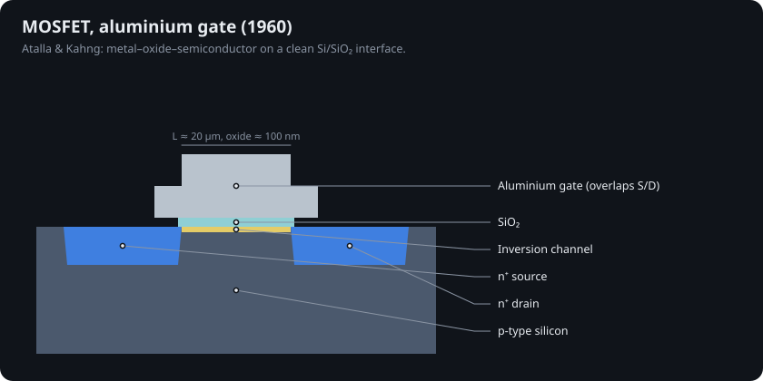
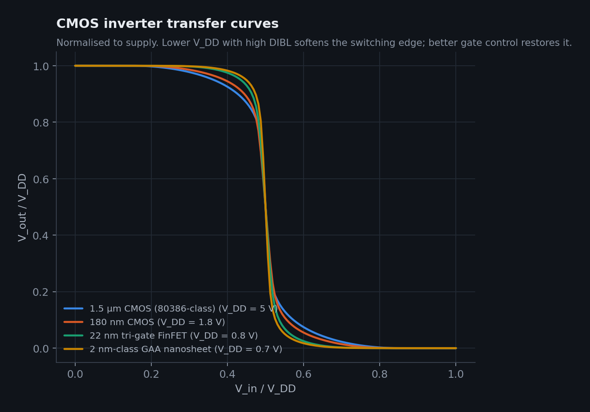

# 3 · The MOSFET, CMOS and the silicon gate (1960–1971)

## Atalla and Kahng, 1960

With a clean oxide, the field effect finally worked. Dawon Kahng and Mohamed Atalla demonstrated the metal-oxide-semiconductor field-effect transistor (MOSFET) in 1959–60 [@kahng1960; @sah1988]: an aluminium gate over ~100 nm of SiO₂ induces an inversion channel between n⁺ source and drain.

Long-channel current follows the square law (Taur & Ning [@taur2013]):

$$I_D = \mu C_{ox}\frac{W}{L}\left[(V_{GS}-V_T)V_{DS} - \tfrac{1}{2}V_{DS}^2\right], \qquad I_{D,sat} = \frac{\mu C_{ox}W}{2L}(V_{GS}-V_T)^2$$

## CMOS, 1963

Frank Wanlass and C.-T. Sah paired an n-channel and a p-channel MOSFET so that one is always off; the pair draws current only while switching [@wanlass1963]. CMOS was slower than nMOS for twenty years, then won in the 1980s once chips had so many transistors that standby power decided everything.

## The self-aligned silicon gate, 1968

Aluminium gates had to be patterned *after* the high-temperature source/drain diffusion, so they were drawn oversized to be sure of overlap, adding capacitance. Federico Faggin and Tom Klein at Fairchild built a production process with doped polysilicon gates, which survive the diffusion and therefore **mask their own source and drain** [@faggin1970]. Density doubled and speed rose about five-fold.

## Intel 4004, 1971

Faggin then led the Intel 4004: 2,300 transistors of 10 µm silicon-gate pMOS on a 12 mm² die, running at up to 740 kHz from a 15 V supply [@faggin1996; @wiki4004; @intel4004story]. It is the first commercially available single-chip microprocessor.

 Left: Intel C4004 (Wikimedia Commons, CC BY-SA 4.0). Right: a CMOS-equivalent inverter drawn with 10 µm λ-rules by <code>sim/transistor_sim/layout.py</code>.

Run the device lab preset **"10 µm pMOS (4004-class)"** to see a device that barely saturates velocity at all: its current is set by mobility and the square law.
