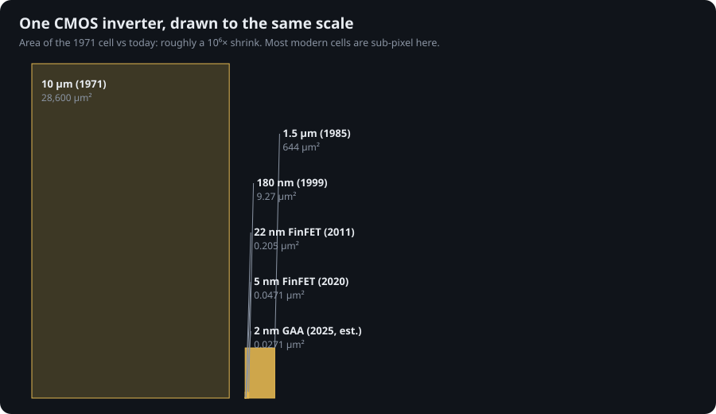
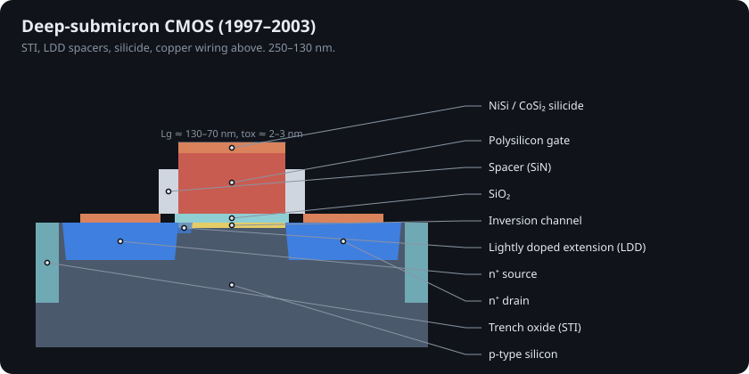

# 4 · Moore, Dennard and the scaling era (1965–2005)

## Moore's observation

In 1965 Gordon Moore plotted the number of components per chip and saw it doubling every year; in 1975 he revised the pace to every two years [@moore1965; @moore1975]. Fitting the 25 production chips in [`data/chips.json`](../data/chips.json) gives a doubling time of **2.15 years** from 1971 to 2024 (computed in `sim/transistor_sim/scaling.py`).

## Dennard's recipe (1974)

Robert Dennard and colleagues at IBM showed how to shrink a MOSFET without breaking it [@dennard1974]: scale every dimension *and* the voltage by 1/κ and raise doping by κ. Then

| Quantity | Scales as |
|---|---|
| Dimensions, voltage, current, capacitance | 1/κ |
| Gate delay CV/I | 1/κ |
| Power per circuit | 1/κ² |
| Circuit density | κ² |
| **Power density** | **1** |

Every generation delivered more transistors, faster, at the same watts per mm². Bohr's 30-year retrospective explains how the industry followed this for three decades [@bohr2007].

## Why it ended

Threshold voltage cannot scale with supply voltage. Below threshold the current falls by at most one decade per ~60 mV at 300 K (the same Boltzmann limit as the BJT in Chapter 1). Keeping leakage acceptable holds V_T near 0.2–0.3 V, which in turn holds V_DD near 0.7–1 V. Once voltage stopped falling (~2005), power density rose with density, and clock frequency flattened [@frank2001].

## VLSI design becomes a discipline

Mead and Conway's *Introduction to VLSI Systems* (1980) introduced scalable λ-based design rules: draw everything in multiples of λ, and a design can move to the next node by changing one number [@mead1980]. [`sim/transistor_sim/layout.py`](../sim/transistor_sim/layout.py) draws the same inverter at λ = 5 µm, 0.75 µm and 90 nm and writes GDS files you can open in KLayout or Magic [@klayout; @magic].

At Berkeley, Laurence Nagel and Donald Pederson released SPICE in 1973 [@nagel1973; @nagel1975]; ngspice continues it today [@ngspice]. The netlists in [`sim/spice/`](../sim/spice) simulate 1.5 µm and 180 nm inverters and a 5-stage ring oscillator.

## Deep sub-micron (1995–2003)

 Intel 80486 DX2 die, Pauli Rautakorpi, CC BY 3.0.

Shallow-trench isolation replaced LOCOS, lightly doped drains tamed hot carriers, silicides cut contact resistance, and IBM introduced copper interconnect in 1997 [@plummer2000]. Lithography moved from mercury-lamp i-line (365 nm) to KrF excimer lasers (248 nm) and then ArF (193 nm), see Chapter 7.

