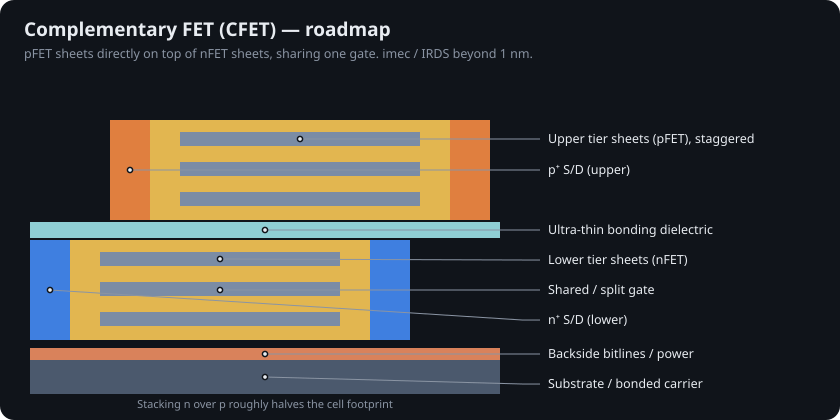

# 8 · Gate-all-around, backside power and the ångström era (2022–2026)

## Nanosheets

A FinFET's gate still misses the fin bottom, and fin width is quantized. Stacking horizontal sheets of silicon and wrapping the gate completely around each fixes both: the gate touches all four sides, and sheet width can be chosen per cell [@loubet2017].

Key process steps: grow a Si/SiGe superlattice, etch fins, form a dummy gate, recess the SiGe under the spacers and fill with **inner spacers**, grow epitaxial source/drain, remove the dummy gate, selectively etch out the SiGe to release the sheets, then deposit high-k and metal into the gaps.

| Company | Name | HVM | Notes |
|---|---|---|---|
| Samsung | SF3E (MBCFET) | 2022 | first GAA in production [@samsung2022] |
| TSMC | N2 | Q4 2025 | ~10–15% faster or 25–30% lower power vs N3E [@tsmc_n2; @semiwiki_n2] |
| Intel | 18A (RibbonFET) | Q4 2025 | with PowerVia backside power; Panther Lake launched Jan 2026 [@intel_18a; @toms_18a; @panther_lake] |
| Rapidus | 2 nm | target 2027 | GAA operation confirmed July 2025 [@rapidus] |

## Backside power delivery

Power wires compete with signal wires for the tightest metal layers on the front of the wafer. Backside power delivery thins the wafer and brings power in from underneath. Intel's PowerVia ships in 18A; TSMC's A16 adds "Super Power Rail" that contacts the source directly from the back, with volume production planned for the second half of 2026 [@tsmc_a16; @semiwiki_a16].

## IBM's 0.7 nm "nanostack" (25 June 2026)

IBM announced the first sub-1 nm technology, named the **7 Å node**. Its "nanostack" architecture stacks and staggers nanosheet transistors vertically. IBM claims nearly 100 billion transistors on a fingernail-sized chip, about twice the density of its 2021 2 nm chip [@ibm2021], up to 50% more performance or 70% better energy efficiency, and 40% SRAM scaling shown at VLSI 2026; IBM projects commercialization within about five years [@ibm2026; @register2026; @futurum2026; @gizmodo2026].

## Forksheet and CFET

imec's **forksheet** places a dielectric wall between n and p sheets so they can sit closer [@weckx2019]. The **complementary FET (CFET)** stacks the pFET directly on the nFET, roughly halving the cell footprint [@ryckaert2018]. IRDS and imec roadmaps extend node labels to "A5" and beyond [@irds2023; @imec_roadmap]; the Korean Institute of Semiconductor Engineers' 2026 roadmap projects 0.2 nm-class labels around 2040 [@kisee2026].

## What "0.7 nm" and "0.42 nm" mean

Node names stopped describing a physical length in the late 1990s. A silicon atom is ~0.2 nm across and the Si lattice constant is 0.543 nm, so no transistor has a 0.7 nm gate. IBM's 0.7 nm is a generation label. The 0.42 nm result (Chapter 9) is the measured thickness of one interface layer [@intelligentliving2026; @wiki1nm].
