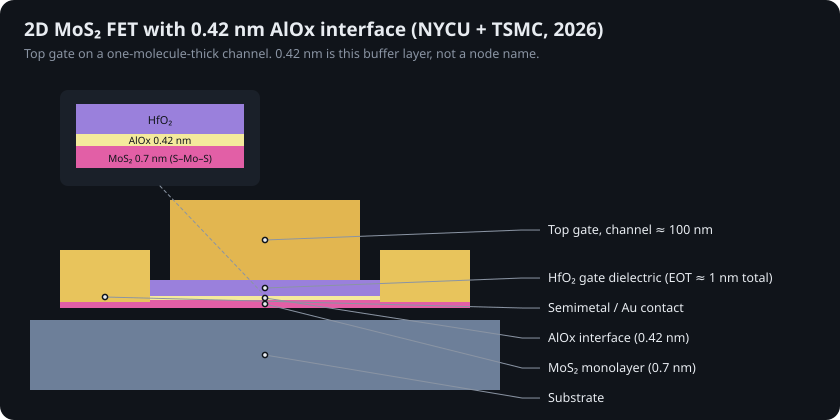

# 9 · Two-dimensional channels and the 0.42 nm interface

## Why 2D

A silicon channel thinner than ~3–5 nm loses mobility to surface-roughness scattering and quantum confinement. Two-dimensional semiconductors are naturally one molecule thick with no dangling bonds on their surfaces. A monolayer of molybdenum disulfide (MoS₂) is ~0.65–0.7 nm thick with a 1.8 eV direct gap [@chhowalla2016; @li2019].

* 2011 — first single-layer MoS₂ transistor (EPFL) [@radisavljevic2011]
* 2016 — MoS₂ FET with a 1 nm carbon-nanotube gate (Berkeley) [@desai2016]
* 2021 — semimetal bismuth contacts cut contact resistance toward the quantum limit [@shen2021]; 2023 — antimony contacts, 40 nm contacted gate pitch [@li2023]
* 2025 — **RV32-WUJI**: Fudan's 32-bit RISC-V processor on 5,900 MoS₂ transistors with a 25-cell 2D standard-cell library, on a 4-inch sapphire wafer; the previous 2D record was 115 transistors [@ao2025; @semitoday_wuji]

## The gate-dielectric problem

High-k oxides do not nucleate well on a dangling-bond-free 2D surface. Deposited directly they come out rough and pinholed, full of traps that scatter carriers and leak [@illarionov2020; @cleaninterface2025]. You can get a thin dielectric or high mobility, but rarely both at short channel length [@das2021].

## NYCU + TSMC, August 2026: engineer the interface

Researchers at National Yang Ming Chiao Tung University and TSMC Corporate Research deposited **~0.3 nm of epitaxial aluminium** on CVD-grown monolayer MoS₂ and oxidized it into **~0.42 nm of aluminium oxide**, then grew HfO₂ on top [@nycu2026; @sciencedaily2026; @scitech2026]. The AlOx layer:

1. gives HfO₂ a smooth, continuous surface to nucleate on, and
2. buffers the MoS₂ from the dielectric so electrons keep their mobility.

Reported results for short-channel top-gate FETs (~100 nm channel): equivalent oxide thickness ≈ 1 nm, low leakage, minimal hysteresis, peak transconductance 0.45 mS/µm.

The device lab's **"Monolayer MoS₂, 0.42 nm AlOx + HfO₂"** preset uses EOT = 1 nm, L = 100 nm and is tuned so its peak gₘ lands within 15% of 0.45 mS/µm (checked by `test_mos2_transconductance_matches_nycu_tsmc`).

## Honest scale

The 0.42 nm is a **layer thickness**. It is not a gate length, not a pitch and not a process node [@intelligentliving2026]. The significance is that it removes a known barrier to putting 2D channels inside future nanosheet or CFET stacks, which is where TSMC, imec and ASML's 2026 work on 300 mm 2D integration is aimed.
