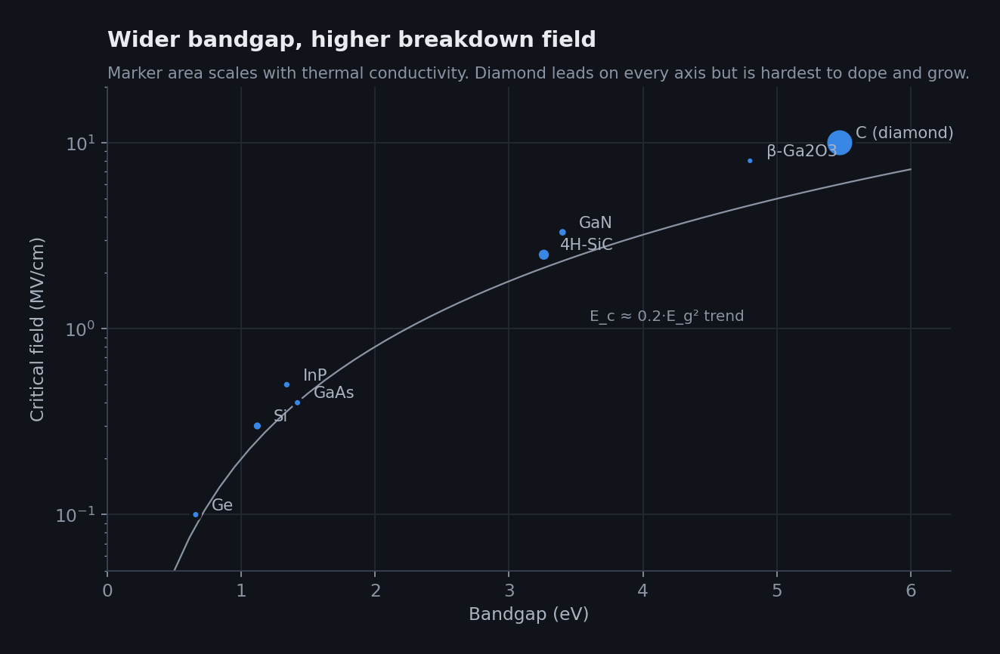
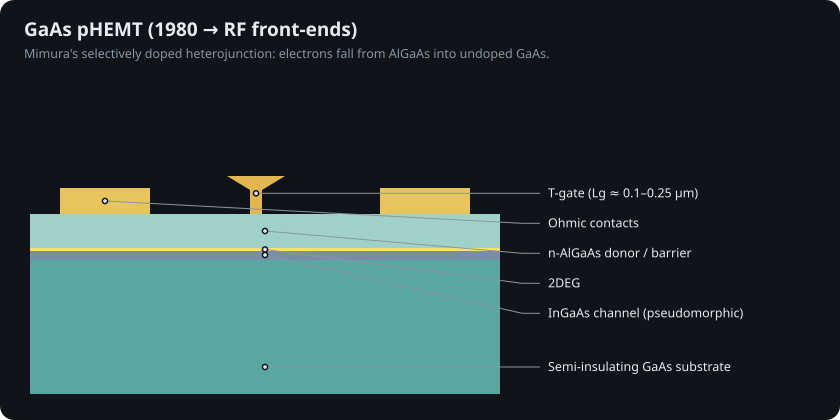
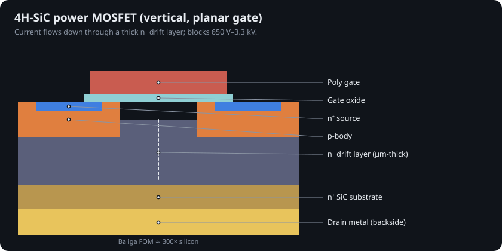

# 10 · Compound semiconductors: GaAs, InP, GaN, SiC, Ga₂O₃

Silicon dominates logic. Other semiconductors dominate where speed, voltage, light or heat matter more than integration density.

## Gallium arsenide and indium phosphide

GaAs electrons are ~6× more mobile than silicon's, and the gap is direct (it emits light).

* 1966–67 — Carver Mead's Schottky-gate FET (MESFET) and the first epitaxial GaAs FET [@mead1966; @hooper1967]
* 1957 / 1980s — Kroemer's wide-gap emitter becomes the heterojunction bipolar transistor (HBT) [@kroemer1957]; Alferov and Kroemer share the 2000 Nobel Prize [@nobel2000]
* 1980 — Takashi Mimura's high-electron-mobility transistor (HEMT): electrons fall from doped AlGaAs into undoped GaAs and move without hitting their donors [@mimura1980]

GaAs **logic** existed: direct-coupled FET logic powered the Cray-3 supercomputer (1993). It lost to CMOS because GaAs has no good native oxide (so no MOS), poor hole mobility (so no efficient complementary logic), smaller wafers and lower yield. GaAs HBT power amplifiers are still in nearly every phone. InP HEMTs and HBTs are the fastest transistors made and drive optical-link electronics.

## Gallium nitride

GaN's 3.4 eV gap and 3.3 MV/cm breakdown field let a thin layer block hundreds of volts. Its real trick is **polarization**: the AlGaN barrier is strained on GaN, and the difference in spontaneous plus piezoelectric polarization leaves a fixed sheet charge that pulls in ~10¹³ electrons/cm² with no doping at all [@ambacher1999; @ambacher2000].

`sim/transistor_sim/hemt.py` implements Ambacher's model: at x = 0.3 it gives a bound charge of 1.68×10¹³ cm⁻² and a critical barrier thickness near 2.5 nm (tests check both).

* 1989–1992 — p-type GaN by Amano, Akasaki and Nakamura, enabling the blue LED (Nobel 2014) [@amano1989; @nakamura1992; @nobel2014]
* 1993 — first AlGaN/GaN HEMT (Khan et al.) [@khan1993]; overview in Mishra et al. [@mishra2002]
* Today — GaN-on-Si power transistors in USB-C chargers and data-center supplies [@lidow2019]; GaN-on-SiC HEMTs in 5G and radar

**GaN for logic?** HEMTs are normally-on n-type devices, and GaN holes are slow (~30 cm²/V·s), so complementary GaN logic is hard. Routes being explored: Intel's 300 mm co-integration of high-k GaN nMOS with Si pMOS [@then2019]; p-GaN and polarization-doped pFETs toward wide-bandgap CMOS [@bader2020].

## Silicon carbide and gallium oxide

4H-SiC combines a 3.26 eV gap, 2.5 MV/cm breakdown and 3.7 W/cm·K thermal conductivity; vertical SiC MOSFETs now switch EV traction inverters at 650 V–1.2 kV [@kimoto2014].

β-Ga₂O₃ (4.8 eV) can be melt-grown into large, cheap substrates and has an ~8 MV/cm field, but no usable p-type doping and poor thermal conductivity [@higashiwaki2012; @tsao2018].

## Figures of merit

Baliga's figure of merit ε·µ·E_c³ measures conduction loss of a power switch at fixed blocking voltage [@baliga1982; @baliga1989]; Johnson's (E_c·v_sat/2π)² measures RF power-frequency capability [@johnson1965].

