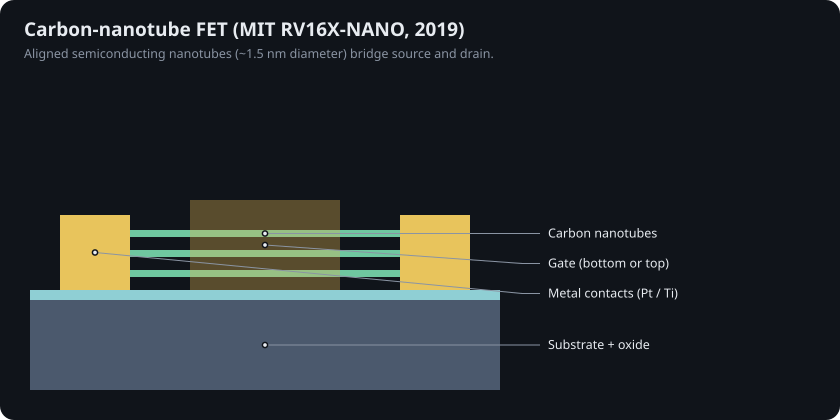

# 11 · Diamond, carbon nanotubes and beyond-CMOS

## Diamond

On paper diamond is the ultimate semiconductor: 5.47 eV bandgap, ~10 MV/cm breakdown, electron and hole mobilities measured above 4,000 and 3,800 cm²/V·s in the best CVD crystals [@isberg2002], and thermal conductivity of ~22 W/cm·K, fifteen times silicon's. Its Baliga figure of merit is tens of thousands of times silicon's.

In practice, dopants sit deep in the gap (boron 0.37 eV, phosphorus 0.57 eV), so few carriers are free at room temperature. The workaround is the **hydrogen-terminated surface**: C–H bonds plus surface adsorbates pull electrons out of the diamond, leaving a two-dimensional hole gas just below the surface [@landstrass1989; @maier2000]. FETs built on it date to 1994 [@kawarada1994]; Al₂O₃-passivated versions are stable enough for complementary power inverter demonstrations [@kawarada2017]. Donato et al. review the state of diamond power devices [@donato2020].

**Chapter 13 goes much deeper**: doping physics with a simulation, transfer doping, inversion and vertical MOSFETs, kilovolt records, wafers and GaN-on-diamond. Chapters 14 and 15 cover other niche and exotic switches.

Where diamond already ships: heat spreaders (GaN-on-diamond), radiation detectors, and nitrogen-vacancy centres for quantum sensing. Large, cheap, low-defect wafers are the missing piece.

## Carbon nanotubes

A semiconducting single-walled nanotube (~1–1.5 nm diameter) is a near-ballistic 1D channel. Milestones: first room-temperature CNT transistor (Delft, 1998) [@tans1998]; a sub-10 nm CNT FET from IBM [@franklin2012]; Stanford's 178-transistor "Cedric" computer [@shulaker2013]; and MIT's **RV16X-NANO**, a RISC-V processor from more than 14,000 CNFETs, which solved purity and placement with "metallic CNT removal" design rules [@hills2019].

## Graphene

Graphene's mobility is spectacular [@novoselov2004], but it has no bandgap, so a graphene transistor cannot turn off. It is used for RF, sensors and as a contact or interconnect material, not as a logic switch.

## Other roads

* **Superconducting logic** (RSFQ) switches with flux quanta at hundreds of GHz, at 4 K [@likharev1991].
* **Vacuum-channel transistors** return to the vacuum tube at nanoscale [@han2012].
* **Single-atom transistors** — a phosphorus atom in silicon — mark the ultimate size limit of a switch [@fuechsle2012].

## Summary

| Material | Best at | Missing for logic |
|---|---|---|
| Si | integration, oxide, cost | nothing yet; approaching atomic limits |
| GaAs / InP | frequency, optics | native oxide, fast holes |
| GaN | power + RF | fast holes, cheap large wafers |
| SiC | high-voltage power | channel mobility at the oxide |
| Ga₂O₃ | very high voltage | p-type doping, heat removal |
| Diamond | heat, voltage, radiation | shallow dopants, wafers |
| MoS₂ / WSe₂ | ultrathin channels | contacts, dielectrics (improving: Chapter 9) |
| CNT | ballistic transport | placement, purity at scale |
