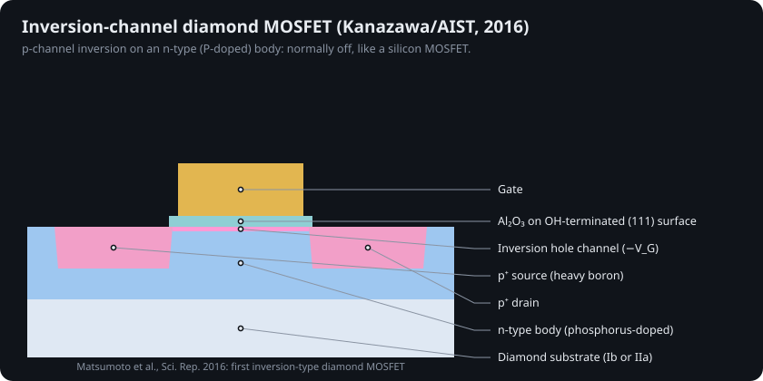
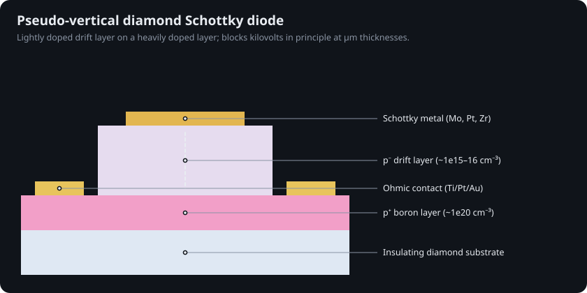
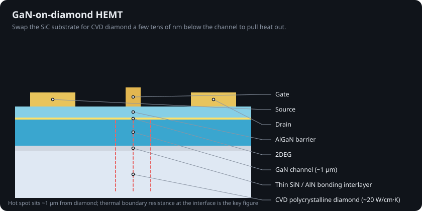

# 13 · Diamond electronics in depth

Chapter 11 introduced diamond as "the ultimate semiconductor that is hard to make." This chapter covers why, and what researchers have done about it, from the 1989 discovery of surface conductivity to packaged power MOSFETs shown in 2025.

## 1. The numbers that make diamond attractive

| Property | Diamond | Si | 4H-SiC | GaN | Source |
|---|---|---|---|---|---|
| Bandgap (eV) | 5.47 | 1.12 | 3.26 | 3.4 | [@sze2006] |
| Breakdown field (MV/cm) | ~10 | 0.3 | 2.5 | 3.3 | [@donato2020] |
| Electron / hole mobility (cm²/V·s) | 4,500 / 3,800 (best CVD) | 1,400 / 450 | 900 / 115 | 1,200 / 30 | [@isberg2002] |
| Thermal conductivity (W/cm·K) | ~22 | 1.5 | 3.7 | 1.3 | [@donato2020] |
| Baliga FOM (× Si) | ~28,000 (computed here) | 1 | ~310 | ~880 | [@baliga1982] |

The Baliga figure of merit, ε·µ·E_c³, measures conduction loss at a given blocking voltage. Diamond's comes out tens of thousands of times silicon's because E_c enters cubed. Its thermal conductivity, fifteen times silicon's, means heat leaves the channel faster than in any other semiconductor.

## 2. The doping problem

Silicon's dopants sit ~45 meV from the band edges, so nearly all of them are ionized at room temperature. Diamond's do not:

| Dopant in diamond | Type | Ionization energy | Ionized at 300 K (10¹⁷ cm⁻³, this repo's model) |
|---|---|---|---|
| Boron | p | 0.37 eV | ~0.5 % |
| Phosphorus | n | 0.57 eV | ~0.04 % |
| Nitrogen (substitutional) | n | 1.7 eV | effectively 0 |

`sim/transistor_sim/dopants.py` solves the charge-neutrality quadratic for each case (tests check that boron in silicon is >80 % ionized and boron in diamond <2 %). The consequences:

* **p-type works, slowly.** Heavy boron (>10²⁰ cm⁻³) conducts by hopping and impurity-band conduction, which is fine for contacts but kills mobility in channels.
* **n-type was missing until 1997.** Koizumi et al. grew phosphorus-doped {111} films [@koizumi1997]. Phosphorus is 0.57 eV deep, so n-type diamond is resistive at room temperature and bipolar devices are hard.
* **Heat helps.** At 600 K boron ionization rises by over an order of magnitude, one reason diamond is pitched for hot environments.

## 3. The workaround: hydrogen-terminated surfaces

In 1989 Landstrass and Ravi found that hydrogen-terminated CVD diamond conducts at its surface, and stops conducting once oxidized [@landstrass1989]. Maier et al. explained it in 2000: the C–H surface has a *negative* electron affinity, so diamond's valence band sits higher than the lowest empty states of adsorbed water and air layers. Electrons leave the diamond, and a two-dimensional hole gas (2DHG) forms within ~1 nm of the surface [@maier2000]. Strobel et al. showed the same effect with deliberately deposited molecular acceptors, calling it **surface transfer doping** [@strobel2004].

Air adsorbates are unstable, so modern devices replace them with NO₂ exposure, transition-metal oxides (MoO₃, V₂O₅) or ALD Al₂O₃, which both passivates and supplies negative charge [@kawarada2017; @hterm_review2025].

## 4. Diamond transistors, generation by generation

| Year | Device | What it showed | Ref |
|---|---|---|---|
| 1994 | H-terminated MESFET | first FETs using the surface channel | [@kawarada1994] |
| 2016 | Inversion-channel MOSFET | normally-off p-channel inversion on n-type (P-doped) diamond | [@matsumoto2016] |
| 2017 | Al₂O₃-stabilized 2DHG MOSFETs | durable enough for complementary power inverters | [@kawarada2017] |
| 2022 | Modulation-doped MOSFET | 3,326 V off-state | [@modulation3326] |
| 2024 | Vertical 2DHG trench MOSFET (Waseda) | 0.7 A from one device, −1.5 A from two in parallel; 13.8 mΩ·cm² | [@oi2024] |
| 2025 | Boron-doped normally-off MOSFET | breakdown above 1.7 kV | [@apl2025_17kv] |
| 2025 | 2DHG MOSFET | 4,266 V off-state | [@jvstb2025_4266] |
| 2025 | Packaged diamond MOSFETs (Power Diamond Systems) | first public demo at SEMICON Japan; JAXA space testing; 2030s commercialization target | [@pds2025; @compoundsemi_pds] |

<table>
<tr>
<td width="50%"> Inversion-channel MOSFET: the diamond analogue of a silicon MOSFET.</td>
<td width="50%"> Vertical trench MOSFET: 2DHG on the sidewalls, drain on the back.</td>
</tr>
</table>

Progress reviews: CS MANTECH 2024 [@csmantech2024] and Donato et al. [@donato2020].

## 5. Diodes

Schottky diodes are simpler than transistors and further along. Pseudo-vertical designs put a lightly doped p⁻ drift layer on a heavily doped p⁺ layer grown on an insulating substrate, with the ohmic contact etched down to the p⁺ layer.

## 6. Wafers: the real bottleneck

Natural and HPHT single-crystal plates are a few millimetres across. Routes to wafer scale:

* **Mosaic wafers** tile many single-crystal plates and overgrow them; the seams carry defects.
* **Heteroepitaxy** grows single-crystal diamond on iridium buffer layers (on YSZ/Si, MgO or sapphire). Schreck et al. identified the buried-lateral-growth mechanism that makes it work [@schreck2017; @heteroepi_review2024]. Orbray grows inch-scale diamond on sapphire [@orbray_wafers].
* **100 mm** single-crystal diamond was announced by Diamond Foundry in November 2023 [@df2023].
* **Growth tool:** microwave-plasma CVD [@mpcvd_review2026]. The challenge is dislocation density, not diameter alone [@pen_diamond].

## 7. Diamond as a partner material

**GaN-on-diamond.** Replace the SiC substrate of a GaN HEMT with CVD diamond ~1 µm from the channel and the hot spot runs much cooler at the same power [@felbinger2007]. The limiting factor is the thermal boundary resistance of the thin bonding interlayer; recent work nanopatterns the interface to cut it [@gan_diamond_tbr2021; @gan_diamond_tbr].

**Quantum.** A nitrogen atom next to a vacancy (the NV centre) is a spin that can be initialized with green light and read out by its red fluorescence at room temperature [@doherty2013]. NV centres are already used as nanoscale magnetometers and are a candidate qubit platform.

## 8. Where diamond fits

| Use | Status | Why diamond |
|---|---|---|
| Heat spreaders, GaN-on-diamond RF | shipping / niche | thermal conductivity |
| Radiation and UV detectors | shipping | wide gap, radiation hardness |
| NV quantum sensors | shipping (lab / specialty) | room-temperature spin |
| High-voltage power switches | research → 2030s target | E_c, thermal, high-temperature operation |
| Logic | not a target | no efficient n-type, no CMOS pair, wafers |

## Try it

* Website → **Diamond lab**: move the temperature and doping sliders to see why boron in diamond barely ionizes.
* `python -c "import sys; sys.path.insert(0,'sim'); from transistor_sim import dopants as d; print(d.ionized_fraction(d.DOPANTS['C:B'], 1e17, [300, 500, 700]))"`
