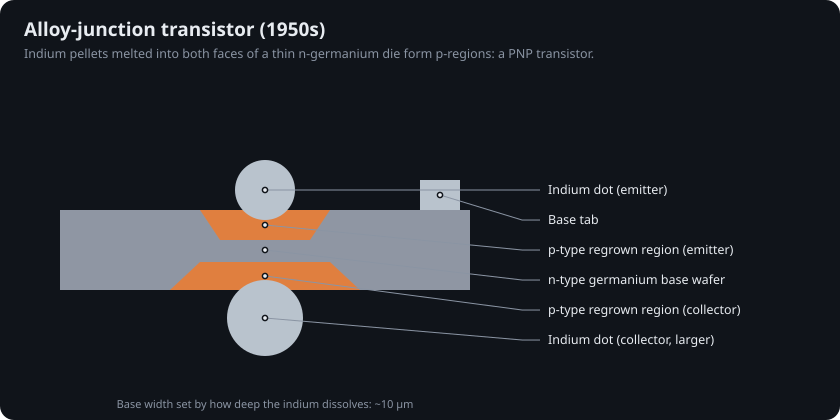
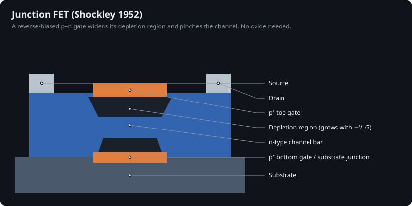
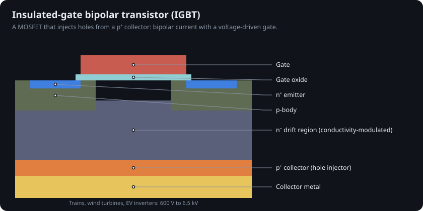
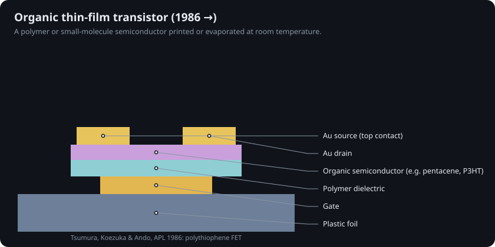
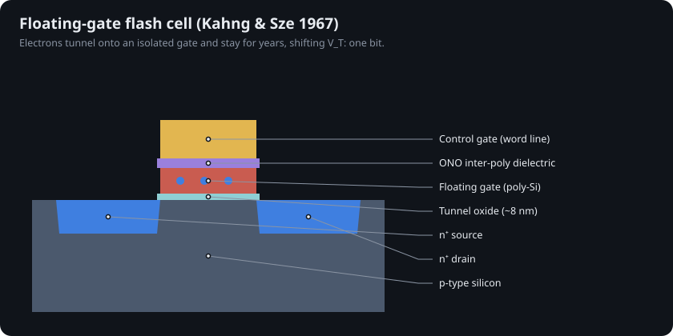
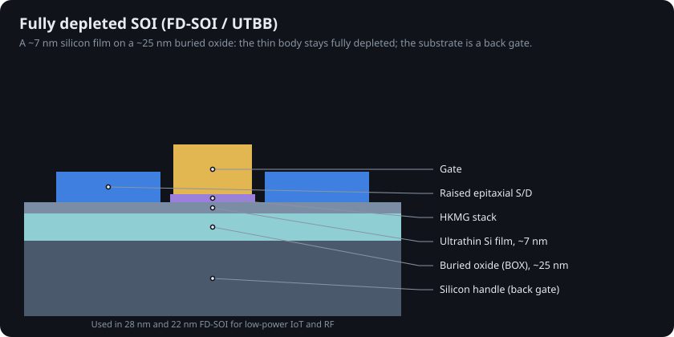
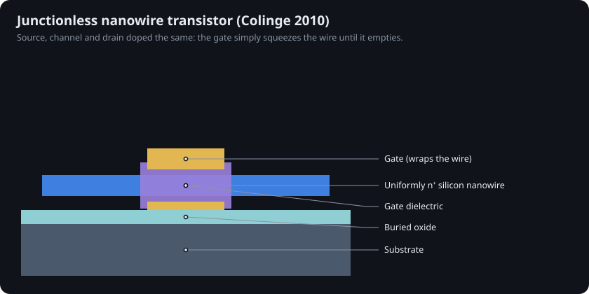
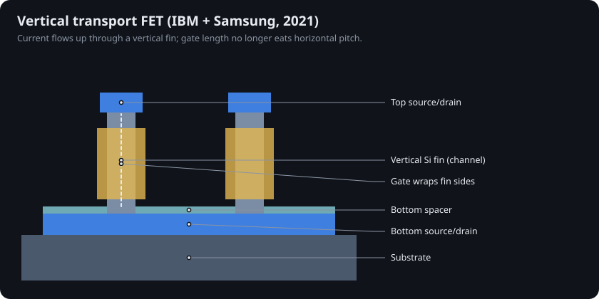

# 14 · Niche and forgotten transistors

The main timeline follows the logic transistor. Plenty of other transistor shapes appeared along the way; some vanished and some quietly run displays, power grids and every SSD. Data for all of them: [`data/niche.json`](../data/niche.json).

## The 1950s zoo

| Device | Year | How it worked | Fate |
|---|---|---|---|
| Alloy-junction | ~1952 | indium dots melted into both faces of n-Ge form a PNP [@riordan1997] | first transistor radios; replaced by diffused silicon |
| Surface-barrier (Philco) | 1953 | jets of electrolyte etch Ge thin, then plate metal contacts [@bradley1953] | fast early computers; obsolete by 1960 |
| Junction FET | 1952 | reverse-biased p–n gate pinches a channel [@shockley1952] | still used for low-noise inputs; SiC JFETs in power |
| Esaki tunnel diode | 1958 | heavy doping lets carriers tunnel; negative resistance [@esaki1958] | microwave oscillators; ancestor of the TFET |

<table>
<tr>
<td width="50%"></td>
<td width="50%"></td>
</tr>
</table>

## Power switches

The **IGBT** (Baliga and others, early 1980s) puts a MOSFET gate on a bipolar structure: a p⁺ collector injects holes that flood the drift region and slash its resistance [@baliga1982igt]. It runs trains, wind turbines and industrial drives. SiC MOSFETs and GaN HEMTs (Chapter 10) now take over at the fast, efficient end.

## Thin-film, oxide, organic and flexible

**Thin-film transistors** are deposited rather than cut from a crystal. Paul Weimer's 1962 TFT [@weimer1962] became the amorphous-silicon backplane of every LCD.

**IGZO.** Nomura, Hosono and colleagues showed in 2004 that amorphous indium–gallium–zinc oxide forms good transistors even at room temperature on plastic [@nomura2004]. Its off-current is so low that screens can refresh slowly and save power.

**Flex-RV (2024)** is a 32-bit RISC-V microprocessor with a machine-learning accelerator built from 0.6 µm IGZO TFTs on polyimide. It has 12,596 NAND2-equivalent gates, runs at up to 60 kHz on under 6 mW, and keeps working bent to a 3 mm radius [@ozer2024]. Compare the two other non-silicon CPUs in this repo: the MoS₂ RV32-WUJI (5,900 transistors) and the carbon-nanotube RV16X-NANO (>14,000 CNFETs).

**Organic TFTs** go back to a 1986 polythiophene FET [@tsumura1986]; they trade mobility for printability.

<table>
<tr>
<td width="50%"></td>
<td width="50%"></td>
</tr>
</table>

## Transistors that remember or see

* **Floating gate** (Kahng & Sze, 1967): charge tunnels onto an isolated gate and stays for years [@kahng1967]. EPROM → EEPROM → flash.
* **3D NAND** (Toshiba BiCS, 2007): word lines stacked vertically around one channel hole [@tanaka2007]. Today's chips stack over 200 layers.
* **Charge-coupled device** (Boyle & Smith, 1970): shifts packets of charge between MOS capacitors, the first solid-state image sensor [@boyle1970].

<table>
<tr>
<td width="50%"></td>
<td width="50%"></td>
</tr>
</table>

## Alternative geometries

* **FD-SOI / UTBB:** a planar transistor on a ~7 nm silicon film over ~25 nm of buried oxide. The body is fully depleted, and the substrate acts as a back gate that can shift V_T on the fly [@colinge_soi].
* **Junctionless transistor** (Colinge et al., 2010): one uniformly doped nanowire that the gate squeezes empty [@colinge2010].
* **Vertical transport FET** (IBM + Samsung, 2021): current flows up through the fin, so the gate length no longer sets horizontal pitch [@vtfet2021].

<table>
<tr>
<td width="33%"></td>
<td width="33%"></td>
<td width="33%"></td>
</tr>
</table>
