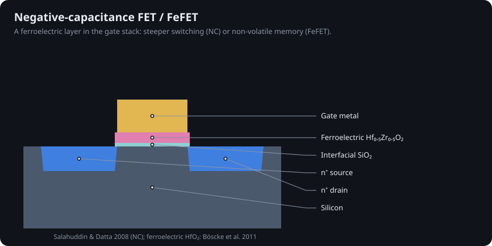
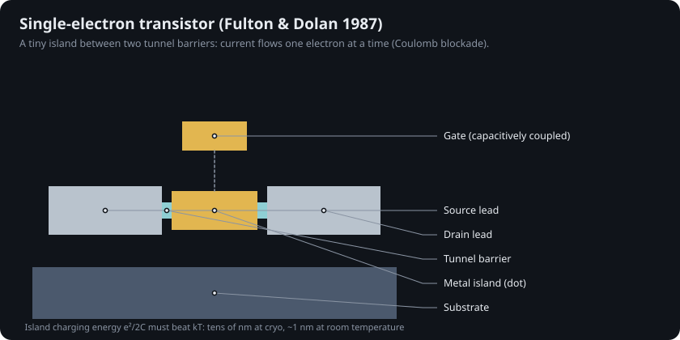

# 15 · Steep-slope and exotic switches

Every MOSFET in Chapters 3–9 turns on by lifting electrons over an energy barrier. Boltzmann statistics then cap how sharply it can switch: at best one decade of current per 59.5 mV at 300 K. That cap is why supply voltage stalled near 0.7 V (Chapter 4). The devices below try to get around it, or to switch with something other than charge.

## Tunnel FET (TFET)

A TFET is a gated p–i–n diode. The gate bends the bands until electrons in the source valence band can tunnel straight into the channel conduction band. Band-to-band tunnelling current follows Kane's form, I ∝ E² exp(−B/E) [@kane1961], which rises faster than 60 mV/decade over a few decades [@ionescu2011; @esaki1958].

`sim/transistor_sim/steep.py` implements it. With its default parameters the minimum swing is ~10 mV/decade at very low current, degrading to >100 mV/decade near 1 µA/µm. The on-current at 0.7 V is a fraction of a FinFET's, and tests check both effects. That low drive is the open problem.

## Negative-capacitance FET and FeFET

Salahuddin and Datta proposed in 2008 that a ferroelectric layer in the gate stack can behave as a negative capacitor and amplify the voltage reaching the channel [@salahuddin2008]. The discovery of ferroelectricity in thin doped HfO₂ in 2011 made this CMOS-compatible [@boscke2011]. The same stack, biased to switch its polarization, becomes a non-volatile ferroelectric FET (FeFET) memory. The figure above models an idealized NC-FET as a MOSFET with body factor n = 0.8; real devices show hysteresis and frequency limits.

## Single-electron transistor

Put a tiny metal island between two tunnel barriers. Adding one electron costs a charging energy e²/2C, so current flows one electron at a time (Coulomb blockade) [@fulton1987]. SETs are standard charge sensors for silicon spin qubits.

## Spin, resistance, vacuum and flux

| Idea | Year | Switch variable | Status | Ref |
|---|---|---|---|---|
| Datta–Das spin FET | 1990 | electron spin precession | proposal → spintronics; MRAM shipped instead | [@datta1990] |
| Memristor / ReRAM | 1971 / 2008 | resistance state | ReRAM products; analog in-memory computing research | [@chua1971; @strukov2008] |
| Nanoscale vacuum channel | 2012 | ballistic electrons in vacuum | research; radiation-hard | [@han2012] |
| RSFQ superconducting logic | 1991 | magnetic flux quanta | niche at 4 K | [@likharev1991] |
| Single-atom transistor | 2012 | one phosphorus atom in Si | physics limit demonstration | [@fuechsle2012] |

None of these has displaced CMOS for general logic. The most likely near-term path to lower switching voltage is still better electrostatics (GAA, 2D channels, CFET) plus steep-slope stacks borrowed from the ferroelectric work above.
