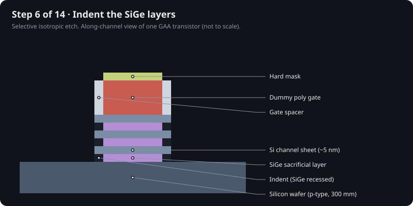
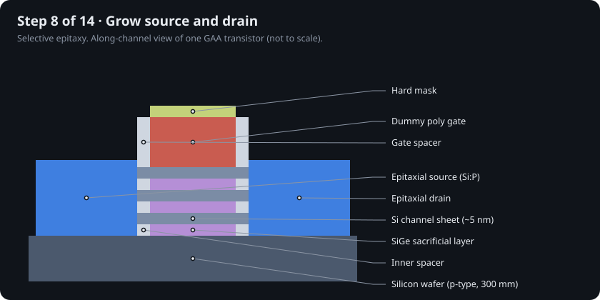
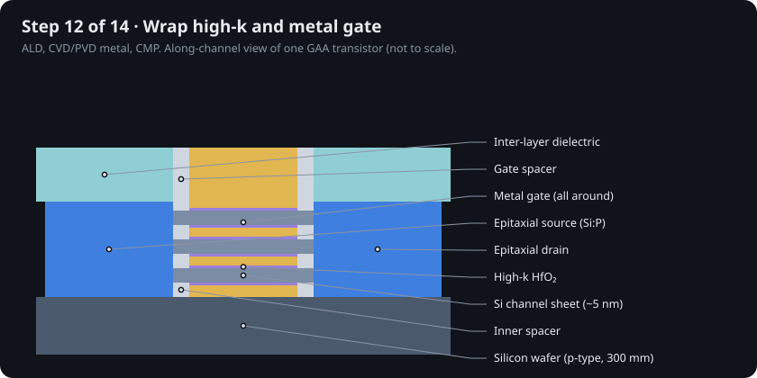

# 16 · How a 2 nm-class transistor is built

The earlier chapters show finished structures. This one builds a gate-all-around (GAA) nanosheet transistor in 14 steps, one drawing per step. The drawings come from `sim/transistor_sim/process.py`, and the site's **Fab stepper** animates them. The flow follows the published nanosheet integration of Loubet et al. [@loubet2017] and the general front-end sequence in Plummer, Deal & Griffin [@plummer2000], simplified for teaching. Backside power is the optional last step used by Intel 18A and TSMC A16 [@intel_18a; @tsmc_a16].

| # | Step | Main tool | Why |
|---|---|---|---|
| 1 | Silicon wafer | Czochralski growth, chemical-mechanical polishing (CMP) | a near-perfect crystal to build on |
| 2 | Si/SiGe superlattice | epitaxy (reduced-pressure chemical vapor deposition, RPCVD) | three silicon sheets separated by sacrificial SiGe |
| 3 | Dummy gate | extreme-ultraviolet (EUV) lithography + plasma etch | a placeholder that defines where the real gate will go |
| 4 | Gate spacers | atomic layer deposition (ALD) + anisotropic etch | separate gate from source/drain |
| 5 | Source/drain cavities | plasma etch | open space for the source and drain |
| 6 | SiGe indent | selective isotropic etch | make room for inner spacers |
| 7 | Inner spacers | ALD + etch-back | stop gate-to-source/drain shorts and capacitance |
| 8 | Source/drain epitaxy | selective epitaxy (Si:P or SiGe:B) | contacts that strain and feed the sheets |
| 9 | Fill and planarize | CVD oxide + CMP | flat surface over everything |
| 10 | Remove dummy gate | etch | reopen the gate trench |
| 11 | Release nanosheets | highly selective SiGe etch | leave silicon sheets suspended |
| 12 | High-k + metal gate | ALD HfO₂, work-function metals, fill | the gate wraps all four sides |
| 13 | Contacts and wiring | middle-of-line + back-end-of-line (BEOL) copper | connect billions of transistors |
| 14 | Backside power (optional) | wafer bonding, thinning, backside lithography | move power wires under the transistor |

<table>
<tr>
<td width="50%"></td>
<td width="50%"></td>
</tr>
<tr>
<td></td>
<td></td>
</tr>
<tr>
<td></td>
<td></td>
</tr>
</table>

All 14 drawings are in [`figures/process/`](../figures/process).

## What makes it hard

* **Selectivity.** Step 11 must remove every atom of SiGe between sheets a few nanometres apart without thinning the silicon.
* **Inner spacers.** Steps 6–7 require lateral etch control of about a nanometre, on every sheet, across a 300 mm wafer.
* **Conformal films.** Step 12 coats the underside of suspended sheets. Only ALD, which grows one atomic layer per cycle, can reach those surfaces.
* **Overlay.** Each lithography layer must land within a few nanometres of the one beneath. EUV reduces how many exposures each layer needs (Chapter 7).

Compared with a FinFET flow, steps 2, 6, 7 and 11 are new; the rest descend from the replacement-metal-gate flow introduced at 45 nm [@mistry2007].
