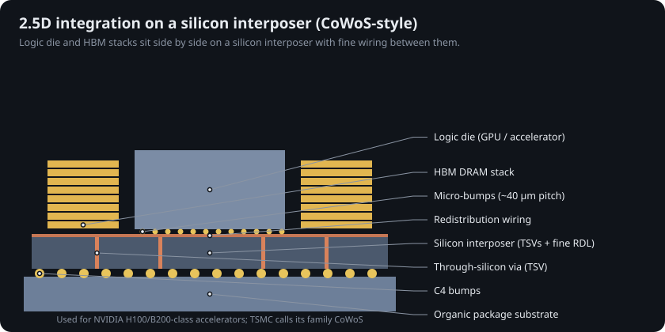
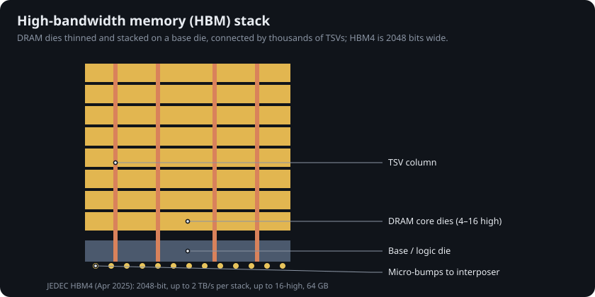
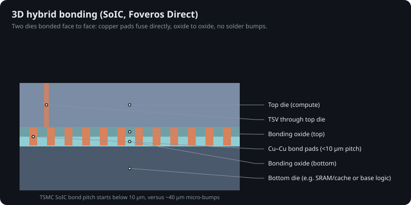

# 17 · Packaging and 3D integration

As transistor shrinks slow, more of each generation's gain comes from how dies are put together. A modern AI accelerator is several dies in one package, stacked or placed side by side.

## 2.5D: silicon interposers (CoWoS and similar)

A logic die and several high-bandwidth memory stacks sit side by side on a silicon interposer. The interposer carries wiring far finer than an organic package can, plus through-silicon vias (TSVs) down to the substrate. TSMC groups these technologies under 3DFabric (CoWoS, InFO, SoIC) [@tsmc_3dfabric]. Design partners continue to join the ecosystem around it [@iclink2026].

## High-bandwidth memory (HBM)

DRAM dies are thinned, stacked 4 to 16 high on a base die and joined by thousands of TSVs. JEDEC's HBM4 standard (JESD270-4, April 2025) doubles the interface to 2048 bits, running at up to 8 Gb/s per pin for 2 TB/s per stack, with up to 64 GB in a 16-high stack of 32 Gb dies [@jedec_hbm4].

## 3D: hybrid bonding

Solder micro-bumps stop shrinking at a few tens of micrometres of pitch. Hybrid bonding polishes both dies flat and bonds copper to copper and oxide to oxide directly. TSMC's SoIC bond pitch "starts from the sub-10 µm rule," in chip-on-wafer and wafer-on-wafer variants, with a second generation aimed at N2 and beyond [@tsmc_soic]. Intel's equivalent is Foveros Direct [@intel_packaging; @hybrid_guide2026].

## How this connects to the transistor story

* **Backside power delivery** (Chapter 8) is itself a wafer-bonding process: the device wafer is bonded to a carrier and thinned from the back.
* **CFET and IBM's nanostack** stack transistors inside one die; hybrid bonding stacks whole dies. Both move scaling into the vertical direction.
* **Chiplets** let each function use its best node: logic on 2 nm, analog and I/O on older, cheaper nodes, memory on DRAM processes.

## Try it

The site's **Niche atlas** has a "Packaging & 3D" filter with these three structures.
