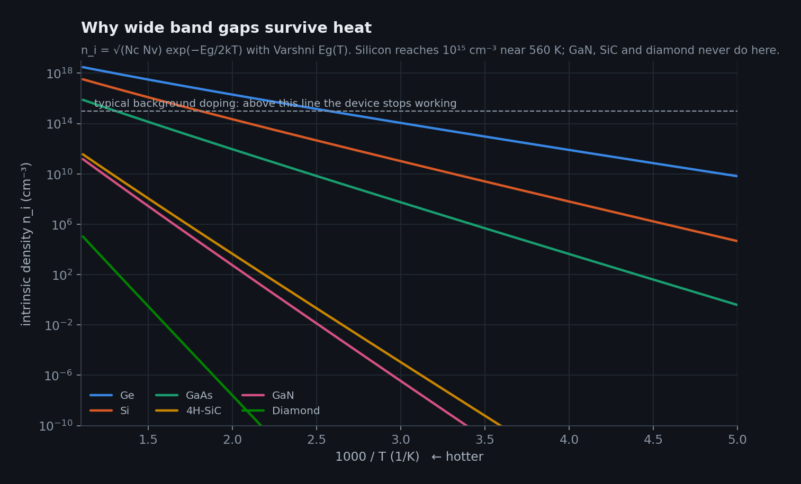
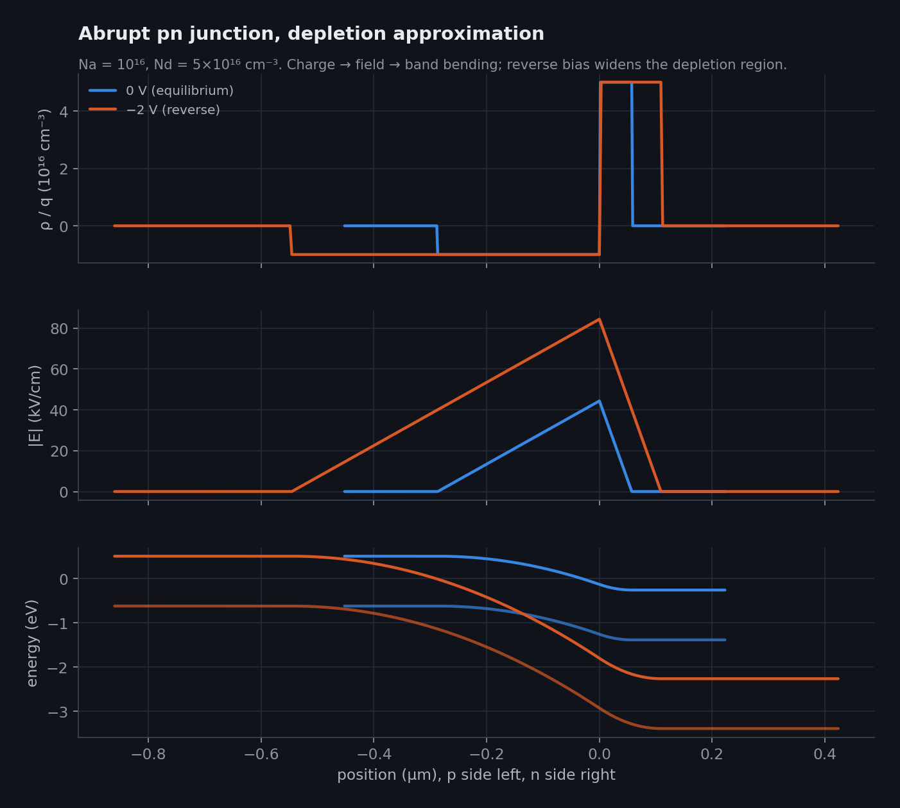
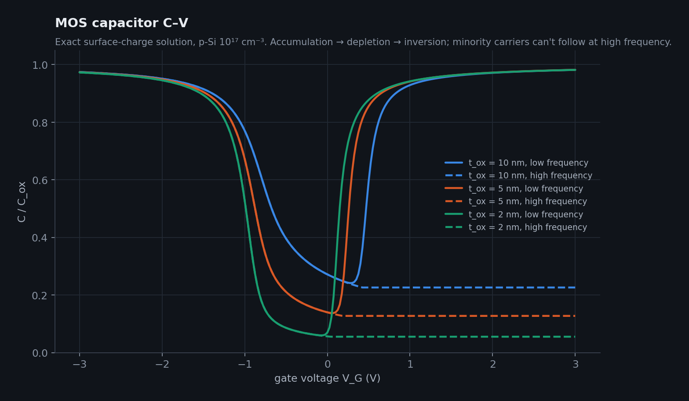
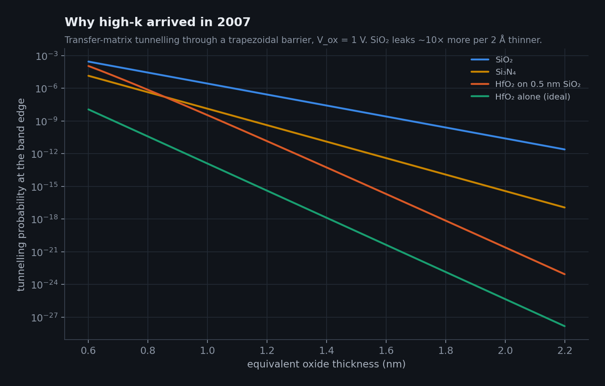
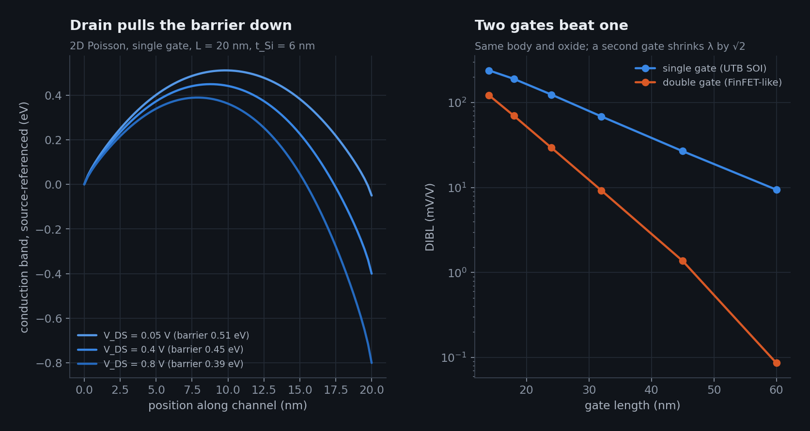
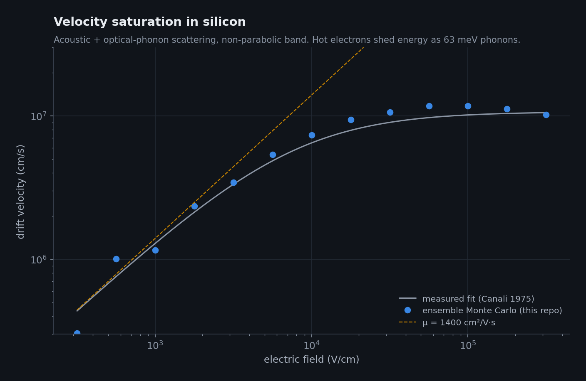

# 19 · The Physics Lab: semiconductor physics you can run

The [Physics Lab](https://normansrule.github.io/transistor-odyssey/physics.html) is a second page of the site with seven live simulations. Each one solves the governing equations in the browser (`site/js/physics/`) and has a Python twin in `sim/transistor_sim/physics/`. `tests/test_semiphysics.py` pins every Python model to a closed form or a measured number. `tests/js_parity.mjs` then checks that the JavaScript reproduces the Python results (`data/physics_reference.json`). CI runs both.

This chapter explains what each lab computes, what it leaves out, and which experiment to try first.

## 1 · Bands and carriers

The band gap follows Varshni's fit, E<sub>g</sub>(T) = E<sub>g0</sub> − αT²/(T + β) [@varshni1967]. The intrinsic density is n<sub>i</sub> = √(N<sub>c</sub>N<sub>v</sub>) exp(−E<sub>g</sub>/2kT). With every dopant ionized, charge neutrality gives n and p, and the Fermi level sits at kT ln(n/n<sub>i</sub>) from midgap [@sze2006].

Constants come from the Ioffe archive and Vurgaftman's III–V review [@ioffe_nsm; @vurgaftman2001]. Silicon's n<sub>i</sub> comes out at 8.6 × 10⁹ cm⁻³ at 300 K, against the accepted 9.65 × 10⁹ [@altermatt2003].



**Try:** heat lightly doped silicon to 650 K. The crystal produces more carriers than the doping, so it no longer behaves as a doped device. GaN, SiC and diamond do not reach that point in this temperature range.

**Leaves out:** incomplete ionization (see Chapter 13 for diamond), degeneracy and band-gap narrowing. The page warns when E<sub>F</sub> comes within 3kT of a band edge.

## 2 · The pn junction

The lab uses the depletion approximation. It gives the built-in voltage V<sub>bi</sub> = (kT/q) ln(N<sub>A</sub>N<sub>D</sub>/n<sub>i</sub>²) and a width W that grows as √(V<sub>bi</sub> − V). It also gives the triangular field and the parabolic potential that bends the bands. The I–V curve is Shockley's long-base diode [@shockley1949], with mobilities from Caughey and Thomas [@caughey1967].



**Try:** dope both sides to 10¹⁹ cm⁻³. The depletion region shrinks to about 20 nm and the field passes 10⁶ V/cm. That is Esaki's tunnel-diode regime [@esaki1958]. For a fuller simulator, see nanoHUB's PN Junction Lab [@nanohub_pntoy].

## 3 · The MOS capacitor

This lab uses the exact surface-charge function F(ψ<sub>s</sub>), not the depletion approximation. The gate voltage is V<sub>G</sub> = V<sub>FB</sub> + ψ<sub>s</sub> − Q<sub>s</sub>/C<sub>ox</sub> [@sze2006; @taur2013].

The band profile comes from integrating dψ/dx into the substrate. Low-frequency capacitance is the series combination of C<sub>ox</sub> and dQ<sub>s</sub>/dψ<sub>s</sub>. The high-frequency curve drops the minority-carrier term and pins the depletion edge at W<sub>max</sub>. At ψ<sub>s</sub> = 2φ<sub>B</sub> the exact solution reproduces the textbook threshold formula (a test checks this).



**Try:** sweep the gate from −2.5 V to +2.5 V and watch the surface go through accumulation, depletion and inversion. Then switch to high frequency.

## 4 · Quantum tunnelling

The Schrödinger equation is solved exactly for a stack of flat slabs with the transfer-matrix method [@ando1987]. For a single rectangular barrier the result matches the closed form to machine precision [@griffiths2018].

With a double barrier, the lab shows resonant tunnelling, first proposed by Tsu and Esaki and then measured [@tsu1973; @chang1974]. Tilting the barrier by the oxide voltage gives the gate-leakage curve. It falls about 10× for every 2 Å of added SiO₂. HfO₂ at the same equivalent oxide thickness leaks orders of magnitude less, even with a 0.5 nm SiO₂ interlayer [@lo1997; @robertson2006].



**Numerics note:** multiplying the interface matrices directly loses precision when T falls below about 10⁻¹⁶. The code instead computes the transmission amplitude as det(M)/M₂₂ and takes each interface determinant from its closed form. This keeps T accurate to about 10⁻³⁰.

## 5 · Short-channel electrostatics

This lab solves ∇·(ε∇ψ) = qN<sub>A</sub> on the cross-section of a thin-body MOSFET by red-black successive over-relaxation [@selberherr1984]. The gates, source and drain are fixed-potential boundaries. The solver runs on a grid of 81 × up to 110 points and re-solves when you move a slider, starting from the previous solution to save time.

The electron barrier is read along the leakiest horizontal path. DIBL is how much that barrier drops per volt of drain bias. The natural length λ = √(ε<sub>Si</sub>t<sub>Si</sub>t<sub>ox</sub>/(Nε<sub>ox</sub>)) [@yan1992; @frank1998] explains the trends: a second gate (N = 2), a thinner body and a thinner oxide all shorten λ, so the gate can be shorter.



**Try:** shrink L from 40 nm to 12 nm with one gate, then add a second gate. This is the argument for the FinFET in Chapter 6 and for gate-all-around in Chapter 8.

**Leaves out:** mobile charge (valid only in subthreshold), quantum confinement and source/drain doping gradients.

## 6 · Hot-electron transport

This is an ensemble Monte Carlo simulation of electrons in one isotropic, non-parabolic valley (m* = 0.26 m₀, α = 0.5 eV⁻¹). Electrons scatter off acoustic phonons and absorb or emit 63 meV optical phonons [@jacoboni1983; @lundstrom2000]. Real silicon has six valleys; here two coupling constants stand in for that, calibrated to the measured low-field mobility (about 1400 cm²/V·s) and saturation velocity (about 10⁷ cm/s) [@canali1975].

The browser runs 500 electrons live and flashes each scattering event. The lab reproduces velocity saturation and the brief velocity overshoot after a sudden rise in field.



## 7 · Crystal structures

Atom positions are generated in Python from lattice constants for these structures:

* diamond cubic (Si, Ge, C)
* zincblende (GaAs)
* wurtzite (GaN)
* the 4H polytype (SiC)
* a monolayer of 2H-MoS₂ [@wilson1969]

The positions are drawn in three.js. The generated bond lengths (Si 2.35 Å, GaN 1.95 Å, MoS₂ 2.40 Å) and the tetrahedral angle of 109.47° are unit-tested.

## Running the models yourself

```bash
python3 -c "import sys; sys.path.insert(0, 'sim'); \
from transistor_sim.physics import poisson2d; \
print(poisson2d.dibl(20), poisson2d.dibl(20, double_gate=True))"
node tests/js_parity.mjs          # browser physics vs Python reference
make figures && make test         # regenerate every figure, run every test
```

Further study: Lundstrom's *Fundamentals of Nanotransistors* [@lundstrom2017] and nanoHUB's MOSCap tool [@nanohub_moscap].
