# 20 · How each transistor works: cross-sections and energy band diagrams

> **Live version:** the [Device Atlas](https://normansrule.github.io/transistor-odyssey/devices.html) animates every device in this chapter. Drag the gate and drain voltages and the band diagrams are recomputed in your browser from the same model that drew the figures below.

The first nineteen chapters follow the transistor through history. This one takes the same devices and asks one question of each: *what does an electron see?* The answer is an energy band diagram, the single most useful picture in semiconductor physics. Nineteen devices, from the 1947 point contact to the complementary FET (CFET) now in research, are drawn here with two diagrams each: one along the path the current takes, and one straight down through the gate.

## Reading a band diagram

A band diagram plots, at each point in a device, the lowest energy a free electron can have (the conduction-band edge Ec) and the highest energy of the filled states below (the valence-band edge Ev). Between them is the band gap Eg: 1.12 eV in silicon, 3.4 eV in gallium nitride, 5.47 eV in diamond [@sze2006]. Four rules are enough to read every figure in this chapter.

1. **Electrons live on Ec, holes on Ev.** In the animations electrons are filled blue dots and holes are open orange rings.
2. **The Fermi level EF is the water line.** Where Ec approaches EF there are many electrons; where Ev approaches it there are many holes. With no voltage applied, EF is flat through the whole device. A voltage V splits it by qV between two contacts, and that split drives the current.
3. **A slope is an electric field.** Electrons roll down a sloping Ec; holes float up a sloping Ev, because energy increases *downward* for a hole.
4. **Most transistors are a barrier the gate can move.** Carriers must climb a barrier of height ΦB to get from source to drain. The fraction with enough thermal energy falls as exp(−qΦB/kT), so the current changes by a factor of ten for every 2.3 kT/q ≈ 60 mV of barrier height at 300 K. The gate lowers the barrier through a capacitive divider with an efficiency 1/n ≤ 1, giving the subthreshold swing

   S = n · (kT/q) · ln 10 ≥ 60 mV per decade

   which is the thermionic limit every device below either lives with or tries to escape [@taur2013; @lundstrom2000].

The chart above puts the 21 materials used in this chapter on one energy scale, measured from the vacuum level using each material's electron affinity χ (vacuum to Ec) and band gap. It is the starting point for every heterojunction and every gate stack below.

## The model behind the pictures

The band diagrams come from `sim/transistor_sim/bandatlas.py`, with a line-for-line JavaScript twin in `site/js/devices/bands.js` that the test suite checks against it. Two kinds of diagram are drawn, and the chapter says which is which:

* **Solved.** The metal-oxide-semiconductor (MOS) cut through the gate uses the exact charge equation of the MOS capacitor from Physics Lab 05, with the flat-band voltage chosen so that the capacitor's threshold equals the device's. The high-electron-mobility transistor (HEMT) cut solves the Schrödinger and Poisson equations self-consistently for the AlGaN/GaN quantum well, as in Physics Lab 08.
* **Schematic.** The lateral diagrams (source to drain) and the remaining vertical cuts are smooth shapes built from a few physical parameters per device: the band gap, the threshold voltage, an ideality factor n that sets the swing, and a DIBL coefficient η that sets how far the drain pulls the barrier down. They are ordered correctly between devices (the tests check, for example, that DIBL falls from planar to FinFET to gate-all-around) but they are not device simulations. For quantitative work use a technology computer-aided design (TCAD) tool.

Read the grid row by row. The bipolar devices (top left) open a junction barrier. Every MOSFET has the same hump; they differ in how little the off-state (grey) barrier is pulled down on the drain side. The depletion-mode devices (JFET, MESFET, GaN HEMT, diamond) are on at zero gate voltage, so their "off" curve needs a negative gate (a positive one for the p-type diamond FET). The tunnel FET has no hump at all: its source is p-type, and it turns on when the channel conduction band drops below the source valence band.

## Bipolar

Bipolar transistors have no insulated gate. The control terminal, the base, is a thin doped layer between two junctions. Forward-biasing the emitter–base junction lowers its built-in barrier by qVBE, so the number of carriers able to cross grows as exp(qVBE/kT), ten times for every 60 mV at room temperature. Carriers that reach the base diffuse across it and fall down the reverse-biased collector junction. Both carrier types matter, which is where the name comes from [@shockley1949; @sze2006].

### Point-contact transistor · 1947

J. Bardeen, W. Brattain (Bell Labs) · material: Ge · hole current · [open in the Device Atlas](https://normansrule.github.io/transistor-odyssey/devices.html#point_contact)

Two gold contacts 50 µm apart press on n-type germanium. Forward-biasing the emitter injects holes into a thin surface layer; the reverse-biased collector sweeps them up, and a small emitter current controls a larger collector voltage swing.

**What the band diagram shows, step by step:**

1. Emitter unbiased: the barrier between emitter and germanium blocks hole injection; only a tiny leakage reaches the collector.
2. Forward-bias the emitter a little: holes start to spill over the lowered barrier into the n-type surface layer.
3. Holes drift and diffuse ~50 µm to the collector point, whose reverse bias pulls them in: collector current follows emitter current.
4. Because the collector sits at a much higher voltage, the same current delivers more power there than the emitter consumed: gain.

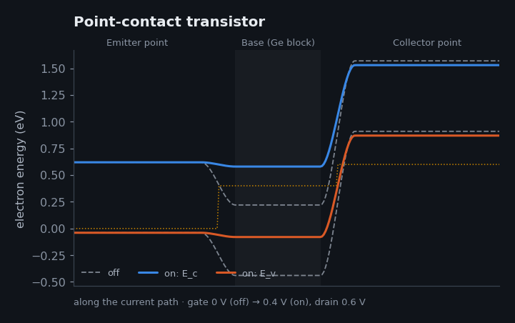

| Key numbers | |
|---|---|
| Material | n-type germanium (Eg 0.66 eV) |
| Contact spacing | ~50 µm |
| Carrier | Holes (minority carriers) |
| First demonstrated | 16 Dec 1947 |

**Where you find it:** Museums: replaced within a decade by junction transistors, which were far more reproducible. Sources: [@bardeen1948]; [@riordan1997]; [@nobel1956].

### Bipolar junction transistor (npn) · 1951

W. Shockley (Bell Labs) · material: Si · electron current · [open in the Device Atlas](https://normansrule.github.io/transistor-odyssey/devices.html#bjt)

A thin p-type base sits between an n⁺ emitter and an n collector. The base–emitter voltage lowers the barrier for electrons exponentially; almost all injected electrons cross the thin base and fall into the collector.

**What the band diagram shows, step by step:**

1. VBE = 0: the emitter–base junction is at equilibrium and its built-in barrier (~0.9 eV) keeps electrons in the emitter.
2. Raise VBE: the barrier drops by qVBE and electron injection grows tenfold every 60 mV — the Boltzmann factor.
3. Injected electrons diffuse across the thin base faster than they recombine, then drop down the collector junction's field.
4. Base current (holes back-injected into the emitter) is ~100× smaller than collector current: current gain β ≈ 100.

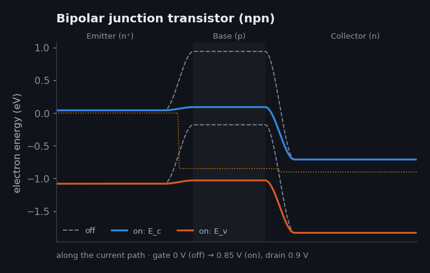

| Key numbers | |
|---|---|
| Base width | 0.05–1 µm |
| Current gain β | 50–500 |
| Law | IC = IS e^{qVBE/kT} |
| Invented | 1948 (theory), 1951 (grown junction) |

**Where you find it:** Analog and RF circuits, bandgap references, power amplifiers; the core of 1960s–80s logic (TTL, ECL). Sources: [@shockley1949]; [@shockley1951]; [@sze2006].

### Heterojunction bipolar transistor (SiGe / InP) · 1987

Concept: H. Kroemer (1957); SiGe HBTs: IBM (late 1980s) · material: SiGe · electron current · [open in the Device Atlas](https://normansrule.github.io/transistor-odyssey/devices.html#hbt)

A narrower-gap base (SiGe, or InGaAs in InP HBTs) creates a valence-band step that blocks holes from flowing back into the emitter. The base can then be heavily doped and very thin, reaching hundreds of GHz.

**What the band diagram shows, step by step:**

1. Off: the emitter–base barrier holds electrons back, exactly as in a BJT.
2. Forward bias injects electrons into the base; the extra valence-band step ΔEv blocks holes from going the other way.
3. Because back-injection is suppressed by e^{ΔEv/kT}, the base can be doped 100× harder and made only ~10–20 nm thick.
4. A thin, low-resistance base means transit times of picoseconds: f_T and f_max of 300–700 GHz in modern SiGe and InP HBTs.

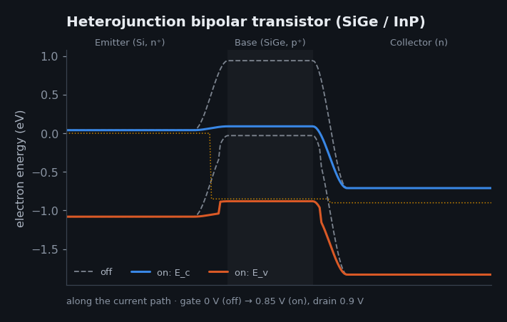

| Key numbers | |
|---|---|
| Base | SiGe (Ge graded 10–30%) |
| Valence-band step | ~0.1–0.2 eV |
| f_T / f_max | up to ~500 / 700 GHz |
| Nobel | Kroemer 2000 |

**Where you find it:** 5G and satellite radios, automotive radar, 100G+ optical-fibre drivers. Sources: [@kroemer1957]; [@nobel2000]; [@sze2006].

## Early field-effect

The first field-effect transistors to work did not use an oxide at all. A reverse-biased junction (junction FET, JFET) or a Schottky metal contact (metal-semiconductor FET, MESFET) widens a depletion region into a doped channel until it pinches the channel off. These devices are normally on: the gate voltage turns them off [@shockley1952; @sze2006].

### Junction field-effect transistor · 1953

W. Shockley (theory 1952); G. Dacey, I. Ross (1953) · material: Si · electron current · [open in the Device Atlas](https://normansrule.github.io/transistor-odyssey/devices.html#jfet)

Current flows through an n-type channel between two p⁺ gate junctions. Reverse-biasing the gate widens the depletion regions until they meet and pinch the channel off. It is normally on.

**What the band diagram shows, step by step:**

1. VGS = 0: the channel is wide open and electrons flow freely from source to drain.
2. Make the gate negative: the reverse-biased junctions grow their depletion regions into the channel, narrowing it.
3. At the pinch-off voltage the depletion regions meet and the channel closes.
4. With drain voltage the channel pinches near the drain first, so the current saturates, like a MOSFET.

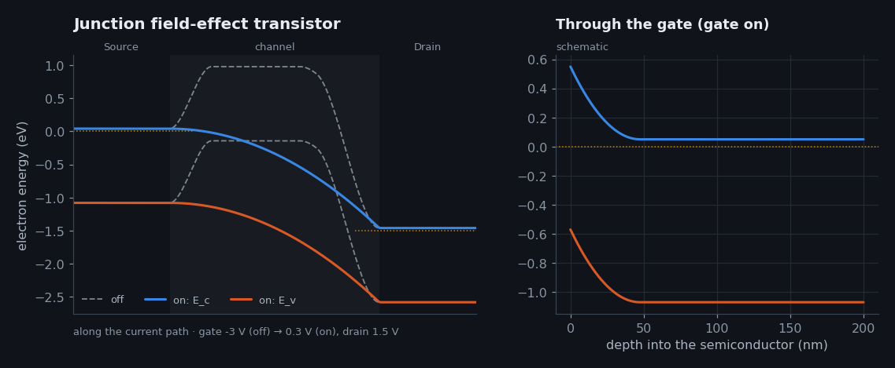

| Key numbers | |
|---|---|
| Mode | Depletion (normally on) |
| Gate input | Reverse-biased pn junction: ~pA |
| Noise | Very low (no oxide traps) |
| Pinch-off | −0.5 to −6 V typical |

**Where you find it:** Low-noise audio and instrument front ends, ultra-high-impedance inputs; SiC JFETs in power switching. Sources: [@shockley1952]; [@sze2006].

## Compound & wide-gap

Compound and wide-gap semiconductors trade silicon's manufacturing maturity for faster electrons (GaAs, InP), higher breakdown fields (GaN, SiC, diamond) or both. Several of them use a heterojunction, an interface between two materials with different gaps, to build a quantum well that holds carriers without dopant atoms in the way [@mimura1980; @ambacher1999].

### GaAs MESFET · 1966

C. Mead (Caltech, 1966); first GaAs MESFET: W. Hooper, W. Lehrer (1967) · material: GaAs · electron current · [open in the Device Atlas](https://normansrule.github.io/transistor-odyssey/devices.html#mesfet)

GaAs has no good native oxide, so the gate is a metal Schottky contact directly on a thin n-type channel. The Schottky depletion region replaces the JFET's p-n junction; GaAs's light electrons make it fast.

**What the band diagram shows, step by step:**

1. VGS ≈ 0: a thin depletion region under the Schottky gate leaves most of the n-GaAs channel open.
2. Negative gate voltage deepens the depletion region into the channel.
3. When depletion reaches the semi-insulating substrate the channel is cut off.
4. Electrons (m* = 0.067 m₀) cross sub-micron gates in picoseconds: the first microwave transistors for satellites and radar.

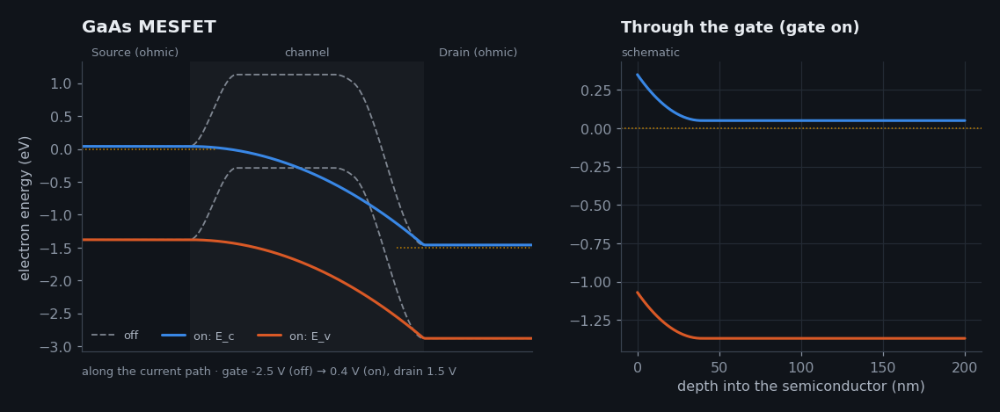

| Key numbers | |
|---|---|
| Electron mobility | ~8500 cm²/V·s (bulk GaAs) |
| Gate | Schottky metal (Ti/Pt/Au) |
| Substrate | Semi-insulating GaAs |
| Era | 1970s–90s microwave |

**Where you find it:** Early cell-phone and satellite amplifiers; mostly replaced by HEMTs and HBTs. Sources: [@mead1966]; [@hooper1967]; [@sze2006].

### AlGaN/GaN HEMT · 1993

Concept: T. Mimura (GaAs, 1980); first AlGaN/GaN HEMT: M. A. Khan et al. (1993) · material: GaN · electron current · [open in the Device Atlas](https://normansrule.github.io/transistor-odyssey/devices.html#gan_hemt)

Polarization charge at the AlGaN/GaN interface creates a sheet of ~10¹³ electrons/cm² with no doping — a two-dimensional electron gas with high mobility. A negative gate voltage lifts the triangular well above the Fermi level to switch it off.

**What the band diagram shows, step by step:**

1. VGS = 0: the polarization-induced well dips below EF and fills with a 2DEG; the transistor is normally on.
2. A negative gate lifts the AlGaN and the well; subbands rise toward EF and the sheet density falls.
3. Past the pinch-off voltage (~−3 to −4 V) the ground subband is above EF: channel empty.
4. The wide 3.4 eV gap lets the drain hold hundreds of volts; high density × mobility gives high current. Heat is the limit (Lab 11).

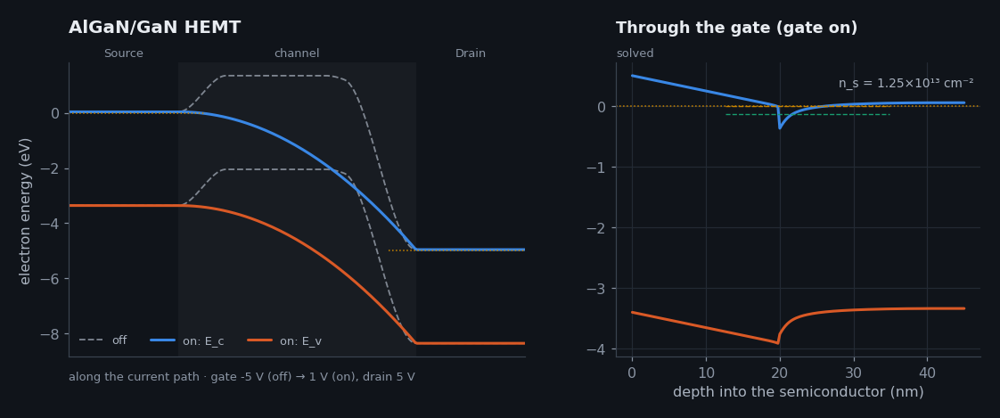

| Key numbers | |
|---|---|
| 2DEG density | ~1×10¹³ cm⁻² |
| Mobility | ~1500–2000 cm²/V·s |
| Breakdown field | ~3.3 MV/cm (10× Si) |
| Mode | Depletion; p-GaN gate for normally-off |

**Where you find it:** 5G base stations, radar, phone and laptop fast chargers, data-centre power supplies. Sources: [@khan1993]; [@mishra2002]; [@ambacher1999]; [@mimura1980].

### Hydrogen-terminated diamond FET · 1994

H. Kawarada et al. (Waseda, 1994); transfer doping: F. Maier et al. (2000) · material: C-H · hole current · [open in the Device Atlas](https://normansrule.github.io/transistor-odyssey/devices.html#diamond_fet)

Diamond is nearly impossible to dope usefully, but a hydrogen-terminated surface under air or Al₂O₃ loses electrons to acceptors outside the crystal. A 2D hole gas ~1 nm deep forms: a p-channel with no dopants in the diamond at all.

**What the band diagram shows, step by step:**

1. VGS = 0: surface transfer doping has bent the valence band above EF at the surface — a 2D hole gas conducts.
2. Positive gate voltage pushes the valence band back down and depletes the holes.
3. When the surface valence band sits below EF the hole gas is gone: off (hole devices switch the opposite way).
4. Diamond's 10 MV/cm breakdown field and 2000 W/m·K conductivity promise extreme voltage and heat tolerance.

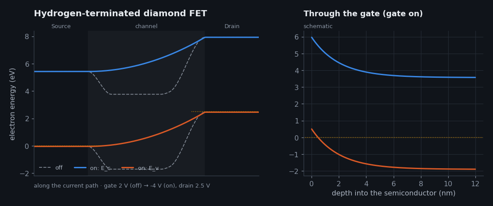

| Key numbers | |
|---|---|
| Channel | 2D hole gas, ~10¹³ cm⁻² |
| Carrier | Holes (p-channel) |
| Band gap | 5.47 eV |
| Record | >2 kV, >1 A devices (2020s) |

**Where you find it:** Research and early commercial power/RF parts (Japanese start-ups, 2025). Sources: [@kawarada1994]; [@maier2000]; [@strobel2004]; [@kawarada2017].

## Silicon MOSFET

Every metal-oxide-semiconductor field-effect transistor (MOSFET) on this list works the same way in the band diagram: a barrier between source and channel that the gate pulls down. What changes from planar to FD-SOI, FinFET, gate-all-around and CFET is how completely the gate controls that barrier, and so how little the drain can lower it when the gate is off. That drain effect is drain-induced barrier lowering (DIBL); the 2D Poisson lab in the Physics Lab shows it directly [@taur2013; @frank2001].

### Planar MOSFET (bulk silicon) · 1960

D. Kahng, M. Atalla (Bell Labs) · material: Si · electron current · [open in the Device Atlas](https://normansrule.github.io/transistor-odyssey/devices.html#planar_mosfet)

A gate on thin oxide pulls electrons to the surface of p-type silicon, forming an inversion layer that connects source and drain. From 1970 to 2011 this flat design, shrunk from 10 µm to 32 nm, built the digital world.

**What the band diagram shows, step by step:**

1. Gate below VT: a potential barrier between source and channel keeps the source's electrons out.
2. Near threshold the barrier drops as the gate bends the bands; current rises one decade per ~85 mV (n ≈ 1.4).
3. Above VT the surface inverts: an electron sheet connects source to drain and current flows by drift.
4. At high drain voltage the channel pinches off near the drain and the drain also lowers the source barrier (DIBL), the weakness that ended planar scaling.

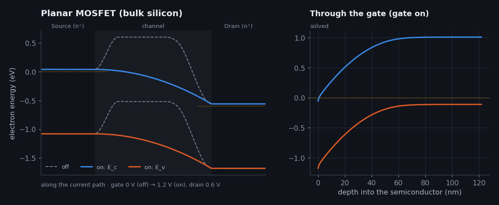

| Key numbers | |
|---|---|
| Gate lengths | 10 µm (1971) → ~30 nm (2011) |
| Oxide | SiO₂, then HfO₂ from 2007 |
| Swing | ~80–100 mV/dec at short L |
| DIBL | ~100 mV/V at 32 nm |

**Where you find it:** Everything digital from the 4004 to 32 nm CPUs; still in analog, sensors and power management. Sources: [@kahng1960]; [@lilienfeld_patent]; [@taur2013].

### Fully depleted SOI MOSFET · 2012

Research: J.-P. Colinge and others; production: STMicroelectronics, GlobalFoundries (28/22 nm) · material: Si · electron current · [open in the Device Atlas](https://normansrule.github.io/transistor-odyssey/devices.html#fdsoi)

The channel is an ultra-thin silicon film (~7 nm) on a buried oxide. There is no deep silicon below for the drain's field to leak through, and the substrate can act as a second 'back gate' to tune the threshold.

**What the band diagram shows, step by step:**

1. Off: the whole thin film is depleted and its barrier is held up by the gate from above and the buried oxide below.
2. Because no deep depletion region soaks up gate charge, the swing is steeper (~65–70 mV/dec).
3. Above threshold electrons fill the film; the undoped channel avoids random-dopant variation.
4. A back-gate bias on the substrate shifts VT by ~80 mV/V, trading speed against leakage on the fly.

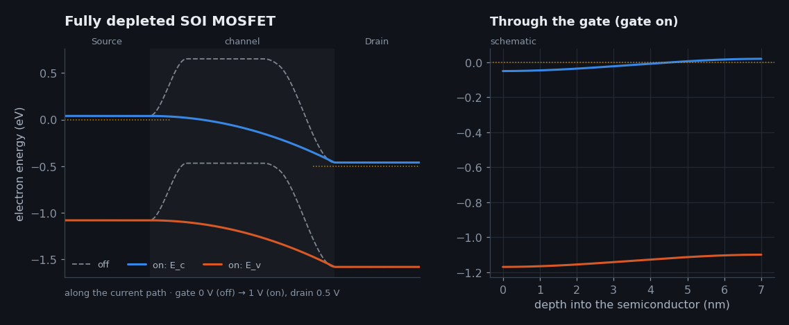

| Key numbers | |
|---|---|
| Silicon film | 5–8 nm |
| Buried oxide | ~20–25 nm |
| Swing | ~65–70 mV/dec |
| Nodes | 28 nm, 22 nm, 18 nm FD-SOI |

**Where you find it:** Low-power IoT, automotive radar, RF SoCs (GlobalFoundries 22FDX, ST 28/18 nm). Sources: [@colinge_soi]; [@colinge2008]; [@frank2001].

### FinFET (tri-gate) · 2011

D. Hisamoto, C. Hu et al. (1998–2000); first in production: Intel 22 nm (2011) · material: Si · electron current · [open in the Device Atlas](https://normansrule.github.io/transistor-odyssey/devices.html#finfet)

The channel stands up as a thin fin and the gate wraps its top and both sides. Gating from three sides shrinks the electrostatic natural length, so the gate keeps control at ~20 nm lengths where planar devices leaked.

**What the band diagram shows, step by step:**

1. Off: gates on both sides hold the whole fin's barrier high; the drain barely reaches the source.
2. The fin is fully depleted and gated from both sides, so the swing is close to the 60 mV/dec limit (~65–70 mV/dec).
3. Above threshold electrons fill the fin volume; several fins in parallel make one wider transistor.
4. DIBL stays near 30–50 mV/V, about three times better than planar at the same gate length.

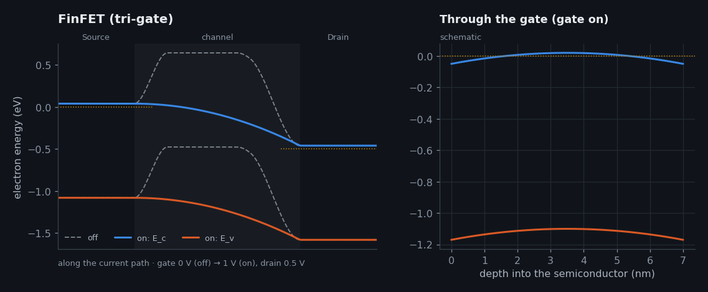

| Key numbers | |
|---|---|
| Fin width | ~5–8 nm |
| Fin height | 42–50 nm (later nodes) |
| Swing | ~65–70 mV/dec |
| Nodes | 22 nm (2011) → 3 nm (2022) |

**Where you find it:** Every leading CPU, GPU and phone chip from 2011 to 2024. Sources: [@hisamoto2000]; [@auth2012]; [@hu2010].

### Gate-all-around nanosheet · 2022

Research: IBM, imec (2017); production: Samsung 3 nm (2022), TSMC N2 and Intel 18A (2025) · material: Si · electron current · [open in the Device Atlas](https://normansrule.github.io/transistor-odyssey/devices.html#gaa)

Three or four horizontal silicon sheets, each ~5 nm thick, are stacked and completely surrounded by the gate. Four-sided control is the best electrostatics silicon can get, and the sheet width can be tuned per transistor.

**What the band diagram shows, step by step:**

1. Off: the gate surrounds each sheet, so its barrier is controlled from every side; leakage paths through the body are gone.
2. Swing ≈ 62–65 mV/dec, within a few percent of the thermal limit.
3. Electrons flow through all stacked sheets in parallel; wider sheets give more current per footprint than fins.
4. DIBL ~20–30 mV/V, so gates of ~12–15 nm hold off the drain. Quantum confinement in 5 nm sheets shifts VT (Lab 08).

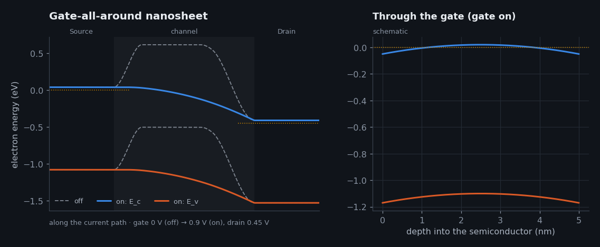

| Key numbers | |
|---|---|
| Sheets | 3–4 per device, ~5 nm thick |
| Sheet width | ~15–50 nm (tunable) |
| Gate length | ~12–15 nm |
| Nodes | Samsung SF3, TSMC N2, Intel 18A |

**Where you find it:** 2 nm-class chips from late 2025; the base for CFET and IBM's 0.7 nm nanostack. Sources: [@loubet2017]; [@tsmc_n2]; [@intel_18a].

### Complementary FET (stacked nFET/pFET) · 2026

imec (roadmap, 2018); research demos by IBM, Intel, TSMC · material: Si · electron current · [open in the Device Atlas](https://normansrule.github.io/transistor-odyssey/devices.html#cfet)

The pFET nanosheets are stacked directly on top of the nFET nanosheets under one gate, so a CMOS inverter uses the footprint of one transistor. The band diagram shows the nFET tier; the pFET above mirrors it with holes.

**What the band diagram shows, step by step:**

1. Input low: the bottom nFET's barrier is high (off) while the top pFET is on, pulling the output high.
2. As the shared gate rises the nFET barrier falls and the pFET barrier rises: the inverter switches.
3. Input high: nFET on, pFET off — the output is pulled to ground through the bottom tier.
4. Stacking halves the cell area of a logic gate; the price is harder processing and heat trapped in the stack.

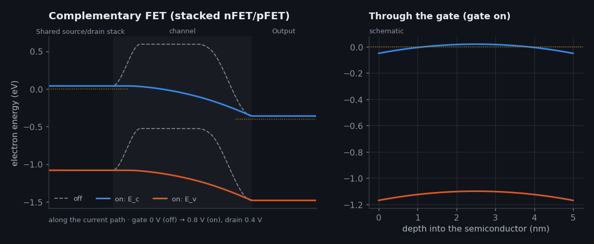

| Key numbers | |
|---|---|
| Stack | nFET sheets below, pFET above |
| Area gain | ~40–50% for logic cells |
| Status | Research; expected ~2030s |
| Related | IBM 0.7 nm nanostack (2026) |

**Where you find it:** Future logic nodes beyond ~1 nm-class naming. Sources: [@ryckaert2018]; [@ibm2026]; [@irds2023].

## Power

Power transistors spend most of their area holding voltage off. A thick, lightly doped drift region supports hundreds or thousands of volts; the MOS gate on top only has to switch a channel. The insulated-gate bipolar transistor (IGBT) adds a p⁺ layer at the back so that, when on, the drift region floods with both electrons and holes and conducts far better than its doping suggests [@baliga1982; @kimoto2014].

### SiC power MOSFET (vertical) · 2011

Cree/Wolfspeed first commercial (2011); B. J. Baliga's figure of merit (1982) · material: 4H-SiC · electron current · [open in the Device Atlas](https://normansrule.github.io/transistor-odyssey/devices.html#sic_mosfet)

Current flows through a short MOS channel at the surface of the p-body, then vertically down a thick, lightly doped n⁻ drift layer to the drain on the back. SiC's 10× higher breakdown field lets the drift layer be 10× thinner than silicon's for the same voltage.

**What the band diagram shows, step by step:**

1. Off: the p-body blocks electrons; the drain voltage is held by the depleted n⁻ drift layer below.
2. Gate voltage inverts the p-body surface; SiC's rough SiC/SiO₂ interface makes this channel less mobile than silicon's.
3. Electrons cross the channel, turn downward and cross ~10 µm of drift layer to the backside drain.
4. The blocking layer is thin and doped 100× more than a silicon device of the same rating, so on-resistance is far lower at 650–3300 V.

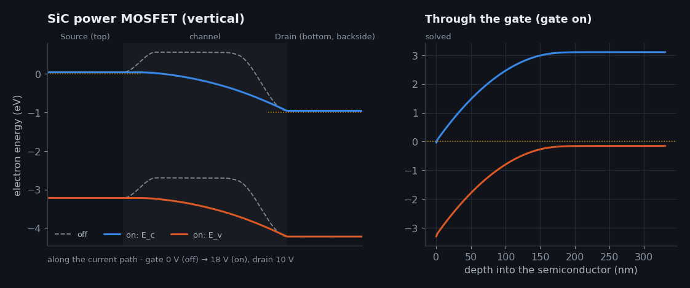

| Key numbers | |
|---|---|
| Breakdown field | ~2.5–3 MV/cm |
| Ratings | 650 V – 3.3 kV |
| Gate drive | +15 to +20 V |
| Drift layer | ~5–30 µm |

**Where you find it:** Electric-vehicle traction inverters and chargers, solar inverters, rail. Sources: [@kimoto2014]; [@baliga1982]; [@baliga1989].

### Insulated-gate bipolar transistor · 1982

B. J. Baliga (GE, 1982) · material: Si · electron current · [open in the Device Atlas](https://normansrule.github.io/transistor-odyssey/devices.html#igbt)

A MOSFET on top, a bipolar p⁺ layer at the bottom. When the MOS channel turns on, electrons flow down and trigger hole injection from the p⁺ collector; the drift region floods with both carriers (conductivity modulation), so it conducts far better than a MOSFET's.

**What the band diagram shows, step by step:**

1. Gate off: no MOS channel, so no electron flow; the thick drift region holds the voltage.
2. Gate above VT: electrons enter the drift region through the channel.
3. Those electrons forward-bias the bottom p⁺/n junction, which injects holes: the drift region fills with electron–hole plasma.
4. Low on-voltage at high current; the stored holes must be removed at turn-off, which limits switching speed (the 'tail current').

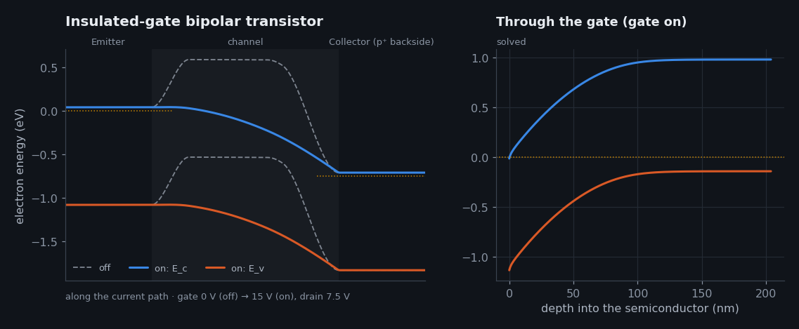

| Key numbers | |
|---|---|
| Voltage | 600 V – 6.5 kV |
| Current | up to kA per module |
| On-voltage | ~1.5–2 V |
| Switching | ~1–50 kHz |

**Where you find it:** Trains, industrial drives, wind turbines, many EV inverters, induction cooktops. Sources: [@baliga1982igt]; [@baliga1982].

## Emerging & 2D

The emerging devices attack the limits of the thermionic barrier from two directions: channels only one or a few atoms thick (MoS₂, carbon nanotubes) that the gate can control almost perfectly, and switching mechanisms that do not rely on carriers climbing a barrier at all (tunnelling) [@radisavljevic2011; @ionescu2011].

### Monolayer MoS₂ FET · 2011

B. Radisavljevic, A. Kis et al. (EPFL, 2011); 0.42 nm AlOx interface: NYCU + TSMC (2026) · material: MoS2 · electron current · [open in the Device Atlas](https://normansrule.github.io/transistor-odyssey/devices.html#mos2_fet)

The channel is a single molecular layer of MoS₂, 0.65 nm thick, with no dangling bonds. The gate controls every atom of the channel, so short-channel effects are tiny; the challenges are contacts, interfaces and wafer-scale growth.

**What the band diagram shows, step by step:**

1. Off: the 1.8 eV gap and atomically thin body keep leakage very low.
2. The body is thinner than any silicon sheet, so the natural length λ is tiny and the swing stays near 60–70 mV/dec.
3. Electrons accumulate in the sheet; mobility (~50–200 cm²/V·s) is lower than silicon's but degrades less with thinness.
4. Engineering the gate interface (the 0.42 nm AlOx layer) and metal contacts decides whether 2D channels beat silicon.

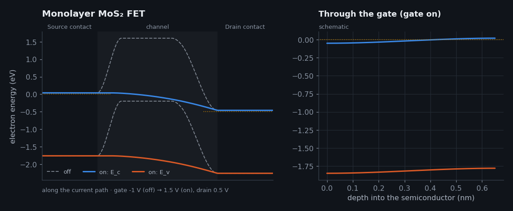

| Key numbers | |
|---|---|
| Thickness | 0.65 nm (one layer) |
| Band gap | ~1.8 eV (direct, monolayer) |
| Record circuit | 5,900-transistor RISC-V (2025) |
| Interface | 0.42 nm AlOx (NYCU/TSMC 2026) |

**Where you find it:** Research; candidate channel beyond silicon nanosheets (IRDS roadmap, 2030s). Sources: [@radisavljevic2011]; [@ao2025]; [@nycu2026]; [@desai2016].

### Carbon-nanotube FET · 1998

S. Tans, A. Verschueren, C. Dekker (Delft, 1998); RV16X-NANO CPU: MIT (2019) · material: CNT · electron current · [open in the Device Atlas](https://normansrule.github.io/transistor-odyssey/devices.html#cnt_fet)

A single semiconducting nanotube ~1.5 nm across bridges two metal contacts. Where metal meets tube a Schottky barrier forms; the gate thins that barrier until electrons tunnel through, so a CNT FET switches at the contacts, not in the middle.

**What the band diagram shows, step by step:**

1. Off: the tube's bands sit high; electrons from the metal face a tall, thick Schottky barrier.
2. The gate pushes the tube's bands down; the barrier at each contact becomes a thin spike.
3. Electrons tunnel through the thin spike and cross the nearly ballistic tube (mean free path ~100s of nm).
4. Promise: ballistic transport and ~3× energy efficiency; problems: purity (metallic tubes), placement and contacts.

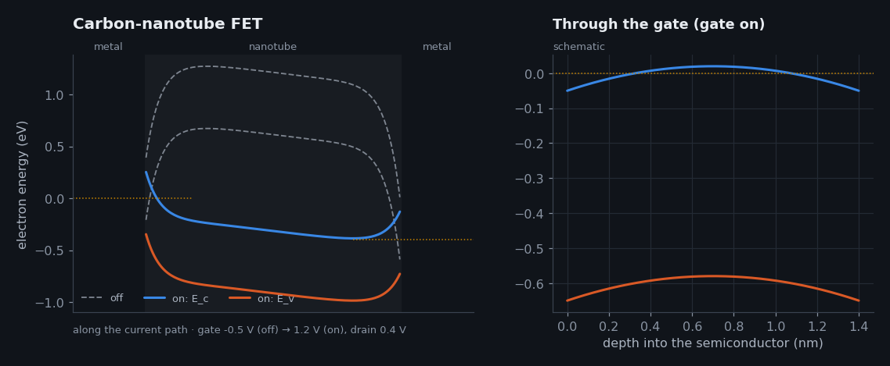

| Key numbers | |
|---|---|
| Diameter | ~1–2 nm |
| Band gap | ~0.8 eV/d(nm) |
| Transport | Near-ballistic |
| Largest CPU | RV16X-NANO, 14,000 CNFETs (2019) |

**Where you find it:** Research; monolithic 3D chips and flexible electronics. Sources: [@tans1998]; [@franklin2012]; [@hills2019].

### Tunnel FET · 2004

Band-to-band tunnelling: L. Esaki (1958); TFET review: A. Ionescu, H. Riel (2011) · material: Si · electron current · [open in the Device Atlas](https://normansrule.github.io/transistor-odyssey/devices.html#tfet)

Instead of lifting electrons over a barrier (which can't switch faster than 60 mV/decade), the gate pulls the channel's conduction band below the source's valence band so electrons tunnel straight through the gap. The turn-on can be steeper than the thermal limit.

**What the band diagram shows, step by step:**

1. Off: the channel conduction band sits above the source valence band — no empty states at the same energy, so no tunnelling.
2. Raising the gate lowers the channel bands; an energy window opens between source Ev and channel Ec.
3. Electrons tunnel horizontally from the source valence band into the channel conduction band and flow to the drain.
4. Because the window opens abruptly, swing can beat 60 mV/dec — but tunnelling currents are small (Chapter 15).

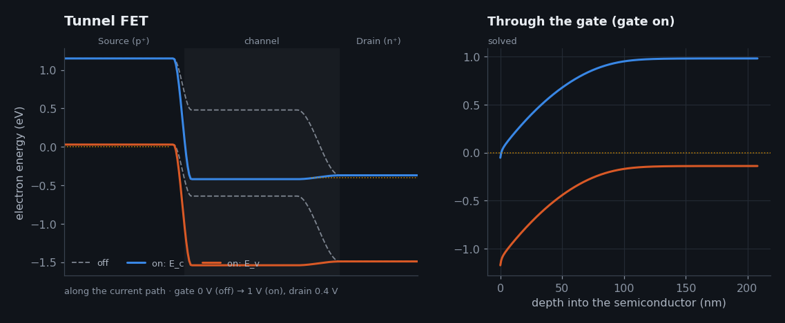

| Key numbers | |
|---|---|
| Swing | <60 mV/dec over a few decades |
| On-current | Low (tunnelling-limited) |
| Materials | Si, SiGe, InAs/GaSb heterojunctions |
| Status | Research |

**Where you find it:** Research into ultra-low-voltage logic (<0.3 V). Sources: [@ionescu2011]; [@esaki1958]; [@kane1961].

## Memory & displays

The last two are field-effect transistors built for jobs other than logic: a thin-film transistor made on glass or plastic at low temperature for display backplanes, and a floating-gate cell that stores a bit as trapped charge and reads it back as a shift in threshold voltage [@nomura2004; @kahng1967].

### IGZO thin-film transistor · 2004

K. Nomura, H. Hosono et al. (Tokyo Tech, 2004) · material: IGZO · electron current · [open in the Device Atlas](https://normansrule.github.io/transistor-odyssey/devices.html#igzo_tft)

An amorphous indium–gallium–zinc oxide film deposited at low temperature on glass or plastic, gated from below. Its wide gap gives extremely low leakage, and its mobility (~10 cm²/V·s) beats amorphous silicon's by 10×.

**What the band diagram shows, step by step:**

1. Off: the wide-gap oxide film is depleted; leakage is below 10⁻¹⁹ A/µm, so a pixel holds its charge for seconds.
2. The bottom gate draws electrons into the film next to the gate insulator (accumulation, not inversion).
3. Electrons move through overlapping metal s-orbitals, which stay conductive even in an amorphous film.
4. Low-temperature processing on large glass panels makes IGZO the switch behind OLED and high-refresh LCD pixels.

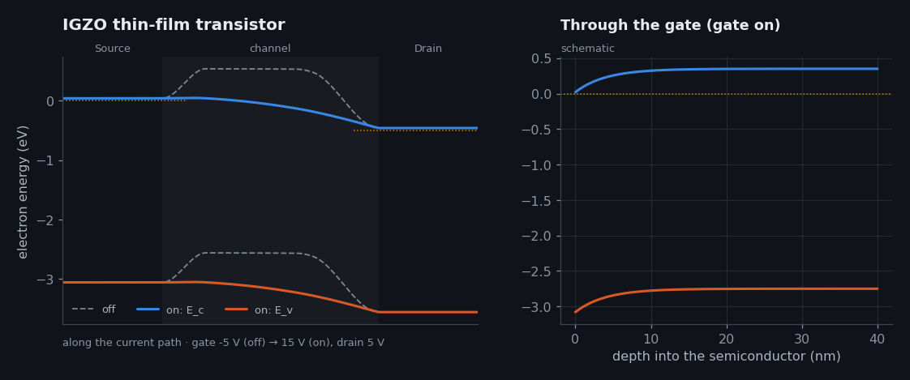

| Key numbers | |
|---|---|
| Mobility | ~10–30 cm²/V·s |
| Band gap | ~3.1 eV |
| Off-current | <10⁻¹⁹ A/µm |
| Process | Sputtered, <400 °C |

**Where you find it:** Displays (phones, TVs, laptops); research into oxide DRAM and back-end-of-line logic. Sources: [@nomura2004].

### Floating-gate flash memory cell · 1967

D. Kahng, S. M. Sze (Bell Labs, 1967); flash: F. Masuoka (Toshiba, 1980s) · material: Si · electron current · [open in the Device Atlas](https://normansrule.github.io/transistor-odyssey/devices.html#flash)

A MOSFET with an extra, electrically isolated floating gate buried in its oxide. Electrons pushed onto the floating gate by tunnelling raise the threshold voltage; reading checks whether the cell turns on at a reference gate voltage.

**What the band diagram shows, step by step:**

1. Erased cell, low gate: behaves like an ordinary MOSFET below threshold.
2. Programming: a high control-gate voltage pulls electrons through the thin tunnel oxide (Fowler–Nordheim) onto the floating gate.
3. The trapped electrons stay for 10+ years; their charge raises VT by several volts.
4. Read: at a middle gate voltage an erased cell conducts (1) and a programmed one does not (0). Multi-level cells store 3–4 bits per cell.

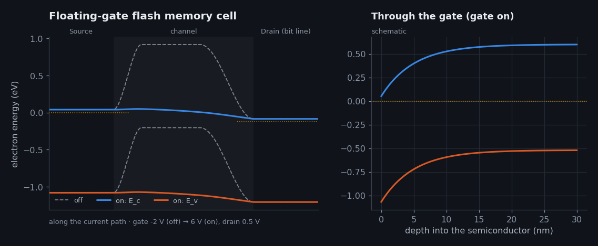

| Key numbers | |
|---|---|
| Tunnel oxide | ~7–9 nm |
| V_T shift | several volts |
| Retention | ~10 years |
| 3D NAND | 200–300+ layers (charge-trap) |

**Where you find it:** Every SSD, phone, memory card and microcontroller program memory. Sources: [@kahng1967]; [@lo1997].

## Putting materials together: heterojunctions

When two semiconductors meet, their band edges have to line up somehow, and the steps that result, ΔEc in the conduction band and ΔEv in the valence band, decide where carriers collect. The simplest estimate is Anderson's electron-affinity rule, ΔEc = χ1 − χ2, with ΔEv following from the two gaps [@anderson1962]. It ignores the dipole that forms at a real interface, so measured offsets can differ by a few tenths of an electronvolt; for III–V alloys the recommended values are tabulated by Vurgaftman and co-workers [@vurgaftman2001]. Three alignments are possible:

| Type | Picture | Where it is used |
|---|---|---|
| **I, straddling** | The narrow-gap material's Ec and Ev both sit inside the wide-gap material's gap, so electrons *and* holes collect on the narrow-gap side. | Quantum wells, lasers, the AlGaAs/GaAs and AlGaN/GaN HEMT channels [@mimura1980; @ambacher2000]. |
| **II, staggered** | Both edges step the same way; electrons collect on one side and holes on the other. | Si/Ge and SiGe/Si stacks; tunnel-FET junctions, where the effective gap across the interface is smaller than either material's own [@ionescu2011]. |
| **III, broken gap** | The conduction band on one side lies below the valence band on the other, so electrons cross with no applied voltage. | InAs/GaSb; hydrogen-terminated diamond's surface conductivity works in a related way, with electrons leaving diamond's valence band for surface acceptors [@maier2000; @maier2001]. |

The gate dielectric is a heterojunction too. Its conduction-band offset to the channel is the barrier that gate-leakage electrons must tunnel through: about 3.1 eV for SiO₂ on silicon, but only about 1.5 eV for HfO₂. Hafnium oxide won anyway because its dielectric constant (about 20 against 3.9) lets the layer be several times thicker for the same capacitance, and tunnelling falls exponentially with thickness [@robertson2006]. Physics Lab 07 computes exactly this trade-off.

The [heterojunction builder](https://normansrule.github.io/transistor-odyssey/devices.html#hetero) on the Device Atlas page lets you pick any two of the 21 materials and shows the resulting offsets and alignment type.

## Limits of these pictures

* Band diagrams are one-dimensional cuts through three-dimensional devices. The FinFET and gate-all-around diagrams in particular average over a cross-section that the gate wraps.
* Carriers in short devices are not in equilibrium with the lattice; near the drain they are "hot" and ballistic, which a band-edge picture cannot show [@lundstrom2000; @natori1994]. Physics Lab 10 simulates that regime.
* The schematic lateral diagrams are tuned to published behaviour (threshold, swing, DIBL); none of them is fitted to a specific commercial device.

