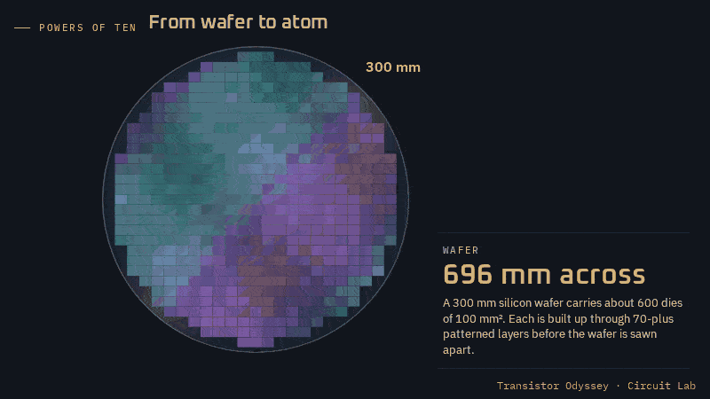
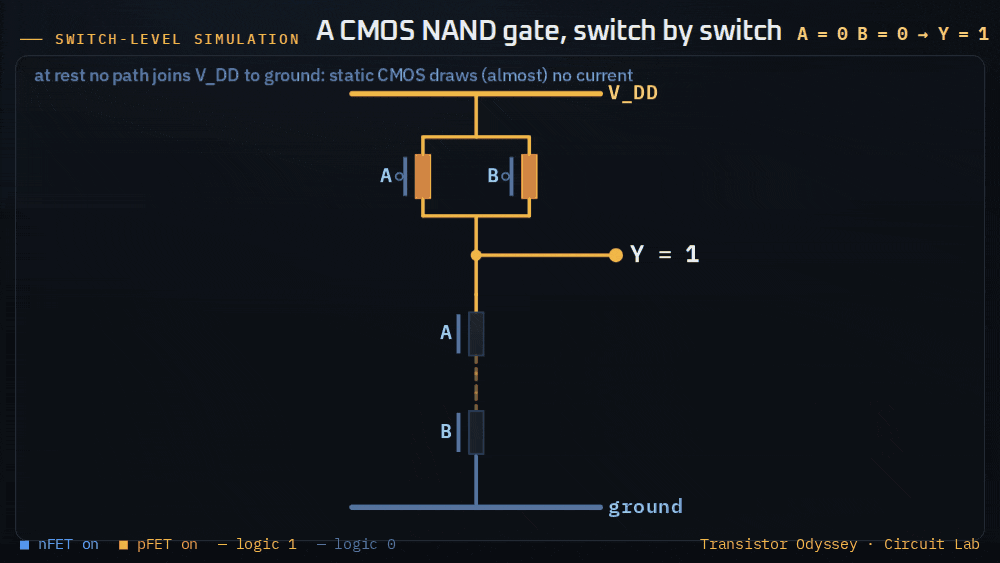
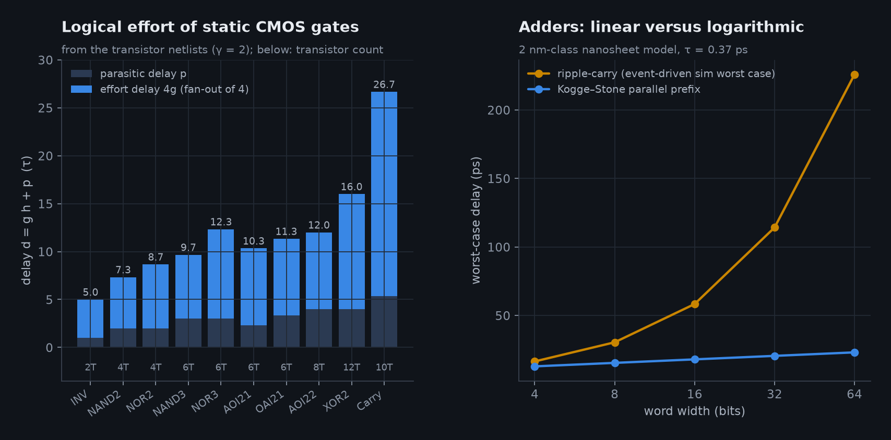
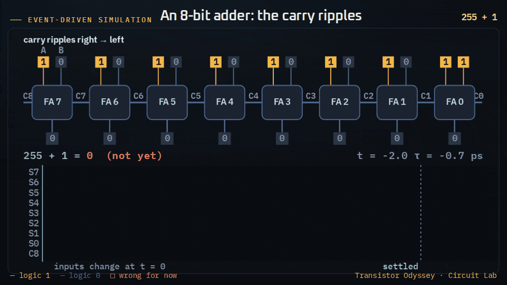
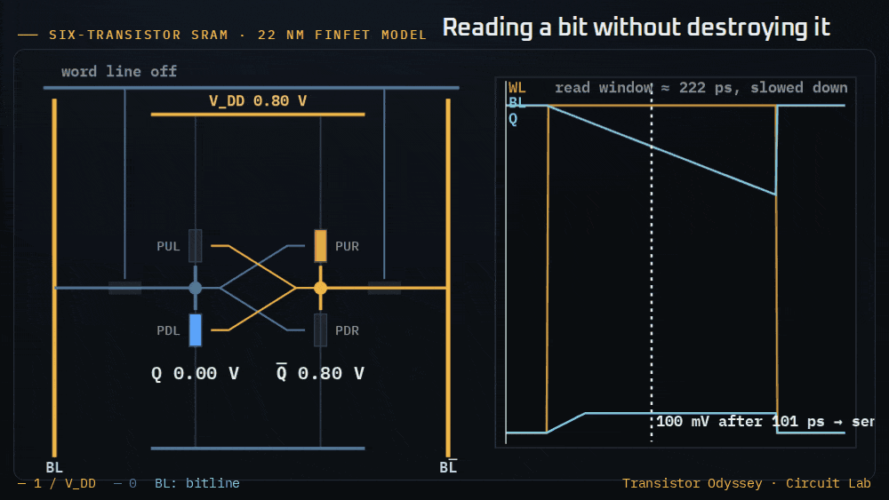
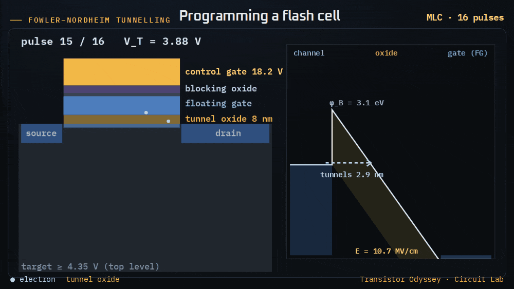
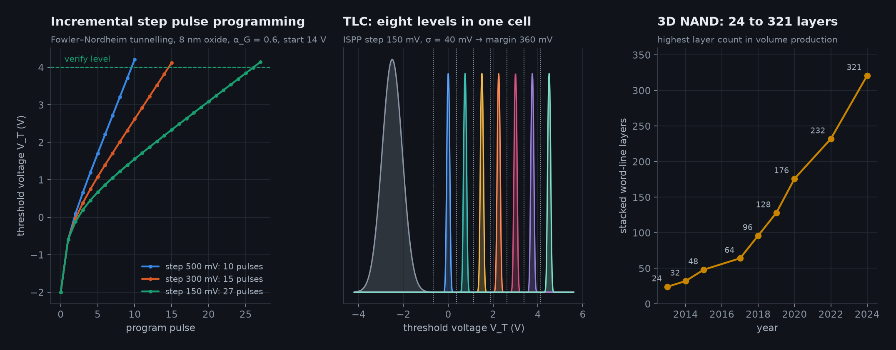

# 21 · From transistor to computer: the Circuit Lab

The rest of this repository is about one switch. This chapter is about what billions of them do together. The [Circuit Lab](https://normansrule.github.io/transistor-odyssey/circuits.html) is a separate page with a powers-of-ten zoom and four interactive labs: logic gates, an adder, the SRAM cell and the flash cell. Every lab runs a JavaScript model in the browser. That model is a twin of a Python module in `sim/transistor_sim/physics/` (`logic.py`, `sram.py`, `flash.py`), and the two are checked against each other in CI by `tests/js_parity.mjs` and `tests/test_circuitlab.py`.

## 0 · Nine powers of ten

The page opens on a zoom from a 300 mm wafer (field of view 0.45 m) to a single silicon–silicon bond (0.45 nm). Each decade is its own scene, and the next scene is cross-faded into the centre of the current one:

| Field of view | What you see | Real dimension shown |
|---|---|---|
| 450 mm | the wafer, with a grid of ~600 dies | 300 mm diameter |
| 45 mm | dies across scribe lanes | 12 × 10 mm die |
| 4.5 mm | cores, L2 and L3 SRAM arrays | a core of a few mm² |
| 450 µm | register files, a sea of standard cells, power straps | — |
| 45 µm | rows of standard cells sharing supply rails | 0.135 µm row height |
| 4.5 µm | gates and the lowest metal | 48 nm contacted gate pitch |
| 450 nm | one NAND2 cell | four transistors in three gate pitches |
| 45 nm | a gate-all-around nanosheet transistor in cross-section | 5 nm sheets, ~14 nm gate |
| 4.5 nm | silicon atoms under HfO₂ | 0.543 nm lattice |
| 450 pm | one covalent bond | 0.235 nm |

The drawings are schematic, but the scale bar and the dimensions in the captions are real for a 2 nm-class process.

## 1 · Gates from switches

A static CMOS gate is described by its pull-down network, written as a series/parallel expression. For example, `('p', ('s', 'A', 'B'), 'C')` is AOI21. The pull-up network is the dual expression (series and parallel swapped) built from pFETs, so the output is always `NOT f(inputs)` and exactly one network conducts. `logic.netlist()` builds the transistor netlist from that expression, and `logic.simulate()` is a switch-level simulator in the style of Bryant's MOSSIM [@bryant1984]:

- every transistor is a switch that is on, off or unknown;
- nodes joined by on switches form a group;
- a group that touches a supply or an input takes that value;
- a group that touches both supplies is a short (X);
- a group that touches neither is floating and keeps its stored charge.

That last rule is the principle behind dynamic logic and DRAM. The tests check every gate's truth table against its Boolean formula.

**Logical effort** [@sutherland1999] is computed rather than looked up:

- Size each network so that its worst series path has the resistance of one unit nFET. Series children share the resistance budget equally, and pFETs are γ = 2 times wider.
- The logical effort of an input is g = (W_n + W_p)/3.
- The parasitic delay is p = (diffusion width on the output)/3.

With this rule the code reproduces the textbook values:

| Gate | g | p |
|---|---|---|
| NAND2 | 4/3 | 2 |
| NOR2 | 5/3 | 2 |
| NAND3 | 5/3 | 3 |
| NOR3 | 7/3 | 3 |
| AOI21 | 2 (A, B), 5/3 (C) | 7/3 |
| Mirror-adder carry gate, carry input | 2 | — |

A gate driving electrical effort h takes d = g·h + p, in units of τ. The lab converts τ to picoseconds using the compact transistor model of [Chapter 12](12-simulation.md): a fan-out-of-4 inverter is 5τ. That gives τ ≈ 3.3 ps at 180 nm and τ ≈ 0.37 ps for the 2 nm-class nanosheet preset.

## 2 · An adder, event by event

`logic.ripple_add(a_old, b_old, a, b, n)` switches the inputs at t = 0 and propagates waveforms through these gates:

- P_i = A_i ⊕ B_i, an XOR2 driving one gate (h = 1);
- C_i+1 = MAJ(A_i, B_i, C_i), the carry gate driving the next carry and one XOR (h = 2);
- S_i = P_i ⊕ C_i, an XOR2 driving a fan-out of 4.

Delays are transport delays, so every input change that changes an output propagates and glitches are kept. In the worst case, 255 + 1, the carry crosses all eight stages and the settle time equals (N − 1)·t_carry + t_sum. The test checks that equality for 4, 8 and 16 bits. In that same example, 14 of the 22 output transitions are glitches: a sum bit turns on when A ⊕ B arrives and off again when the carry passes, and each of those transitions costs C·V².

For wide words the lab compares ripple-carry with a Kogge–Stone parallel-prefix adder [@koggestone1973]. The prefix adder's delay is t_pg + ⌈log₂N⌉·t_prefix + t_sum. At 64 bits it is about ten times faster but needs roughly twice the transistors. For scale, the whole Intel 4004 had about 2,300 transistors.

## 3 · Six transistors per bit

`sram.vtc()` solves each inverter inside the cell with the compact model. Widths are relative to the access transistor:

- CR (cell ratio) is the pull-down width;
- PR is the pull-up width;
- β is the pFET strength per width for the era.

During a read, both bitlines sit at V_DD and the access nFET pushes current into the node that holds 0. That node rises to V_read, which is the **read disturb**. The static noise margin follows Seevinck, List & Lohstroh [@seevinck1987]:

1. Rotate the butterfly plot by 45°.
2. In each wing, find the largest vertical gap between the two curves and divide it by √2.
3. The SNM is the smaller of the two wings.

A threshold mismatch ΔV_T between the two halves grows one wing and shrinks the other. Read current comes from the access transistor at the read-disturb voltage. The bitline swing assumes 256 cells at about 4 fF per µm of access width.

The bitcell area data in `data/memory.json` traces the high-density six-transistor cell:

- **Intel's nodes:** 1.0 µm² at 90 nm [@eetimes_sram90], 0.57 at 65 nm [@sram65_intel], 0.346 at 45 nm [@rwt_intel45], 0.171 at 32 nm [@natarajan2008], 0.092 at 22 nm [@intel22_pres], 0.0588 at 14 nm [@natarajan2014] and 0.0312 at 10 nm [@intel10_iedm2017].
- **TSMC's nodes:** 0.027 µm² at N7 [@wu2016_n7], 0.021 at N5, 0.0199 at N3B and 0.021 at N3E [@wikichip_sram2022], then 0.0175 at N2 [@tsmc_n2_sram].

The halving every node ended at 5 nm. N3E's cell is *larger* than N3B's, and nanosheets brought the first real shrink in years.

## 4 · Charge that stays put

The floating-gate cell [@kahng1967] is modelled as capacitors in series. The gate coupling ratio is α_G = C_CG/C_total. With the channel grounded, V_FG = α_G (V_CG − ΔV_T) and E_ox = V_FG/t_ox.

Electrons cross the tunnel oxide by Fowler–Nordheim tunnelling [@fowler1928; @lenzlinger1969]:

- The current density is J = A·E²·exp(−B/E).
- B = 8π√(2m_ox)(qφ_B)^{3/2}/(3qh) ≈ 240 MV/cm, for φ_B = 3.1 eV and m_ox = 0.42 m₀.
- Stored charge shifts the threshold at the rate d(ΔV_T)/dt = J·t_ox·(1 − α_G)/(α_G·ε_ox).

`flash.pulse()` integrates over threshold rather than time (dt = dV/rate). That keeps it stable even though the current changes by eleven decades during a pulse.

**Incremental step pulse programming** [@suh1995] raises the control gate by one step per pulse and verifies the threshold after each one. As the stored charge pulls the oxide field back, the threshold settles into climbing by exactly one step per pulse, and the test checks this limit.

**Multi-level cells** put 2^b threshold levels in one window. Each level is about one step wide plus ±3σ of noise, so every extra bit:

- needs smaller steps;
- needs more pulses;
- leaves a smaller margin.

QLC with an MLC-sized step does not fit, and its distributions overlap.

A 20 nm planar cell holds only about 70 electrons at its top level. That is one reason NAND went vertical:

| Year | Milestone |
|---|---|
| 1987 | Toshiba's NAND string [@masuoka1987] |
| 2007 | BiCS proposal [@tanaka2007] |
| 2013 | Samsung's 24-layer V-NAND [@park2015vnand] |
| 2024 | SK hynix's 321 layers [@skhynix321] |

Highest layer count in volume production, by year [@semieng_3dnand]:

| Year | Layers |
|---|---|
| 2014 | 32 |
| 2015 | 48 |
| 2017 | 64 |
| 2018 | 96 |
| 2019 | 128 |
| 2020 | 176 |
| 2022 | 232 |

## What the models leave out

- Gate delays come from logical effort and an ideal step input. There is no slope dependence, no wire capacitance and no Miller coupling.
- The switch-level simulator has no drive strengths, so ratioed logic would read as X.
- The SRAM model has no write-margin analysis, no assist circuits and no 6-σ statistics; mismatch is one deterministic ΔV_T.
- The flash model is planar floating gate. Modern 3D NAND uses charge-trap silicon nitride and a cylindrical channel, which changes the field distribution but not the trade-offs shown here.
