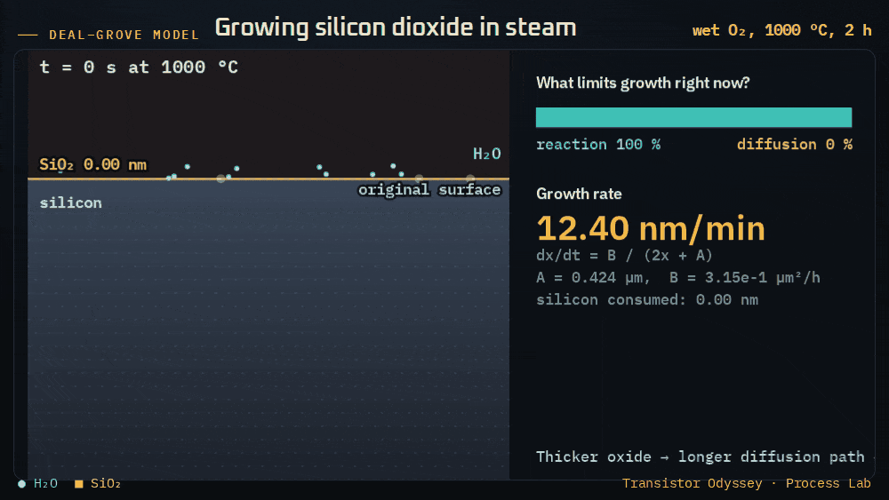
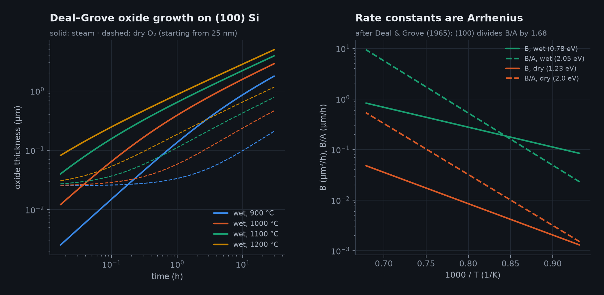
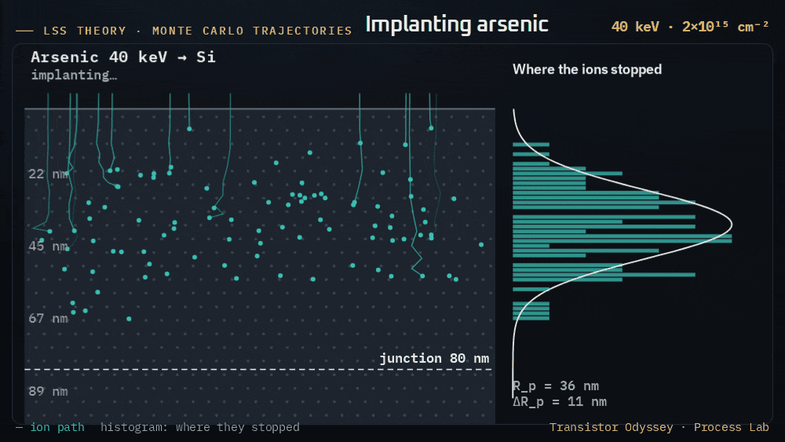
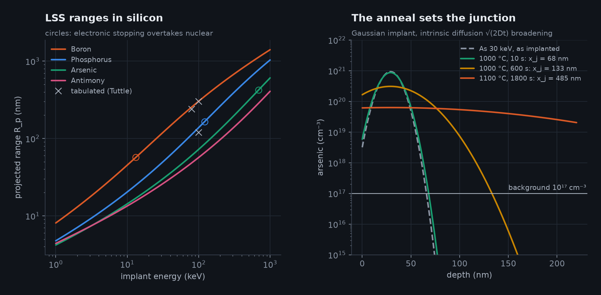
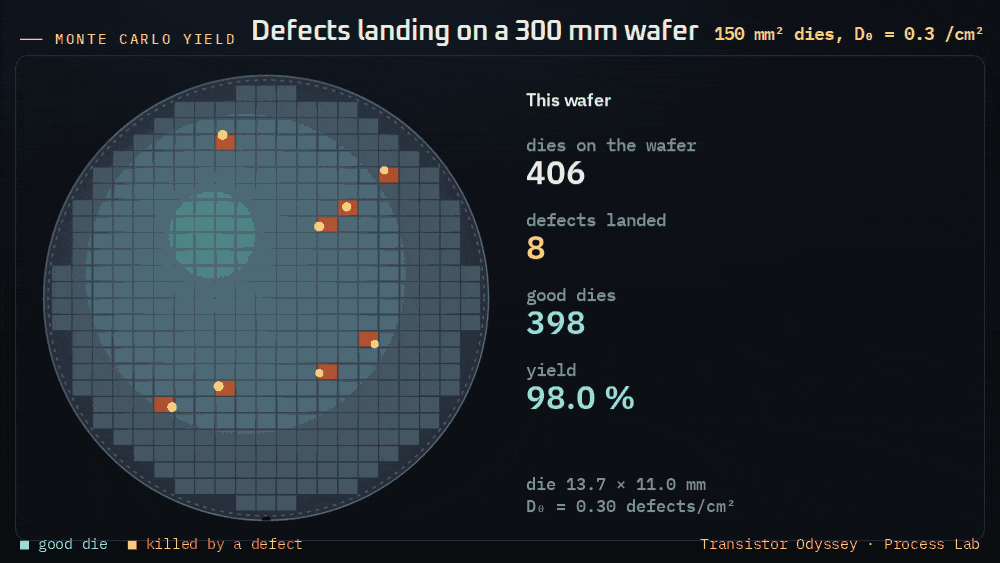
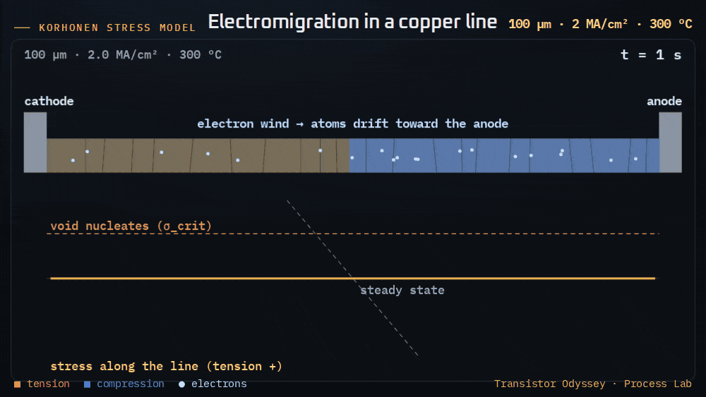
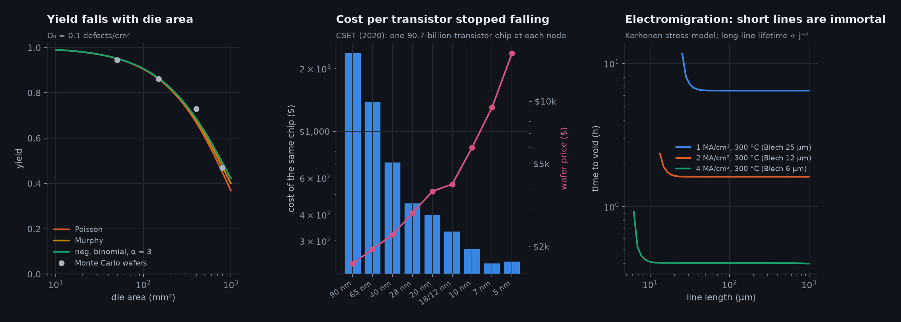

# 22 · The physics of making chips: the Process Lab

[Chapter 16](16-process-flow.md) walks through the steps that build a 2 nm-class transistor. This chapter covers the physics behind four of those steps, and the economics and reliability that follow from them.

The [Process Lab](https://normansrule.github.io/transistor-odyssey/process.html) runs each model live in the browser. Every model is a JavaScript twin of a Python module in `sim/transistor_sim/physics/` (`oxidation.py`, `implant.py`, `yieldcost.py`, `electromigration.py`). `tests/test_processlab.py` and `tests/js_parity.mjs` check them against each other and against closed forms or published numbers.

## 1 · Thermal oxidation (Deal–Grove)

Before the oxidant can react at the interface, it has to diffuse through the oxide already grown. Setting the diffusion flux through the oxide equal to the reaction rate at the interface gives the Deal–Grove relation [@dealgrove1965]:

> x² + A·x = B·(t + τ)

- At **small thickness** growth is linear, x ≈ (B/A)·t, and the interface reaction sets the rate.
- At **large thickness** growth is parabolic, x ≈ √(B·t), and diffusion through the oxide sets the rate.

Both constants are Arrhenius terms. The lab uses the values tabulated by Hollauer [@hollauer_dg] for (111) silicon at 1 atm:

| Ambient | Parabolic constant B | Linear constant B/A |
|---|---|---|
| Dry O₂ | 772 µm²/h × e^(−1.23 eV/kT) | 6.23 × 10⁶ µm/h × e^(−2.00 eV/kT) |
| Steam | 386 µm²/h × e^(−0.78 eV/kT) | 1.63 × 10⁸ µm/h × e^(−2.05 eV/kT) |

Three adjustments apply:

- (100) silicon divides B/A by 1.68.
- Both constants scale linearly with pressure.
- Dry oxidation starts from an effective 25 nm, because the model underestimates the fast initial growth.

Each nanometre of oxide consumes 0.44 nm of silicon. Steam at 1000 °C grows about 0.39 µm in an hour; dry O₂ grows about 0.06 µm. The tests check:

- the linear and parabolic limits;
- that the computed thickness satisfies the Deal–Grove quadratic;
- that the Arrhenius slope recovers 1.23 eV.

## 2 · Ion implantation and diffusion

**Range.** Lindhard–Scharff–Schiøtt (LSS) theory [@lindhard1963] adds up the energy an ion loses to two mechanisms:

- collisions with atomic nuclei, S_n, using the universal reduced stopping of Ziegler, Biersack and Littmark [@zbl1985];
- drag from the electron cloud, S_e = k√E (Lindhard).

The total path length is R = ∫ dE / (N(S_n + S_e)), with N the atomic density of silicon. The projected range and straggle follow from the mass ratio:

> R_p ≈ R / (1 + M₂/3M₁),  ΔR_p ≈ (2/3)·R_p·√(M₁M₂)/(M₁ + M₂)

Comparison with tabulated values [@tuttle_implant]:

| Implant | This model R_p | Tabulated R_p |
|---|---|---|
| B, 80 keV | 255 nm | ≈ 240 nm |
| P, 100 keV | 138 nm | ≈ 120 nm |
| B, 100 keV | 303 nm | ≈ 300 nm |

Electronic stopping overtakes nuclear stopping at about 13 keV for boron, 120 keV for phosphorus and 690 keV for arsenic. That is why light boron travels far and heavy arsenic stops near the surface.

**Profile and anneal.** The implanted profile is a Gaussian with dose Q. An anneal broadens its variance: ΔR_p² → ΔR_p² + 2Dt, with D = D₀·e^(−Eₐ/kT). Intrinsic D₀ and Eₐ come from the Illinois table [@uiuc_diffusivity]; the model leaves out transient-enhanced and concentration-dependent diffusion.

From the profile the lab computes:

- the **junction depth**, where the dopant concentration equals the background doping;
- the **sheet resistance**, by integrating q·μ·N over the layer, with Caughey–Thomas mobility [@caughey1967].

## 3 · Yield and cost

**Dies per wafer.** A common closed form gives DPW = π(d/2)²/S − πd/√(2S) for wafer diameter d and die area S. The wafer map packs real dies inside a 3 mm edge exclusion, with 0.1 mm scribe lanes. It lands within a few per cent of the formula.

**Yield models.** For defect density D₀ on a die of area A:

| Model | Yield |
|---|---|
| Poisson | e^(−AD₀) |
| Murphy [@murphy1964] | ((1 − e^(−AD₀))/AD₀)² |
| Negative binomial [@stapper1973] | (1 + AD₀/α)^(−α) |

Here α measures how strongly defects cluster. The Monte Carlo wafer draws a gamma-distributed defect rate for each die and then Poisson-distributed defects at that rate. A test checks that it reproduces the negative-binomial yield.

**Cost.** CSET [@cset2020] modelled a 90.7-billion-transistor chip built at every node from 90 nm to 5 nm, assuming perfect yield:

- From 90 nm to 28 nm the same chip got about 7 times cheaper.
- From 7 nm to 5 nm its cost was flat, because wafer prices nearly doubled ($9,346 to $16,988).
- Reported N3 and N2 wafer prices (about $18,500 and $30,000 [@tsmc_n2_wafer]) continue the trend.

That flattening is the economic reason for chiplets.

## 4 · Electromigration

The electron wind drives metal atoms toward the anode. In a line blocked at both ends, Korhonen et al. [@korhonen1993] write the evolution of hydrostatic stress σ as:

> ∂σ/∂t = ∂/∂x [κ (∂σ/∂x + G)],  κ = D_a·B·Ω/kT,  G = e·Z*·ρ·j/Ω

**Steady state and the Blech length.** At steady state the stress is linear along the line, with a peak of G·L/2. If that peak stays below the void-nucleation stress σ_crit, the line never fails. This gives Blech's criterion [@blech1976]:

> (j·L)_crit = 2·Ω·σ_crit / (e·Z*·ρ)

**Long lines and Black's law.** In a long line the cathode stress grows as 2G√(κt/π), so the time to nucleate a void scales as j⁻²·e^(Eₐ/kT). That is Black's law [@black1969] with n = 2, which the solver reproduces to within 1 %.

**Parameters.** The lab uses teaching values for copper with a dielectric cap: Eₐ = 0.9 eV, Z* = 5, B = 28 GPa and σ_crit = 300 MPa. These give (jL)_crit ≈ 3,900 A/cm. A long line at 1 MA/cm² and 105 °C lasts about 14 years; at 2 MA/cm² and 300 °C it lasts about 1.6 hours.

## What the models leave out

- **Oxidation:** the thin-oxide regime (Massoud), stress-dependent and dopant-enhanced oxidation, and 2D shapes such as LOCOS bird's beaks.
- **Implantation:** channelling, damage and amorphisation, and asymmetric (Pearson IV) profiles.
- **Diffusion:** transient-enhanced diffusion, clustering and solubility limits, and diffusion of dopants into the oxide.
- **Yield:** parametric and systematic yield loss, and redundancy repair.
- **Electromigration:** voids growing after nucleation, Joule heating, polycrystalline grain structure, and statistical (lognormal) failure distributions.
