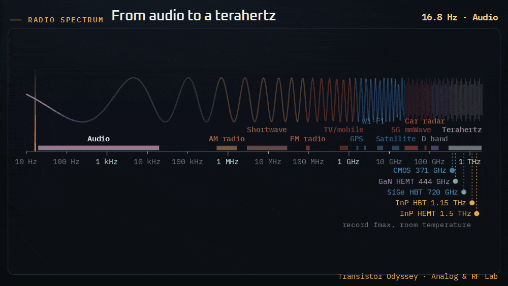
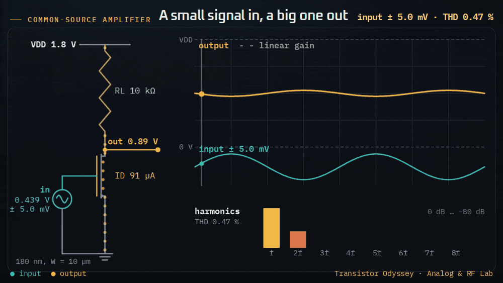
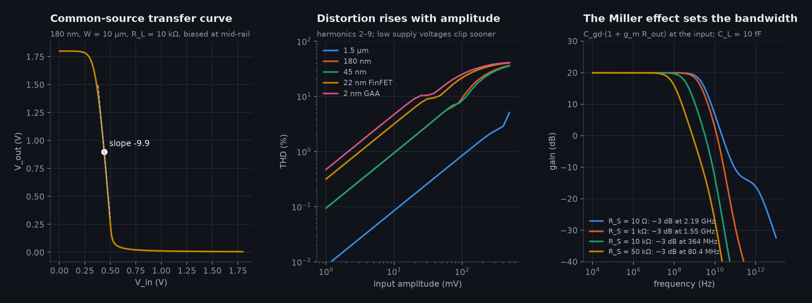
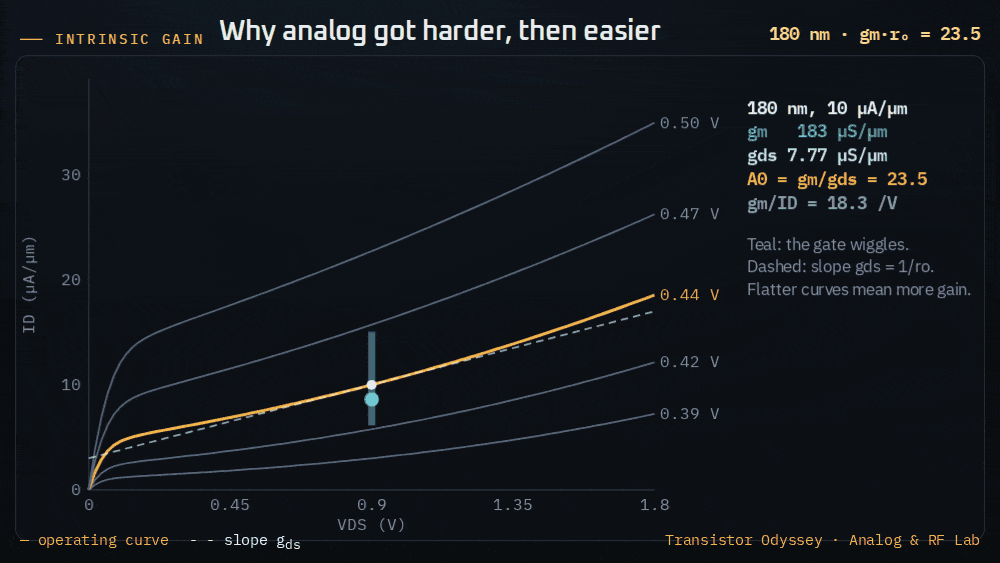
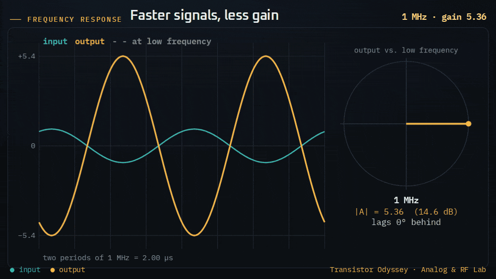
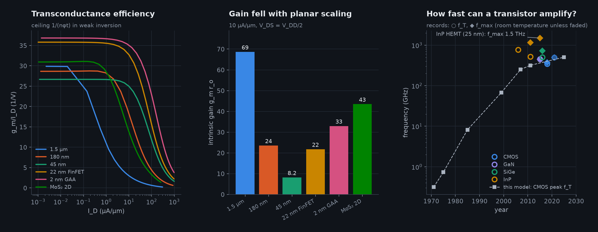
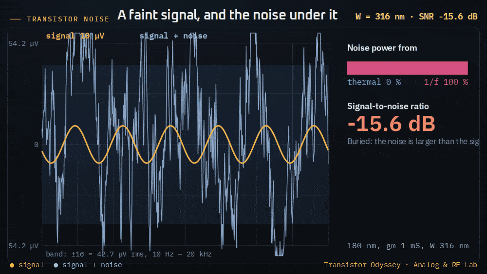
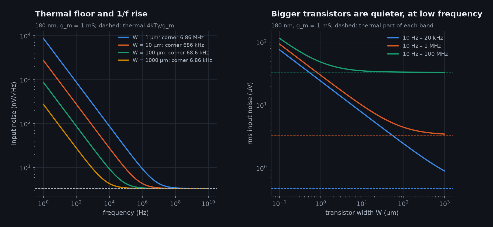

# 23 · The transistor as an amplifier: the Analog & RF Lab

Before transistors computed, they amplified. The first transistorized consumer product in the US was a Sonotone hearing aid in 1952, and the Regency TR-1 radio followed in October 1954 with four germanium junction transistors [@chm_consumer1952]. Every radio, radar and sensor still starts and ends with a transistor that turns a small signal into a larger one.

The [Analog & RF Lab](https://normansrule.github.io/transistor-odyssey/analog.html) builds that amplifier from the same compact transistor model as the rest of the site. It opens on the radio spectrum from 10 Hz to 2 THz, with the bands each technology made usable and the fastest transistors on record. The models live in `sim/transistor_sim/physics/analog.py`, with a JavaScript twin that `tests/js_parity.mjs` checks against it; `tests/test_analoglab.py` checks them against closed forms and limits.

## 1 · The common-source amplifier

A resistor R_L hangs from the supply to the drain, and the gate is biased so that the output sits at mid-rail. The lab solves the large-signal circuit exactly: for each input voltage it finds the output where the transistor current equals the resistor current,

> I_D(V_in, V_out) = (V_DD − V_out) / R_L,

by bisection on the compact model. Around the bias point the slope of that transfer curve is the small-signal gain [@razavi2017]:

> A_v = −g_m·(r_o ∥ R_L)

For a 180 nm transistor 10 µm wide with R_L = 10 kΩ, the model gives a gain of 9.9 at a bias current of about 90 µA.

**Distortion.** The transfer curve is not a straight line, so a sine wave comes out with harmonics. The lab takes one period of the output, computes its discrete Fourier transform and reports the total harmonic distortion of harmonics 2 to 9. For small inputs the second harmonic dominates and grows in proportion to the amplitude; a test checks this. Larger inputs drive the output into the rails and the distortion climbs past 10 %.

The 2 nm transistor has only 0.7 V of supply, so it clips at a much smaller input than a 1.5 µm transistor running from 5 V. Low supply voltage is one of the hardest problems in modern analog design.

## 2 · Gain versus scaling

Two numbers summarise a transistor for an analog designer:

- **Transconductance efficiency, g_m/I_D.** How much transconductance each microampere buys. In weak inversion the current is exponential in V_GS, so g_m/I_D reaches its ceiling 1/(nφ_t): about 29 per volt for the 180 nm preset and 36 for the near-ideal FinFET. It falls in strong inversion, where speed rises instead. Choosing a g_m/I_D for each transistor is a standard design method [@silveira1996].
- **Intrinsic gain, g_m·r_o.** The most voltage gain a single transistor can give. In this model the output conductance comes from drain-induced barrier lowering and channel-length modulation [@taur2013].

At 10 µA/µm and V_DS = V_DD/2 the model gives:

| Generation | 1.5 µm | 180 nm | 45 nm | 22 nm FinFET | 2 nm GAA | MoS₂ 2D |
|---|---|---|---|---|---|---|
| g_m·r_o | 69 | 24 | 8.2 | 22 | 33 | 43 |

Planar scaling cost analog designers dearly: at 45 nm a single transistor cannot reach a gain of 10. Designers answered with longer channels, cascodes and digital calibration. FinFETs and nanosheets wrap the gate around the channel, shield it from the drain and bring much of the gain back.

## 3 · Frequency response

**Capacitances.** In saturation the lab uses quasi-static estimates: C_gs = ⅔·C_ox·W·L plus an overlap term, and C_gd equal to the overlap and fringe capacitance, 0.25 fF per µm of width (a teaching value). The transit frequency is

> f_T = g_m / 2π(C_gs + C_gd).

**Two poles and a zero.** With a source resistance R_S and a load capacitance C_L, the stage's transfer function is

> A_v(s) = −g_m R_out (1 − s·C_gd/g_m) / (1 + a·s + b·s²),

with a = R_S[C_gs + C_gd(1 + g_m R_out)] + R_out(C_gd + C_L) and b = R_S R_out(C_gs C_gd + C_gs C_L + C_gd C_L).

**The Miller effect.** The term C_gd(1 + g_m R_out) is the Miller effect, first described for vacuum-tube triodes [@miller1920]. The output swings the far end of C_gd the opposite way, so the input sees it multiplied by the gain. In the 180 nm example C_gd is 2.5 fF but looks like 27 fF at the input, more than twice C_gs. The −3 dB bandwidth then depends on the source driving it:

| Source resistance | 10 Ω | 1 kΩ | 10 kΩ | 50 kΩ |
|---|---|---|---|---|
| −3 dB bandwidth | 2.2 GHz | 1.6 GHz | 364 MHz | 80 MHz |

The right-half-plane zero at g_m/C_gd comes from the signal leaking forward through C_gd; it adds up to 90° of extra phase lag. Tests check the Miller capacitance and that the input pole or the output pole sets the bandwidth in the right limits.

**Speed records.** f_T is where the current gain falls to one; f_max is where the power gain falls to one, and it also depends on gate and base resistance. The lab plots room-temperature records next to the model's intrinsic peak f_T for each CMOS generation (8 GHz at 1.5 µm, 67 GHz at 180 nm, 251 GHz at 45 nm, 505 GHz at 2 nm):

| Device | Year | f_T (GHz) | f_max (GHz) | Source |
|---|---|---|---|---|
| InP pseudomorphic HBT | 2006 | 765 | — | [@hafez_phbt] |
| InP HBT, 130 nm | 2011 | 521 | 1,150 | [@urteaga2016] |
| InP HEMT, 25 nm | 2015 | — | 1,500 | [@mei2015], [@deal_estf2015] |
| GaN HEMT | 2015 | 454 | 444 | [@tang2015] |
| SiGe HBT | 2016 | 505 | 720 | [@heinemann2016] |
| Si CMOS, 22 nm FD-SOI | 2018 | 347 | 371 | [@ong2018] |
| Si CMOS, 22 nm FD-SOI, cryogenic | 2021 | 495 | 497 | [@cryo22fdx] |

The model's f_T is intrinsic: real layouts add wiring capacitance and gate resistance, so measured circuits are slower.

## 4 · Noise

The lab refers all noise to the gate, as a voltage density in V²/Hz:

> S_v(f) = 4kTγ/g_m + K_f / (C_ox·W·L·f)

- **Thermal noise** is flat. γ = 2/3 is the long-channel value [@vanderziel1986]; short channels are noisier. At g_m = 1 mS the density is 3.3 nV/√Hz, and only more g_m (more current) lowers it.
- **Flicker (1/f) noise** comes from charges trapped and released at the oxide interface [@mcwhorter1957]. A bigger gate averages over more traps, so the 1/f power falls with gate area. K_f = 10⁻²⁵ V²·F is a teaching value of the right order for silicon CMOS.

The two are equal at the corner frequency f_c = K_f·g_m / (4kTγ·C_ox·W·L). For a 180 nm transistor at g_m = 1 mS, the corner falls from 686 kHz at W = 10 µm to 6.9 kHz at W = 1 mm. Over the audio band (10 Hz to 20 kHz) the rms input noise drops from 7.6 µV to 0.9 µV: that is why audio and sensor front ends use very large input transistors. Over a 100 MHz radio bandwidth the thermal part dominates instead.

Tests check that the two terms are equal at the corner, that the closed-form rms matches numerical integration, and that four times the area gives a four-times lower corner.

## What the models leave out

- **Amplifier:** body effect, temperature, mismatch between transistors, and output conductance from the load's own transistors in a real active-load stage.
- **Capacitances:** junction capacitances, wiring capacitance and the non-quasi-static behaviour near f_T.
- **f_max:** gate and base resistance; the lab shows measured f_max values but does not model them.
- **Noise:** short-channel excess thermal noise (γ above 1), gate-induced noise, shot noise in weak inversion, and the bias and process dependence of K_f.
