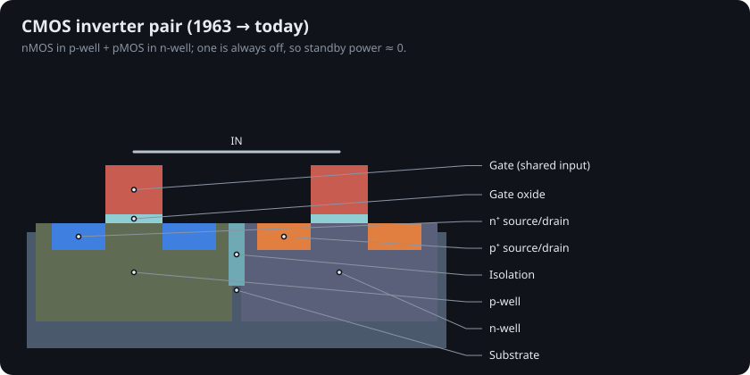
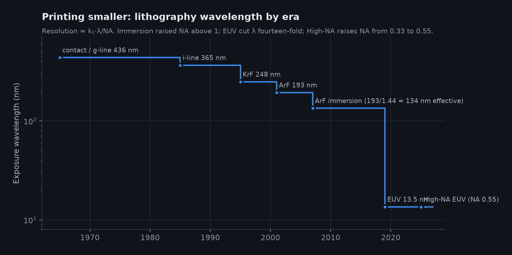
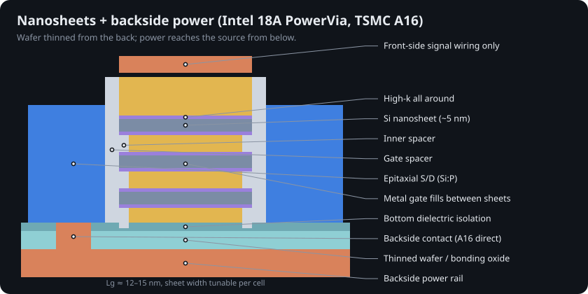
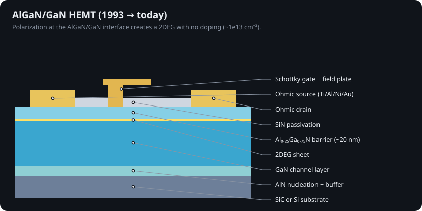
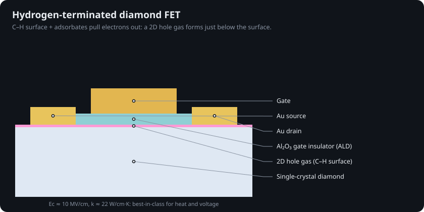
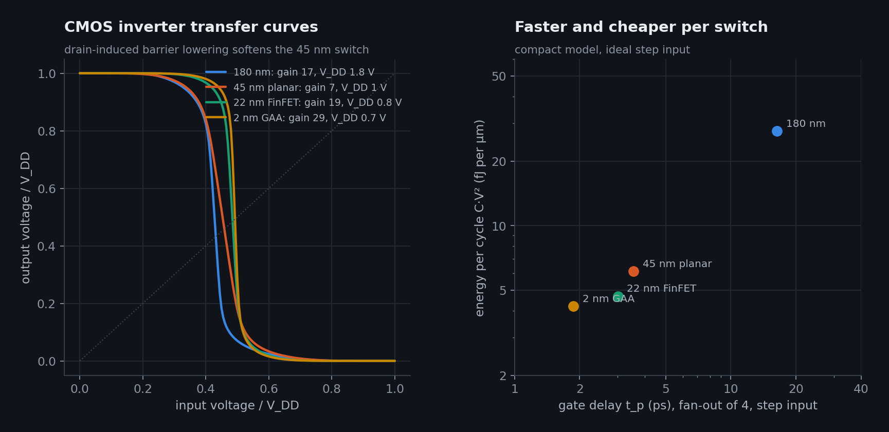
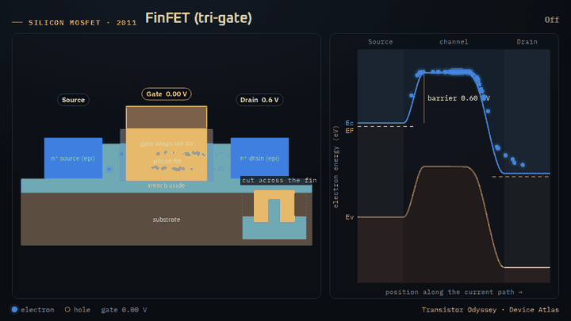
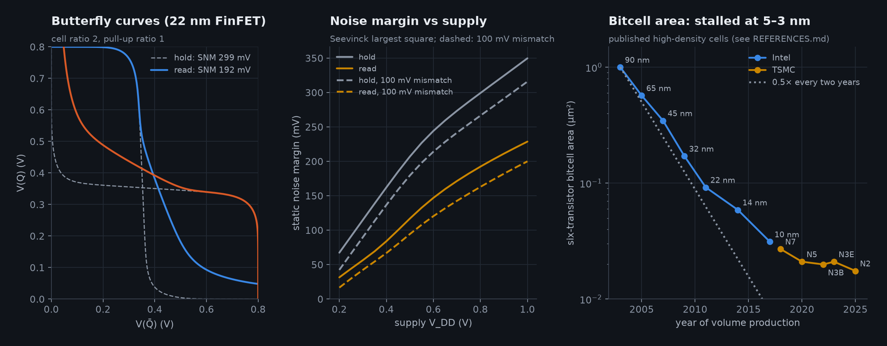

# Chapters

| # | Chapter | Years | Key figure |
|---|---|---|---|
| 1 | [Origins: the point contact and the junction](01-origins.md) | 1947–1954 |  |
| 2 | [Oxide, the planar process and the integrated circuit](02-planar-and-ic.md) | 1957–1961 |  |
| 3 | [The MOSFET, CMOS and the silicon gate](03-mosfet-and-cmos.md) | 1960–1971 |  |
| 4 | [Moore, Dennard and the scaling era](04-scaling-era.md) | 1965–2005 |  |
| 5 | [Strained silicon and high-k metal gates](05-strain-and-hkmg.md) | 2003–2011 |  |
| 6 | [FinFET: the transistor stands up](06-finfet.md) | 2011–2022 |  |
| 7 | [Lithography: printing the pattern](07-lithography.md) | 1965–2026 |  |
| 8 | [Gate-all-around, backside power and the ångström era](08-gaa-and-angstrom-era.md) | 2022–2026 |  |
| 9 | [Two-dimensional channels and the 0.42 nm interface](09-2d-materials.md) | 2011–2026 |  |
| 10 | [Compound semiconductors: GaAs, InP, GaN, SiC, Ga₂O₃](10-compound-semiconductors.md) | 1966–2026 |  |
| 11 | [Diamond, carbon nanotubes and beyond-CMOS](11-diamond-and-beyond.md) | 1989–2026 |  |
| 12 | [How the simulations work](12-simulation.md) | — |  |
| 13 | [Diamond electronics in depth](13-diamond-electronics.md) | 1989–2026 |  |
| 14 | [Niche and forgotten transistors](14-niche-and-forgotten.md) | 1952–2024 |  |
| 15 | [Steep-slope and exotic switches](15-steep-slope-and-exotic.md) | 1958–2026 |  |
| 16 | [How a 2 nm-class transistor is built](16-process-flow.md) | 2022–2026 |  |
| 17 | [Packaging and 3D integration](17-packaging-and-3d.md) | 2012–2026 |  |
| 18 | [Glossary](18-glossary.md) | — | |
| 19 | [The Physics Lab: semiconductor physics you can run](19-physics-lab.md) | — |  |
| 20 | [How each transistor works: cross-sections and energy band diagrams](20-how-transistors-work.md) | 1947–2026 |  |
| 21 | [From transistor to computer: the Circuit Lab](21-circuit-lab.md) | 1967–2026 |  |

Citations are written as an at-sign key in square brackets, e.g. `[@kilby1976]`. Every key resolves to an entry in [REFERENCES.md](../REFERENCES.md) (search the page for the key); `tests/test_data.py` fails if one does not.
